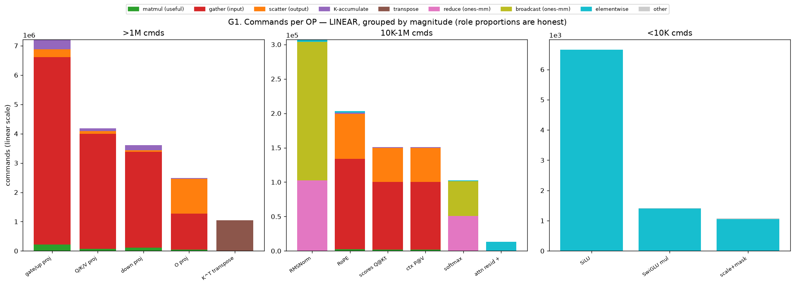
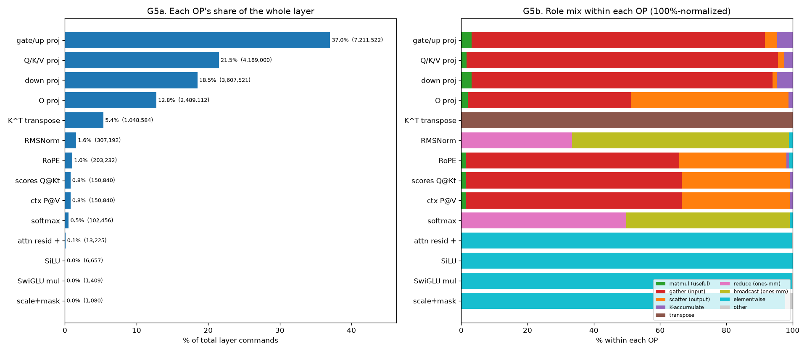
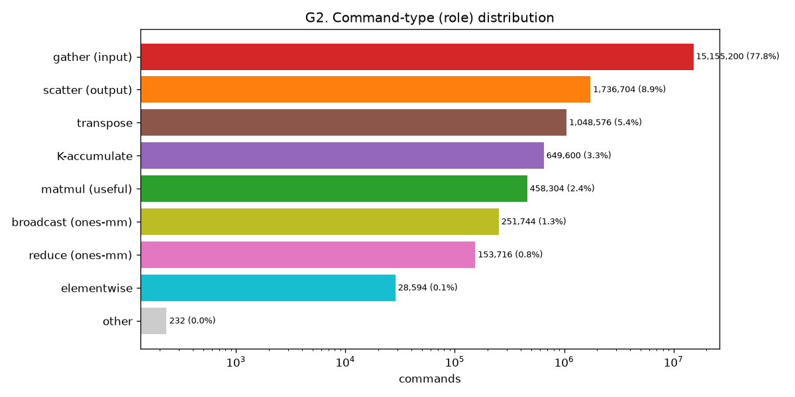
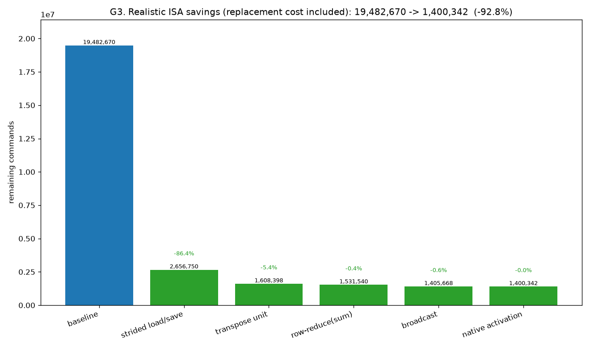
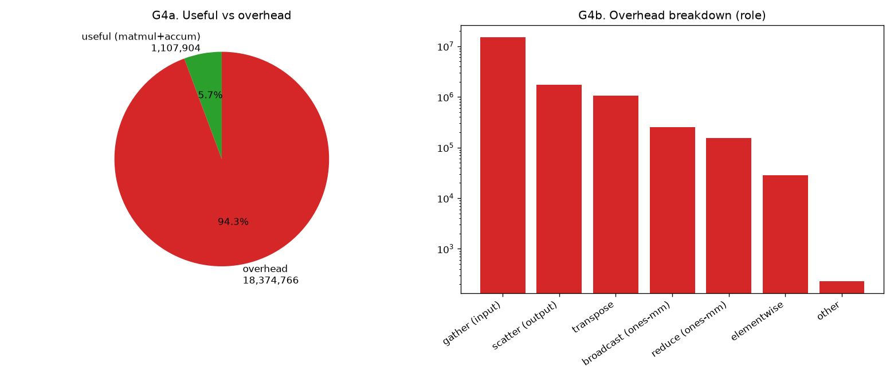

# Llama 3.2 3B 한 레이어 — 커맨드 오버헤드 분석

- 차원: SEQ=128, D=3072, HD=128, F=8192  (config: llama-3.2-3B)
- 측정: **정적 명령 수**(프로그램 크기 ≈ fetch/issue 부하). latency 아님.
- 레이어 총 명령 = **19,482,670**

## 1. 구성요소(OP)별 커맨드 수

| OP | 차원 | ×횟수 | per-op | 레이어 합 | % |
|---|---|---:|---:|---:|---:|
| gate/up proj | — | 2 | 3,605,761 | 7,211,522 | 37.0% |
| Q/K/V proj | — | 40 | 104,725 | 4,189,000 | 21.5% |
| down proj | — | 1 | 3,607,521 | 3,607,521 | 18.5% |
| O proj | — | 24 | 103,713 | 2,489,112 | 12.8% |
| K^T transpose | — | 8 | 131,073 | 1,048,584 | 5.4% |
| RMSNorm | — | 2 | 153,596 | 307,192 | 1.6% |
| RoPE | — | 32 | 6,351 | 203,232 | 1.0% |
| scores Q@Kt | — | 24 | 6,285 | 150,840 | 0.8% |
| ctx P@V | — | 24 | 6,285 | 150,840 | 0.8% |
| softmax | — | 24 | 4,269 | 102,456 | 0.5% |
| attn resid + | — | 25 | 529 | 13,225 | 0.1% |
| SiLU | — | 1 | 6,657 | 6,657 | 0.0% |
| SwiGLU mul | — | 1 | 1,409 | 1,409 | 0.0% |
| scale+mask | — | 24 | 45 | 1,080 | 0.0% |

- Attention(+norm) **44.4%** vs FFN **55.6%**

## 2. 커맨드 종류(role) 분포

| role | 명령 수 | % |
|---|---:|---:|
| gather(입력모음) | 15,155,200 | 77.8% |
| scatter(출력흩음) | 1,736,704 | 8.9% |
| 전치 | 1,048,576 | 5.4% |
| K누적 | 649,600 | 3.3% |
| 행렬곱(유효) | 458,304 | 2.4% |
| broadcast(ones-mm) | 251,744 | 1.3% |
| reduce(ones-mm) | 153,716 | 0.8% |
| 원소별 | 28,594 | 0.1% |
| 기타 | 232 | 0.0% |

- 유효 연산(행렬곱+누적) = **1,107,904 (5.7%)** → 나머지 **94.3%가 오버헤드**(gather/scatter/전치/reduce/broadcast/원소별)

## 3. 미지원 ISA 추가 시 절감 — 상한 vs 현실

- **상한** = 우회 role을 0으로 가정. **현실** = 대체 ISA가 새로 내는 명령(replacement)을 차감.

| 추가 ISA | 상한(role→0) | 현실(−replacement) | replacement 가정 |
|---|---:|---:|---|
| strided load/save | −16,891,904 (86.7%) | −16,825,920 (86.4%) | m_mul의 load/save가 strided 직접접근→복사 소멸, +stride-set(~2/타일)만 |
| transpose unit | −1,048,576 (5.4%) | −1,048,352 (5.4%) | 타일 transpose 1op/64x64 (현재 원소복사) → ~7/타일 |
| row-reduce(sum) | −153,716 (0.8%) | −76,858 (0.4%) | ones-mm 골격 제거, 입력 read는 남음(~절반) |
| broadcast | −251,744 (1.3%) | −125,872 (0.6%) | ones-mm 골격 제거, 출력 write는 남음(~절반) |
| native activation | −6,657 (0.0%) | −5,326 (0.0%) | SiLU 5패스→1패스 (~80% 절감) |
| **누적** | **−18,352,597 (94.2%)** | **−18,082,328 (92.8%)** | — |

- strided/transpose는 대체비용이 거의 없음(load/save 재사용·타일 1op) → 상한≈현실.
- reduce/broadcast는 데이터 read/write가 남아 ~절반, activation은 5→1패스(~80%).
- 현실 적용 후 남는 명령 = **1,400,343** (≈ 유효 행렬곱+누적 중심).
- reduce-max ISA: 안정 softmax용(정확성). 커맨드는 ~+51,936 **증가**(절감 아님).

## 4. 그래프

## 5. 해석 요약

- 가장 큰 절감 ISA = **strided load/save** (−16,891,904, 86.7%).
- 현재 구조는 명령의 **94.3%가 데이터이동/우회 오버헤드** — contiguous 전용 load/save와 미지원 연산(전치·reduce·broadcast·activation) 때문.
- 측정은 정적 명령 수이므로 latency가 아니라 **issue/code-size 부하** 관점의 상한 분석.