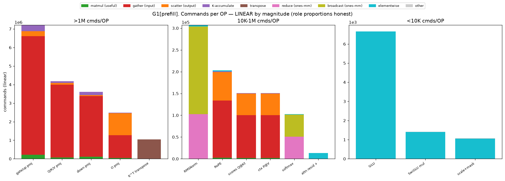
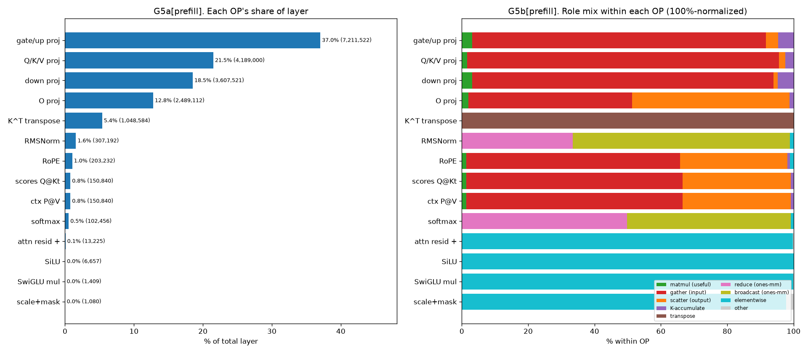
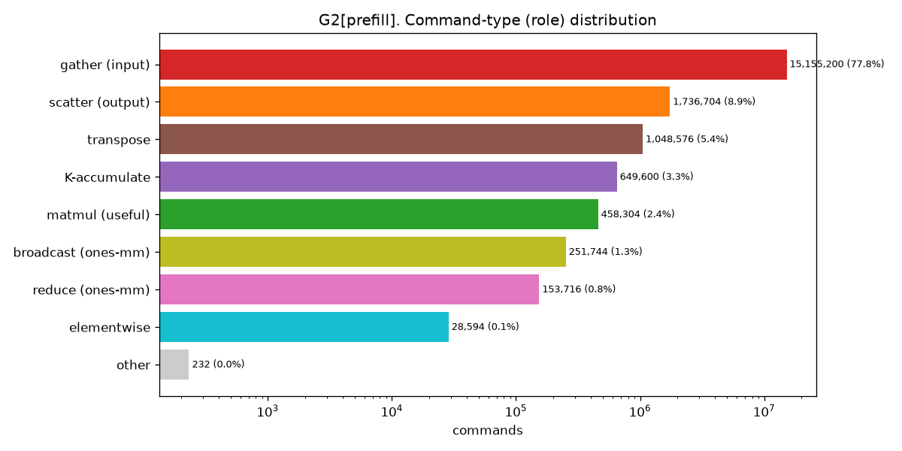
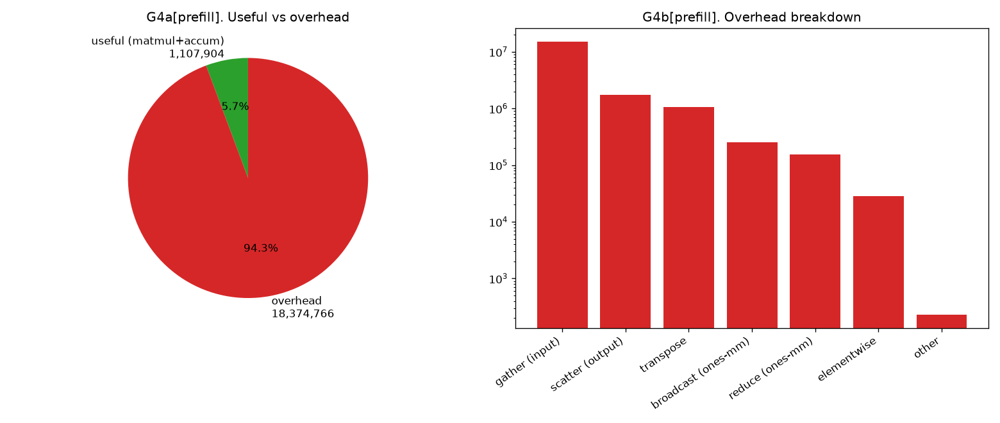
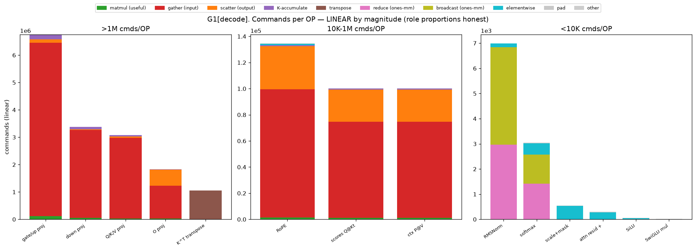
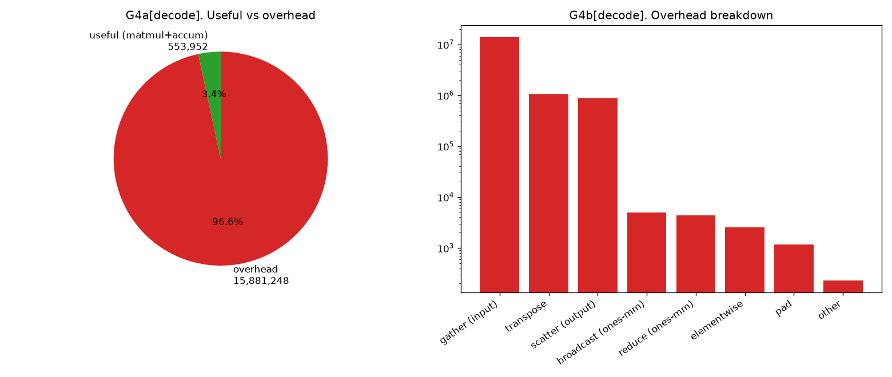
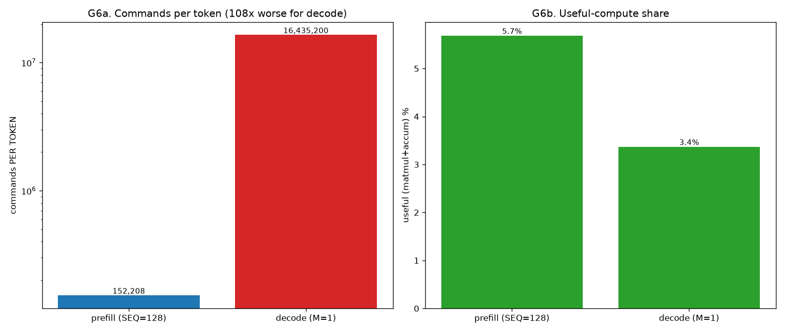
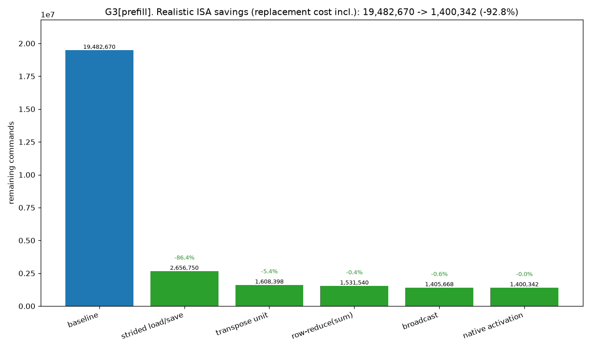
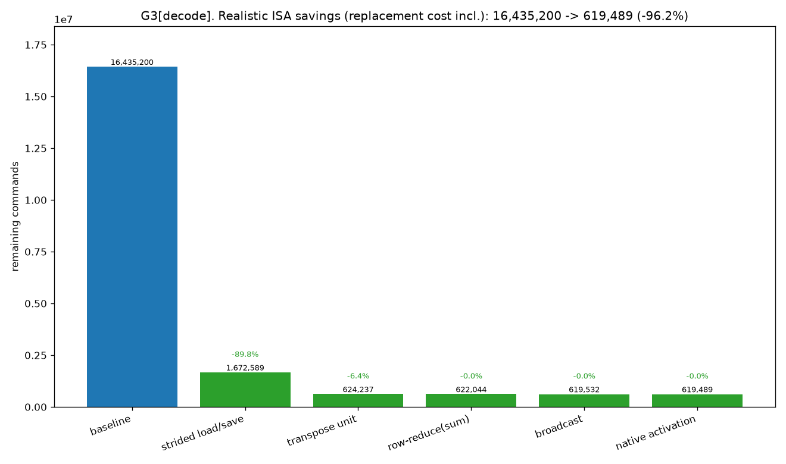

# TVM 기반 NPU 컴파일러 — 구현 상세 및 커맨드 오버헤드 분석

> 작성일: 2026-06-16
> 대상 모델: **Llama 3.2 3B** / 대상 하드웨어: 본 레포의 NPU c-model(`_poc/mysim`)
> 본 문서는 **처음 보는 사람도** 이해하도록 개념부터 차근차근 서술한다.
> 코드 위치: `d_compiler/`. 분석 재현: `python d_compiler/analyze_layer.py`.

---

## 0. 한 문장 요약

> 신경망(Llama 레이어)을 **TVM Relax 그래프**로 받아 → NPU가 못 하는 연산을 할 수 있는 연산 조합으로 바꾸고 → 행렬곱을 **64×64 타일**로 쪼개 → **NPU 명령어**로 생성 → 시뮬레이터 `mysim`에서 돌려 정답과 대조하는 **컴파일러**다.

현재까지: **Llama 3.2 3B 한 레이어(attention+FFN)를 실제 차원으로 컴파일**(reduce-max만 제외)하고, 작은 차원·실가중치 조각으로 **부동소수점 참조와 일치**시켰다. 본 보고서는 그 컴파일러의 **구조·matmul lowering·최적화**를 설명하고, **한 레이어가 소비하는 NPU 명령 수(커맨드 오버헤드)** 를 prefill·decode 두 시나리오로 정량 분석한다.

핵심 결과 미리보기:
- 한 레이어 명령의 **유효 행렬곱은 prefill 5.7% / decode 3.4%뿐**, 나머지는 데이터 이동·우회 오버헤드.
- **gather(입력 타일을 연속으로 모으는 복사)가 prefill 77.8% / decode 84.9%** 로 압도적.
- 미지원 ISA(특히 strided load/save)를 추가하면 명령을 **현실적으로 prefill −92.8% / decode −96.2%** 줄일 수 있다.
- **decode는 토큰당 명령이 prefill의 108배** — GEMV(M=1)+가중치 재적재의 구조적 비효율.

---

## 1. 대상 하드웨어와 시뮬레이터 (배경)

### 1.1 NPU c-model
- **64×64 PE(처리요소) 행렬 배열**: 한 번에 64×64 타일 행렬곱을 한다.
- **G-buffer**: 평탄한 1D 메모리. 값은 **FP16**로 저장, 계산은 float32, **저장(save) 시에만 FP16로 반올림**.
- **명령은 contiguous(연속) 메모리만** load/save 한다. (stride 접근 없음 — 이게 뒤의 오버헤드 핵심 원인)
- **루프·분기가 없다.** 명령을 위에서 아래로 한 번씩 실행. → 컴파일러가 **모든 반복을 펼쳐(unroll)** 명령을 나열해야 한다.

### 1.2 mysim (주어진 실행기)
`_poc/mysim.cpp`는 이 NPU의 **동작 시뮬레이터**다. 명령을 디코드해 G-buffer를 갱신하고 **모든 원소를 stdout으로 출력**한다.
- 장점: 정답(기능) 검증 가능.
- 한계: 원소를 다 출력하므로 **실제 3072차원 전체 레이어를 끝까지 돌리는 건 비현실적**(출력량 폭발). 그래서 검증은 "작은 차원 전체 + 실가중치 조각"으로 한다.
- **mysim은 수정 불가**(주어진 것). 컴파일러는 이 ISA를 타깃한다.

> mysim에는 **사이클(지연) 모델이 없다.** 그래서 본 보고서의 "오버헤드"는 **정적 명령 수**(프로그램 크기 ≈ fetch/issue 부하)이며 **latency가 아니다.**

---

## 2. 전체 컴파일러 구조

### 2.1 두 층의 IR (TVM)
TVM에서 모델은 두 단계 중간표현(IR)으로 표현된다.
- **Relax** = "그래프 IR". 텐서와 연산(op)의 그래프. **무엇을** 계산하는지. (PyTorch 그래프와 유사)
- **TIR** = "Tensor IR". `for` 루프와 버퍼로 된 저수준 IR. **어떻게** 계산하는지. (C 루프와 유사)

흐름: `Relax(무엇) → TIR(어떻게) → NPU 명령(ISA)`.

### 2.2 모듈 지도 (`d_compiler/npu_compiler/`)
| 모듈 | 역할 |
|---|---|
| `frontend.py` | PyTorch 모델 → Relax (torch.export → from_exported_program → FoldConstant → import_legalize) |
| `import_legalize.py` | 고수준 op(silu/softmax/mean/rsqrt…) → 우리 primitive로 분해 |
| `legalize.py` | 수동 빌더: rms_norm/rope/softmax/silu/swiglu/attention를 primitive 조합으로 |
| `model.py` | Llama 레이어를 Relax 그래프로 조립 + numpy 참조 |
| `memplan.py` | 정적 메모리 배치(모든 텐서의 G-buffer 오프셋을 컴파일 타임에 고정) |
| `codegen.py` | Relax → NPU 명령. 행렬곱은 TIR 백엔드로 위임, 나머지(elementwise/transpose/reduce/broadcast)는 직접 emit |
| `tir_backend.py` | **matmul 전용 TIR+tensorize 경로** + walker(TIR→ISA) |
| `isa.py` | 32비트 명령 인코더(바이트 단위로 mysim과 대조 검증됨) |
| `driver.py` | 전체 묶기: memplan+codegen+runtime |
| `runtime.py` | mysim 빌드·실행·결과 회수 |
| `cost.py` | 정적 분석기(명령 수, role별 집계) |

### 2.3 두 백엔드와 라우팅
- **direct 백엔드**(`codegen.py`): 모든 op을 직접 명령으로. 범용. 현재는 **행렬곱 오라클(테스트 비교용)** + 비-matmul op 처리 담당.
- **TIR 백엔드**(`tir_backend.py`): **행렬곱 전용**. Relax→TIR→스케줄(타일+tensorize)→walker. input reuse 등 스케줄 최적화를 표현.
- **라우팅**: 그래프의 모든 `relax.matmul` → TIR 백엔드. elementwise/transpose/reduce/broadcast → direct. (이렇게 분리된 이유는 §4 참고.)

### 2.4 컴파일 파이프라인 (한 레이어)
```
model.py(Relax 그래프)
  → memplan.plan : 모든 텐서에 G-buffer 오프셋 부여
  → codegen.compile_func(mm_backend="tir") : 그래프 순회하며 op별 명령 emit
        · matmul   → tir_backend.emit_matmul_into (아래 §3)
        · sum      → emit_row_sum      (행 reduction)
        · broadcast_to → emit_broadcast
        · permute_dims → emit_transpose
        · add/sub/mul/div/exp/sqrt → emit_ew
  → runtime.run : mysim 실행 → 결과
```

---

## 3. 행렬곱의 TIR lowering (가장 중요, 6단계)

`relax.matmul` 한 줄이 NPU 명령이 되기까지(예: `C[128,128]=A@B`, 64×64 타일이 2×2×2=8개):

### [1] Relax — 무엇을
`lv = R.matmul(x, w)` — 아직 루프도 타일도 없는 "행렬곱을 한다"는 선언.

### [2] LegalizeOps → TIR (스칼라 3중 루프)
TVM 패스가 행렬곱을 **정의 그대로의 루프**로 내린다:
```python
for i, j, k in grid(128, 128, 128):        # i=M(행), j=N(열), k=K(누적)
    with init(): C[i,j] = 0
    C[i,j] += A[i,k] * B[k,j]
```

### [3] tir.Schedule — 64×64 타일링 + tensorize (lowering의 심장)
`schedule_matmul`이 4개 변환을 차례로 적용:
| 변환 | 효과 |
|---|---|
| `split(_,[None,64])` | 각 축 128 → 타일(2)×64블록 |
| `reorder(io,jo,ko, ii,ji,ki)` | **바깥=타일(M,N,K), 안=64블록**. ← M-N-K 루프 순서 결정 |
| `decompose_reduction` | "C=0 초기화"를 K루프 밖으로 분리(타일마다 1번 fill + K타일마다 누적) |
| `tensorize` | 안쪽 64×64×64 루프를 **`call_extern("npu_gemm_acc")` 호출 1개**로 치환 → PE 명령이 될 자리 |

결과(노이즈 제거):
```python
for i0_0, i1_0 in grid(2, 2):          # 출력 타일 (M, N)
    fill C[i0_0, i1_0] = 0             # npu_fill_zero
    for k_0 in range(2):               # K 타일 (누적)
        C += A[i0_0,k_0] @ B[k_0,i1_0] # npu_gemm_acc (64×64)
```

### [4] match_buffer / access_ptr — '심볼릭 타일 뷰'
각 call_extern에는 타일의 **시작 위치(elem_offset)와 행간격(stride)이 심볼**로 붙는다(아직 `i0_0` 등이 숫자가 아니므로). 예: `A = match_buffer(x[i0_0*64:+64, k_0*64:+64], (64,64), strides=("A_s0",1))`.

### [5] _Walker — 심볼을 실제 주소로 풀고 명령 emit (= "TIR→ISA codegen")
walker는 스케줄된 TIR을 **컴파일 타임에 해석(실행)** 하며 명령을 받아 적는다. NPU엔 루프가 없으므로 **모든 for를 펼친다**.
- **루프 펼침**: `for i0_0 in range(2)` → i0_0=0, 1 각각 처리.
- **주소 계산(핵심 공식)**: `off = (행 시작)×(행 폭) + (열 시작)`. 예) A타일 (i0_0=1,k_0=0) → `off = 64×128 + 0 = 8192`. 절대주소 = 버퍼 시작 + off.
- **gather**: NPU의 load는 연속만 읽는데, 넓은 행렬의 64×64 타일은 메모리에서 띄엄띄엄(행간격 128)이라 **연속 스크래치로 복사**해 모은다.
- **명령 emit**: `tile/load/m_mul`(곱) + 누적(K타일) + `save`.

### [6] 결과 = NPU ISA
`relax.matmul` → (스칼라 루프) → (타일+tensorize) → (walker: 펼침+주소화+gather+m_mul+누적) → 평탄한 명령 목록.

> **요약**: 주소는 walker의 `off=행·폭+열`에서, 타일 구조는 schedule의 split/reorder/tensorize에서 나온다. (자세한 단계별 IR은 `d_compiler/walkthrough_tir.py` 실행으로 눈으로 확인 가능.)

---

## 4. 컴파일러가 적용한 최적화

| # | 최적화 | 내용 | 효과 |
|---|---|---|---|
| 1 | **input reuse** | 같은 `(주소,stride)` 입력 타일을 **한 번만 gather**하고 재사용(메모이제이션) | 중복 gather 제거(차원 클수록 큼; 3B matmul −72%) |
| 2 | **fill fusion** | C 타일 0초기화를 실제로 안 쓰고 "0"이라고 표시만 → 첫 누적이 그냥 덮어씀(`fp16(0+x)=fp16(x)`) | 0초기화 명령 제거 |
| 3 | **contiguous-skip** | 타일이 이미 연속(해당 차원=64)이면 gather 생략 | 불필요 복사 제거 |
| 4 | **reduce/broadcast 전용 op 분리** | mean/softmax의 reduce·broadcast를 `relax.matmul`이 아닌 `relax.sum`/`relax.broadcast_to`로 표현 → **모든 `relax.matmul`은 진짜 GEMM** → TIR 백엔드 단독 | matmul 경로 단일화(검증·최적화 용이), reduce는 효율적 ones-matmul로 lowering 유지 |
| 5 | **비-64 패딩(fallback 제거)** | 비-64배수 차원(임의 SEQ)을 TIR 경로가 직접 패딩(M-only는 입력복사 없이 출력만 스크래치로) | direct fallback 제거, byte-exact 유지 |

미구현(가장 큰 잠재 절감): **가중치 사전패킹** — 가중치는 컴파일 타임 상수이므로 tile-blocked 연속 배치로 미리 깔면 §6의 gather 대부분을 ISA 없이 제거 가능(아래 분석 참고).

---

## 5. 정확성 검증

- 작은 차원 **전체 레이어**(attention+FFN) end-to-end: torch 대비 상대오차 **0.13%**.
- PyTorch import한 **전체 Llama 디코더 블록**: 상대오차 ~2.5%.
- **실제 Llama 3.2 3B 가중치** 조각(q/k/v/o proj, FFN): 상대오차 **≤0.36%**.
- 행렬곱: 임의 차원에서 **TIR 경로 = direct = tiled_fp16_reference (byte-exact)**.
- (제외) softmax의 **reduce-max(max 빼기)** — ISA에 reduce-max가 없어 생략. 점수가 큰 경우 수치 안정성 위험.

---

## 6. 커맨드 오버헤드 분석

### 6.1 방법론
- **측정량**: 정적 명령 수(프로그램 크기 ≈ issue/fetch 부하). **latency 아님**.
- **role 태깅**: 명령마다 생성한 emitter가 역할을 표시 — `gather`(입력 모으기), `mmul`(실제 행렬곱), `accum`(K 누적), `scatter`(출력 흩기), `transpose`, `reduce`(ones-mm), `broadcast`(ones-mm), `elementwise`.
- **레이어 합 구성**: 각 구성요소(RMSNorm/Q·K·V·O proj/RoPE/Kᵀ/scores/softmax/ctx/SwiGLU/…)를 **실제 3B 차원으로 단독 컴파일**해 role별 명령 수를 측정하고, model.py의 **출현 횟수**(예: Q proj ×24, scores ×24)로 곱해 합산.
- **두 시나리오**: **prefill**(Mq=SEQ=128 토큰 동시) / **decode**(Mq=1 토큰 생성, KV 캐시 길이 L=128). decode는 NPU 특성상 M=1이 64로 패딩된다.

### 6.2 Prefill (SEQ=128) — 구성요소별

| OP | ×횟수 | per-op | 레이어 합 | % | 지배 role |
|---|---:|---:|---:|---:|---|
| gate/up proj | 2 | 3,605,761 | 7,211,522 | 37.0% | gather |
| Q/K/V proj | 40 | 104,725 | 4,189,000 | 21.5% | gather |
| down proj | 1 | 3,607,521 | 3,607,521 | 18.5% | gather |
| O proj | 24 | 103,713 | 2,489,112 | 12.8% | gather |
| K^T transpose | 8 | 131,073 | 1,048,584 | 5.4% | transpose |
| RMSNorm | 2 | 153,596 | 307,192 | 1.6% | broadcast |
| RoPE | 32 | 6,351 | 203,232 | 1.0% | gather |
| scores Q@Kt | 24 | 6,285 | 150,840 | 0.8% | gather |
| ctx P@V | 24 | 6,285 | 150,840 | 0.8% | gather |
| softmax | 24 | 4,269 | 102,456 | 0.5% | reduce |
| attn resid + | 25 | 529 | 13,225 | 0.1% | elementwise |
| SiLU | 1 | 6,657 | 6,657 | 0.0% | elementwise |
| **레이어 합** | | | **19,482,670** | 100% | |

**role 분포** (전체): gather **77.8%**, scatter 8.9%, transpose 5.4%, K-accumulate 3.3%, **matmul(유효) 2.4%**, broadcast 1.3%, reduce 0.8%, elementwise 0.1%.
**유효 연산(matmul+누적) = 5.7%**, 나머지 94.3%가 오버헤드.


*G1[prefill]: 구성요소별 명령 수(크기 tier별 선형). 큰 projection들은 막대 대부분이 빨강(gather)이고 초록(matmul)은 바닥의 얇은 띠.*


*G5[prefill]: (좌) 각 OP의 레이어 비중 — 상위 4개 projection이 ~90%. (우) OP별 role 구성 100% 정규화 — projection은 ~90%가 gather, RMSNorm/softmax는 reduce+broadcast, Kᵀ는 100% transpose.*


*G2[prefill]: 커맨드 종류 분포 — gather가 77.8%로 압도, 유효 matmul은 2.4%.*


*G4[prefill]: 유효(5.7%) vs 오버헤드(94.3%)와 오버헤드 세부(gather 최다).*

### 6.3 Decode (M=1, L=128) — 구성요소별

| OP | ×횟수 | per-op | 레이어 합 | % |
|---|---:|---:|---:|---:|
| gate/up proj | 2 | 3,375,753 | 6,751,506 | 41.1% |
| Q/K/V proj | 40 | 76,947 | 3,077,880 | 18.7% |
| down proj | 1 | 3,376,633 | 3,376,633 | 20.5% |
| O proj | 24 | 76,441 | 1,834,584 | 11.2% |
| K^T transpose | 8 | 131,073 | 1,048,584 | 6.4% |
| RoPE | 32 | 4,208 | 134,656 | 0.8% |
| scores Q@Kt | 24 | 4,175 | 100,200 | 0.6% |
| ctx P@V | 24 | 4,175 | 100,200 | 0.6% |
| RMSNorm | 2 | 3,496 | 6,992 | 0.0% |
| softmax | 24 | 127 | 3,048 | 0.0% |
| **레이어 합** | | | **16,435,200** | 100% |

**decode 특징**:
- **유효 연산 3.4%**(prefill 5.7%보다 더 낮음), **gather 84.9%**(더 지배적).
- M에 의존하는 부분(RMSNorm 307K→7K, softmax 102K→3K, A-gather/scatter)은 **급감**하지만, **가중치 gather(projection의 B)는 M과 무관**해 거의 그대로 → 총합은 prefill의 84%(16.4M).
- **K^T transpose는 prefill과 동일**(1,048,584) — KV 캐시 [L,HD]=[128,128]를 전치하므로. decode에선 상대 비중이 6.4%로 커진다.


*G1[decode]: decode도 projection의 gather가 지배. softmax/RMSNorm은 거의 사라짐(M=1).*


*G4[decode]: 유효 3.4% vs 오버헤드 96.6%. gather 비중이 prefill보다 더 큼.*

### 6.4 Prefill vs Decode — 토큰당 비용


*G6: (좌) 토큰당 명령 수 — decode가 prefill의 **108배**. (우) 유효 연산 비율 — decode 3.4% < prefill 5.7%.*

| 지표 | prefill (128토큰 동시) | decode (1토큰) |
|---|---:|---:|
| 레이어 총 명령 | 19,482,670 | 16,435,200 |
| **토큰당 명령** | **152,208** | **16,435,200 (108×)** |
| 유효 연산 비율 | 5.7% | 3.4% |
| gather 비율 | 77.8% | 84.9% |

**왜 decode가 토큰당 108배인가**: decode는 토큰 1개를 만들려고 **가중치 전체를 한 번 읽어야** 한다(projection의 B gather는 M과 무관). 게다가 M=1이 **64로 패딩**되어 64×64 PE의 **1/64 행만 유효**. 즉 GEMV(행렬×벡터)를 행렬 엔진에 태우는 구조적 비효율 + 가중치 재적재. (이는 모든 행렬 가속기의 decode 특성과 일치 — 배칭·KV캐시·양자화로 완화하는 영역이며, 우리 컴파일러엔 아직 decode 경로가 없어 동일 primitive로 추정한 값이다.)

### 6.5 미지원 ISA 추가 시 절감 (상한 vs 현실)

각 미지원 연산을 전용 ISA로 대체할 때 줄어드는 명령을 모델링. **상한** = 우회 role을 0으로 가정. **현실** = 대체 ISA가 새로 내는 명령(replacement)을 차감.

| 추가 ISA | 없애는 우회 | prefill 현실 절감 | 가정(replacement) |
|---|---|---:|---|
| **strided load/save** | gather/scatter 복사 | **−86.4%** | m_mul의 load/save가 strided 직접접근 → 복사 소멸, +stride-set만 |
| transpose unit | Kᵀ 원소복사 | −5.4% | 타일 transpose 1op/64×64 |
| row-reduce(sum) | reduce=ones-mm | −0.4% | 골격만 제거, 입력 read 남음(~절반) |
| broadcast | broadcast=ones-mm | −0.6% | 골격만 제거, 출력 write 남음(~절반) |
| native activation | SiLU 체인 | −0.0% | 5패스→1패스(~80%) |
| **누적(현실)** | | **−92.8%** | 남는 명령 1,400,343 |


*G3[prefill]: 현실 절감 워터폴 — strided load/save 하나로 절벽(19.5M→2.7M). 이후는 수확 체감.*


*G3[decode]: decode는 gather 비중이 더 커 현실 절감 누적 **−96.2%**(→619,490). strided load/save가 더더욱 결정적.*

**중요한 실행 시사점**: gather의 대부분은 **가중치 타일 gather**다(예: gate/up은 가중치 타일 6,144개 vs 활성화 96개). 가중치는 상수이므로 **호스트 사전패킹(소프트웨어, ISA 불필요)** 만으로도 이 86%의 큰 몫을 제거할 수 있다. 즉 "−86%"는 ISA 없이도 상당 부분 달성 가능한 목표다.

> 참고: **reduce-max ISA**는 절감이 아니라 안정 softmax(정확성)용이며 커맨드는 오히려 ~+5만 증가한다.

---

## 7. 결론 및 다음 단계

### 결론
1. 현재 컴파일러는 Llama 3.2 3B 한 레이어를 정확히 컴파일하지만, **명령의 ~94%(decode ~96%)가 데이터 이동·우회 오버헤드**이고 유효 행렬곱은 5.7%/3.4%뿐이다.
2. 근본 원인은 **NPU의 contiguous 전용 load/save** — 넓은 행렬의 타일을 들어올 때(gather)·나갈 때(scatter) 복사해야 한다. 그래서 **strided load/save가 단일 최대 개선(−86%)**.
3. gather의 대부분이 **가중치**이므로, **가중치 사전패킹(소프트웨어)** 으로 ISA 없이도 큰 폭을 줄일 수 있다.
4. **decode는 토큰당 108배** 비용 — GEMV(M=1)+가중치 재적재의 구조적 비효율. 배칭·KV캐시·사전패킹·양자화로 완화 대상.

### 다음 단계 (제안)
- **(SW) 가중치 사전패킹** 구현 → G3에 "ISA 없는 절감" 막대 추가, gather 실측 감소.
- **(SW) input reuse를 schedule(cache_read)로** 이전 + weight-stationary dataflow(=PE 입력버퍼 재사용; ISA가 이미 지원).
- **(분석) SEQ 스윕**(128→2048→4096) → attention(SEQ²) vs projection(SEQ) 비중 역전 지점.
- **(기능) decode 경로**(KV 캐시 재사용, 배칭으로 M 키우기) 구현 후 재측정.
- **(정확성) reduce-max** 지원 시 안정 softmax.

---

### 부록 A. 재현 방법
```bash
# 분석 + 그래프 생성 (prefill/decode 모두)
/home/chokwans99/anaconda3/envs/npu-tvm/bin/python d_compiler/analyze_layer.py
# 결과: report/figs/g{1..6}_*.png, 콘솔에 수치
# matmul lowering 단계별 IR 관찰
/home/chokwans99/anaconda3/envs/npu-tvm/bin/python d_compiler/walkthrough_tir.py
```

### 부록 B. 측정 한계
- 정적 명령 수만 측정(사이클 latency·메모리 대역폭 미반영). 따라서 **상대 비교·구조 분석**에 유효하다.
- decode는 컴파일러에 전용 경로가 아직 없어 **동일 primitive로 추정**한 값(KV 길이 L=128 가정).
- ISA 절감의 "현실" 모델은 대체 명령 비용을 보수적으로 가정한 추정치다(가정은 `analyze_layer.py`의 `feats`에 명시).
