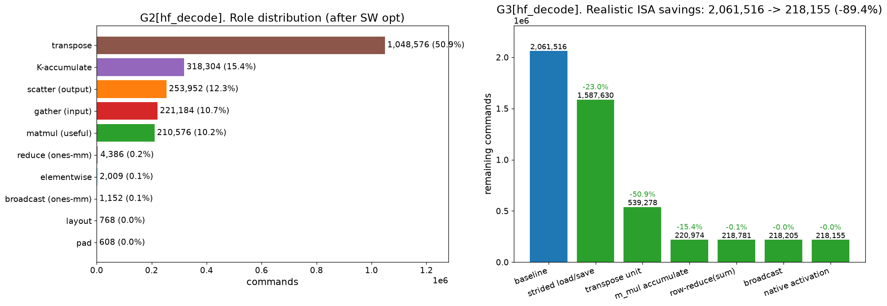

# TVM 기반 NPU 컴파일러 — 구현 상세 및 커맨드 오버헤드 분석 (실제 HF 모델 기준)

> 작성일: 2026-06-16
> 대상 모델: **Llama 3.2 3B** (HuggingFace `transformers`) / 대상 하드웨어: 본 레포 NPU c-model(`_poc/mysim`)
> 본 문서는 처음 보는 사람도 이해하도록 개념부터 서술한다. 코드: `d_compiler/`.
> **오버헤드 분석은 실제 HF `LlamaDecoderLayer`를 frontend로 import한 그래프를 기준으로 한다(아래 §6.0).**

---

## 0. 한 문장 요약

> 신경망(Llama 레이어)을 **TVM Relax 그래프**로 받아 → NPU가 못 하는 연산을 가능한 연산 조합으로 바꾸고 → 행렬곱을 **64×64 타일**로 쪼개 → **NPU 명령어**로 생성 → `mysim`에서 돌려 정답과 대조하는 **컴파일러**다.

핵심 결과(실제 HF Llama 3.2 3B 레이어 1개, frontend import 그래프 기준):
- **최적화 전(baseline)**: 유효 행렬곱이 prefill 5.7% / decode 3.4%뿐, **gather가 78.2% / 84.1%** 로 압도(나머지는 데이터이동·우회 오버헤드).
- **새 ISA 없이 소프트웨어 3단계**로 **총 명령 prefill −81.9%(19.2M→3.48M) / decode −86.3%(15.1M→2.06M)**, 유효 비율 **5.7%→32.4% / 3.4%→25.7%** (byte-exact 또는 fp16 동등, §6.1):
  1. **가중치 사전패킹**(−65.5% / −78.3%): 상수 가중치를 tile-blocked로 미리 배치 → 가중치 gather 제거.
  2. **활성화 gather 재사용**(누적 −76.1% / −82.6%): 같은 활성화(예: `xn`)를 matmul마다 다시 gather하지 않고 레이어당 1회만.
  3. **O-proj head 융합**(누적 −81.9% / −86.3%): head별 `[S,D]` 출력을 24번 scatter하던 것을 공유 누적기로 **1번만** scatter(§6.1a).
- 3단계 후 **남은 최대 오버헤드는 K^T transpose**(prefill 30.1%, decode 50.9%) — 패킹·재사용·융합이 못 건드리는 순수 전치 → transpose ISA / Kᵀ 캐시. 그 다음은 **K-accumulate**(19.5% / 15.4%).
- 그 위에 새 ISA 6종(strided load/save·transpose·**m_mul accumulate**·reduce·broadcast·activation) 추가 시 **최종 대비 추가로 prefill −80.0% / decode −89.4%** → **baseline 대비 prefill −96.4% / decode −98.6%**.
- **decode는 토큰당 명령이 prefill의 약 76배** — GEMV(M=1, PE 1/64만 유효)+가중치 전체 통과+캐시 전치의 구조적 비효율.

---

## 1. 대상 하드웨어와 시뮬레이터 (배경)

### 1.1 NPU c-model
- **64×64 PE 행렬 배열**: 한 번에 64×64 타일 행렬곱.
- **G-buffer**: 평탄한 1D 메모리. FP16 저장, float32 계산, **저장(save) 시에만 FP16 반올림**.
- **명령은 contiguous(연속) 메모리만** load/save (stride 접근 없음 — 오버헤드의 핵심 원인).
- **루프·분기 없음.** → 컴파일러가 모든 반복을 펼쳐(unroll) 명령을 나열.

### 1.2 mysim (주어진 실행기)
`_poc/mysim.cpp`는 동작 시뮬레이터로 모든 원소를 stdout 출력한다. 기능 검증엔 좋지만 **실제 3072차원 전체 레이어를 끝까지 돌리는 건 비현실적**(출력량 폭발). 그래서 검증은 "작은 차원 전체 + 실가중치 조각". **mysim은 수정 불가**(주어진 ISA가 타깃). 사이클 모델이 없으므로 본 분석의 "오버헤드"는 **정적 명령 수**(프로그램 크기 ≈ fetch/issue 부하)이며 latency가 아니다.

---

## 2. 전체 컴파일러 구조

### 2.1 두 층의 IR
- **Relax** = 그래프 IR(텐서·op, "무엇을"). **TIR** = 루프 IR("어떻게"). 흐름: `Relax → TIR → NPU 명령(ISA)`.

### 2.2 모듈 지도 (`d_compiler/npu_compiler/`)
| 모듈 | 역할 |
|---|---|
| `frontend.py` | **PyTorch(HF) → Relax** (torch.export → from_exported_program → FoldConstant → import_legalize) |
| `import_legalize.py` | 고수준 op(silu/softmax/mean/rsqrt…) → 우리 primitive |
| `legalize.py` | 수동 빌더(rms_norm/rope/softmax/silu/swiglu) |
| `model.py` | Llama 레이어 Relax 조립 + numpy 참조 |
| `memplan.py` | 정적 메모리 배치(모든 텐서의 G-buffer 오프셋 고정) |
| `codegen.py` | Relax → NPU 명령. matmul은 TIR 백엔드로 위임, 나머지는 직접 emit. role 태깅·per-OP 기록(`emit_log`) |
| `tir_backend.py` | matmul 전용 TIR+tensorize + walker(TIR→ISA) |
| `isa.py` | 32비트 명령 인코더(mysim과 바이트 대조 검증) |
| `driver.py`/`runtime.py` | 묶기 + mysim 빌드·실행 |
| `cost.py` | 정적 분석기(명령 수, role별·OP별 집계) |

### 2.3 두 백엔드와 라우팅
- **direct**(`codegen.py`): 비-matmul op(elementwise/transpose/reduce/broadcast/slice/concat) + 행렬곱 오라클.
- **TIR**(`tir_backend.py`): 행렬곱 전용(타일+tensorize, input reuse).
- 라우팅: 모든 `relax.matmul` → TIR, 나머지 → direct.

---

## 3. 행렬곱의 TIR lowering (핵심) — 단계별 IR 예시

`relax.matmul` 한 줄이 NPU 명령이 되기까지를 **실제 IR**과 함께 따라간다. 예시는 `C[128,128] = A[128,128] @ B[128,128]` (64×64 타일이 M·N·K 각 2개 → 2·2·2 = **8개**). 아래 IR은 가독성을 위해 `T.int64(64)`→`64`, `T.` 접두사를 생략한 것이며, `python d_compiler/walkthrough_tir.py`로 원본을 직접 볼 수 있다.

> 큰 그림: TVM IR은 2층이다 — **Relax**(그래프, "무엇을") → **TIR**(루프, "어떻게"). 행렬곱은 Relax→TIR로 내린 뒤 **타일링(schedule)** 하고, 마지막에 **walker**가 NPU 명령으로 바꾼다.

### [1] Relax — "무엇을" 계산하나
```python
@R.function
def main(x: R.Tensor((128,128),"float16"), w: R.Tensor((128,128),"float16")):
    with R.dataflow():
        lv = R.matmul(x, w)        # 아직 루프·타일 없음 — "행렬곱을 한다"는 선언
        R.output(lv)
    return lv
```

### [2] LegalizeOps → TIR — 숫자 단위 3중 루프
TVM 패스가 행렬곱을 **정의 그대로의 스칼라 루프**로 내린다(`matmul`이 출력 버퍼 = C):
```python
@T.prim_func
def main(x: Buffer((128,128)), w: Buffer((128,128)), matmul: Buffer((128,128))):
    for i0, i1, k in grid(128, 128, 128):       # i0=M(행), i1=N(열), k=K(누적)
        with block("matmul"):
            v_i0, v_i1, v_k = axis.remap("SSR", [i0, i1, k])   # S=공간축, R=리덕션축
            with init():
                matmul[v_i0, v_i1] = 0.0                       # C = 0
            matmul[v_i0, v_i1] = matmul[v_i0, v_i1] + x[v_i0, v_k] * w[v_k, v_i1]
```

### [3] tir.Schedule — 64×64 타일링 + tensorize (lowering의 심장)
`schedule_matmul`이 변환 4개를 차례로 적용한다.

**(3a) split** — 각 축 128을 `타일(2)×64블록`으로:
```python
for i0_0, i0_1, i1_0, i1_1, k_0, k_1 in grid(2,64, 2,64, 2,64):
    with block("matmul"):
        v_i0 = axis.spatial(128, i0_0*64 + i0_1)    # 진짜 행 좌표 = 타일·64 + 블록내
        v_i1 = axis.spatial(128, i1_0*64 + i1_1)
        v_k  = axis.reduce (128, k_0*64 + k_1)
        ...  # 계산은 [2]와 동일, 루프만 쪼갬
```

**(3b) reorder** — 타일 인덱스(io,jo,ko)를 바깥, 64블록(ii,ji,ki)을 안으로:
```python
for i0_0, i1_0, k_0,  i0_1, i1_1, k_1 in grid(2,2,2,  64,64,64):
    ...   # 바깥 3중 = 어느 타일을 계산할지(M,N,K), 안쪽 3중 = 그 64×64 타일 내부
```
→ 안쪽 64×64×64가 정확히 PE 하나가 하는 일이 됨. 이게 M-N-K 루프 순서를 확정.

**(3c) decompose_reduction** — "C=0 초기화"를 K루프 밖의 별도 블록으로 분리:
```python
for i0_0, i1_0 in grid(2, 2):                        # 출력 타일 (M,N)
    for i0_1_init, i1_1_init in grid(64, 64):        # ── 블록1: 초기화
        with block("matmul_init"):  matmul[v_i0,v_i1] = 0.0
    for k_0, i0_1, i1_1, k_1 in grid(2, 64, 64, 64): # ── 블록2: 누적 (k_0 = K타일)
        with block("matmul_update"): matmul[v_i0,v_i1] += x[v_i0,v_k]*w[v_k,v_i1]
```
→ "출력 타일마다 한 번 0으로 + K타일마다 누적" 구조(우리 NPU 흐름: fill 1회 + gemm 여러 번).

**(3d) tensorize** — 안쪽 64×64×64 루프를 **명령 1개로 치환**. 먼저 매칭할 패턴(desc):
```python
@T.prim_func
def _gemm_desc(a, b, c):                              # "64×64 C += A·B" 패턴
    A = match_buffer(a, (64,64), "float16", strides=("A_s0", 1))
    B = match_buffer(b, (64,64), "float16", strides=("B_s0", 1))
    C = match_buffer(c, (64,64), "float16", strides=("C_s0", 1))
    for i, j, k in grid(64, 64, 64):
        C[vi,vj] = C[vi,vj] + A[vi,vk]*B[vk,vj]
```
`tensorize`가 일치하는 안쪽 루프를 desc의 대체물(impl=`call_extern` 마커)로 바꾼 **최종 스케줄 TIR**:
```python
for i0_0, i1_0 in grid(2, 2):                         # 출력 타일 (M×N = 2×2)
    with block("matmul_init_o"):
        C = match_buffer(matmul[i0_0*64 : i0_0*64+64,  i1_0*64 : i1_0*64+64],
                         (64,64), strides=("C_s0", 1))
        call_extern("npu_fill_zero", C.access_ptr, C.strides[0])   # 이 타일 0초기화
    for k_0 in range(2):                              # K 타일 (누적)
        with block("matmul_update_o"):
            A = match_buffer(x[i0_0*64:+64, k_0*64:+64], (64,64), strides=("A_s0",1))
            B = match_buffer(w[k_0*64:+64, i1_0*64:+64], (64,64), strides=("B_s0",1))
            C = match_buffer(matmul[i0_0*64:+64, i1_0*64:+64], (64,64), strides=("C_s0",1))
            call_extern("npu_gemm_acc", C.access_ptr,C_s0, A.access_ptr,A_s0, B.access_ptr,B_s0)
```
→ 안쪽 64³ 루프가 사라지고 **`call_extern` 8개(=2·2·2)** 가 남았다. 이게 PE 명령이 될 자리.

### [4] match_buffer / access_ptr — '심볼릭 타일 뷰'
위 결과의 `A = match_buffer(x[i0_0*64:+64, k_0*64:+64], (64,64), strides=("A_s0",1))`는 큰 x의 **64×64 부분뷰**를 선언하되, **시작 위치(elem_offset)와 행간격(`A_s0`)을 심볼**로 둔다(아직 `i0_0,k_0`가 숫자가 아니므로). `call_extern(..., A.access_ptr, A_s0, ...)`이 그 포인터·stride를 호출에 넘긴다. **이 심볼을 실제 숫자로 푸는 게 다음 단계.**

### [5] _Walker — 심볼을 실주소로 풀고 명령 emit ("TIR→ISA codegen")
walker는 스케줄 TIR을 **컴파일 타임에 해석**하며 명령을 받아 적는다. NPU엔 루프가 없으니 **모든 `for`를 펼친다**.
- **루프 펼침**: `for i0_0 in range(2)` → i0_0=0,1 각각 처리.
- **주소 공식**: `off = (행 시작) × (행 폭) + (열 시작)`, 절대주소 = 버퍼 시작 + off.

`x@0, w@16384, out@32768`에 배치된 경우의 **실제 walker 추적**(verbose):
```
[walker] gemm_acc  C@32768(s128) += A@0(s128)     · B@16384(s128)   # i0_0=0,i1_0=0,k_0=0
   gather NEW   @0(s128)     -> scratch@53248 (copy 64 rows)        # A타일을 연속으로 모음
   gather NEW   @16384(s128) -> scratch@57344
[walker] gemm_acc  C@32768   += A@64(s128)         · B@24576(s128)  # k_0=1: A off=0·128+64=64
[walker] gemm_acc  C@32832   += A@0                · B@16448        # i1_0=1: C off=+64
   gather REUSE @0           -> scratch@53248 (memoized)            # A@0 재사용 (input reuse!)
```
- `A@8192`처럼 보이는 주소는 `off = i0_0·64·128 + k_0·64` (예: i0_0=1,k_0=0 → 64·128 = 8192).
- **gather**가 필요한 이유: 행렬 폭이 128이라 64×64 타일은 메모리에서 행간격 128로 흩어져 있는데, NPU `load`는 연속만 읽으므로 연속 스크래치로 복사한다. 같은 타일은 **한 번만**(REUSE).

그 첫 gather가 실제로 만든 **명령어**(한 행 복사):
```
0  VLEN 64                  # 64개 복사
1  ADDR 입력1 = 0           # 원본 행 시작 (r=0)
3  LOAD
4  VADD a+0  (복사)
5  ADDR 출력 = 53248        # 스크래치
7  SAVE
8  VLEN 64
9  ADDR 입력1 = 128         # r=1 → 원본을 stride 128로 띄엄띄엄 읽음
...                         # 출력은 +64씩 연속 (strided→contiguous)
```

### [6] 결과 = NPU ISA
`relax.matmul` → (스칼라 루프) → (타일+tensorize, `call_extern` 8개) → (walker: 펼침 + `off=행·폭+열` 실주소화 + gather/m_mul/누적) → **평탄한 NPU 명령 목록**. 주소는 walker의 `_bind_match`, 재사용은 `_gather_cached`(메모이제이션)에서 나온다.

---

## 4. 컴파일러가 적용한 최적화

| # | 최적화 | 내용 | 효과 |
|---|---|---|---|
| 1 | **input reuse** | 같은 `(주소,stride)` 입력 타일을 한 번만 gather 후 재사용 | 중복 gather 제거(3B matmul −72%) |
| 2 | **fill fusion** | C 0초기화를 표시만, 첫 누적이 덮어씀 | 0초기화 명령 제거 |
| 3 | **contiguous-skip** | 이미 연속(차원=64)이면 gather 생략 | 불필요 복사 제거 |
| 4 | **reduce/broadcast 전용 op 분리** | mean/softmax의 reduce·broadcast를 `relax.sum`/`relax.broadcast_to`로 → 모든 `relax.matmul`은 진짜 GEMM → TIR 단독 | matmul 경로 단일화 |
| 5 | **비-64 패딩(fallback 제거)** | 비-64배수 차원을 TIR 경로가 직접 패딩(byte-exact) | direct fallback 제거 |
| 6 | **가중치 사전패킹(weight pre-packing)** | matmul 상수 가중치를 **tile-blocked `[Kt,Nt,64,64]`** 로 호스트에서 미리 배치(memplan) → walker가 가중치 타일을 연속으로 직접 read | **가중치 gather 제거: prefill −65.5%, decode −78.3%** (§6.1, ISA 불필요, byte-exact) |
| 7 | **활성화 cross-matmul gather 재사용** | 같은 `(주소,stride)` 활성화 타일을 **레이어 전체에서 공유**(SSA+bump 할당이라 write-once 보장). 예: `xn`이 Q/K/V·gate/up 등 여러 matmul의 A인데 한 번만 gather | **활성화 gather 급감: 누적 prefill −76.1%, decode −82.6%** (§6.1, byte-exact) |
| 8 | **O-proj head 융합(accumulate-group)** | head별 `ctx_h@Wo_h`의 `[S,D]` 출력을 24번 메모리에 쓰고(scatter) 더하던 것을 → **하나의 공유 C 누적기**에 in-buffer 누적 후 **scatter 1회**(`codegen._detect_oproj_groups`+`tir_backend.emit_matmul_accumulate_group`) | **scatter 24회→1회: O proj −84.5%, 누적 prefill −81.9% / decode −86.3%** (§6.1a, fp16 동등) |

남은 잠재 최적화: **K^T 전치**(3단계 후 최대 비용 → transpose ISA / Kᵀ-전치 캐시), **K-accumulate**(→ m_mul accumulate ISA, §6.5), 남은 활성화 gather/scatter(→ strided load/save), input reuse를 schedule(cache_read)로 이전.

---

## 5. 정확성 검증 (실제 HF 포함)

- **실제 `transformers.LlamaDecoderLayer`(Llama 3.2 3B)와 수치 동등성**: 우리 2D 레이어에 실제 HF 가중치를 복사해 출력 비교 → **최대 상대오차 4.3e-7 (동일).** 구성요소별로도 RMSNorm 0, MLP 0, attention 5e-7로 일치.
- frontend로 import한 전체 Llama 블록(작은 차원) end-to-end: torch 대비 ~2.5%.
- 실제 Llama 3.2 3B 가중치 조각(q/k/v/o proj, FFN): ≤0.36%.
- 행렬곱: 임의 차원에서 TIR=direct=tiled_fp16_reference (byte-exact).
- (제외) softmax의 **reduce-max(max 빼기)** — ISA에 없어 생략.

---

## 6. 커맨드 오버헤드 분석 (실제 HF 그래프 기준)

### 6.0 분석 기반 — "진짜 HF"를 쓰는 방법과 그 한계

**literal HF 레이어는 우리 컴파일러로 그대로 들어오지 않는다.** 실제 `transformers.LlamaDecoderLayer`는 ① `torch.export`가 `_assert_tensor_metadata` 같은 우리 import 미지원 노드를 내고, ② 어텐션이 **4D 배치 텐서(batch,head,seq,dim)** 인데 **우리 NPU codegen은 2D 전용**(NPU 타일 모델이 2D)이라 4D matmul/transpose/softmax를 처리할 수 없다. (실측: import 시 `AssertionError: Unsupported function type _assert_tensor_metadata.default`.)

그래서 분석은 **HF Llama 3.2 3B의 연산을 head 루프로 펼친 2D 레이어**를 쓰되, **그 레이어가 실제 HF와 수치적으로 동일함을 증명**(§5, rel 4.3e-7)하고 **실제 frontend(torch.export→import_legalize)로 import한 그래프**를 측정한다. 즉:
- 연산(수식)은 **실제 transformers와 검증된 동일**.
- 그래프는 **실제 import 경로**로 생성(수동 빌더 아님). per-OP는 codegen의 `emit_log`로 binding별 귀속.
- HF 충실 포인트: RoPE는 **실제 HF식 slice+neg+concat**(→ layout), Kᵀ 전치는 **KV-head당 1회**(HF 배치 동작과 동일).

두 시나리오: **prefill**(S=128 토큰 동시), **decode**(M=1 토큰 생성, KV 캐시 길이 L=128; NPU 특성상 M=1은 64로 패딩).

> **SW 최적화 3종이 기본 적용됨**: ① 가중치 사전패킹(tile-blocked `[Kt,Nt,64,64]`), ② 활성화 cross-matmul gather 재사용, ③ O-proj head 융합(§4). 아래 §6.1이 단계별 효과를, §6.2~6.5는 **3단계 모두 적용 후(현재 기본=최종)** 수치를 보여준다.

### 6.1 SW 최적화 4단계 효과 — ISA 없이 소프트웨어만으로

새 ISA 없이(연산·정확성 불변; 패킹/재사용은 byte-exact, 융합은 fp16 누적순서만 다른 동등) 단계별로:

| 단계 | prefill 총 | (누적) | decode 총 | (누적) | 유효(pf/dc) | gather(pf) | scatter(pf) |
|---|---:|---:|---:|---:|---:|---:|---:|
| baseline | 19,211,527 | — | 15,066,897 | — | 5.7% / 3.4% | 78.2% | 8.7% |
| **+가중치 패킹** | 6,628,615 | **−65.5%** | 3,270,417 | **−78.3%** | 16.6% / 15.8% | 36.8% | 25.2% |
| **+활성화 재사용** | 4,596,999 | **−76.1%** | 2,615,057 | **−82.6%** | 24.0% / 19.8% | 8.9% | 36.4% |
| **+O-proj 융합** | **3,478,647** | **−81.9%** | **2,061,516** | **−86.3%** | **32.4% / 25.7%** | 11.8% | **15.5%** |


*G7: SW 4단계 — (좌) 총 명령이 19.2M→3.48M(prefill)/15.1M→2.06M(decode), (우) 유효 연산 비율 5.7%→32.4%/3.4%→25.7%. ISA 변경 없이 소프트웨어만으로 달성.*

→ 단계별 핵심: **패킹**이 가중치 gather를(78%→37%), **활성화 재사용**이 활성화 gather를(37%→9%), **O-proj 융합**이 scatter를(36%→16%) 무너뜨린다. 3단계 후 남은 최대 비용은 **K^T transpose**(패킹·재사용·융합이 못 건드림).

### 6.1a O-proj head 융합 상세 — scatter 24회→1회

패킹·재사용 후 최대 비용이던 **O proj**(prefill 28.5%)는 weight가 큰 탓이 아니라 **head별 분해의 구조** 때문이었다. HF의 단일 `o_proj[3072,3072]` 대신 우리 2D 레이어는 head별 `Wo_h[128,3072]` 24개로 펼쳐 `attn = Σ_h ctx_h@Wo_h`로 계산한다. 그래서 **같은 `[S,3072]` 출력을 head마다 메모리에 쓰고(scatter) 더한다 → scatter 24회**.

| OP | 융합 전 | 융합 후 | scatter |
|---|---:|---:|---|
| O proj (레이어 합) | 1,309,440 | **203,232 (−84.5%)** | 1,179,648 → **49,152** (24회→1회) |

**구현**: `codegen._detect_oproj_groups`가 *"같은 shape의 matmul들만 leaf로 갖는 add-tree"*(=`Σ_h ctx_h@Wo_h`)를 그래프에서 찾아, `tir_backend.emit_matmul_accumulate_group`이 24개 matmul을 **하나의 walker/공유 C 누적기**로 돌리고 `flush()`(scatter)를 **마지막에 1회만** 수행한다. cross-head 합은 in-buffer `accum`으로 흡수되므로 scatter가 사라지는 대신 accum이 소폭 증가한다(32K→63K). 수치는 fp16 누적순서만 다른 동등(검증: mysim에서 비융합과 max_abs≈1–2 fp16 ULP, float32 기준과 동일 수준).

### 6.2 Prefill (S=128, 최종) — 총 3,478,647 명령

| OP | 레이어 합 | % | 비고 |
|---|---:|---:|---|
| **K^T transpose** | 1,048,576 | **30.1%** | 전치(SW 최적화 무관) → **단일 최대 비용** |
| gate/up proj | 870,912 | 25.0% | A-gather 재사용 후 |
| down proj | 461,792 | 13.3% | |
| Q/K/V proj | 305,952 | 8.8% | **재사용 전 33.5%→8.8%**(xn 1회 gather) |
| attn matmul (scores+ctx) | 236,096 | 6.8% | 활성화@활성화(미패킹) |
| O proj | 203,232 | 5.8% | **융합 전 28.5%→5.8%**(scatter 24→1) |
| reduce (norm/softmax) | 153,716 | 4.4% | ones-mm |
| RoPE (slice/concat) | 131,072 | 3.8% | layout(HF식) |
| broadcast / elementwise | ~67,000 | 2.0% | |

**role 분포(최종)**: **transpose 30.1%**, K-accumulate 19.5%, scatter 15.5%, **matmul(유효) 12.9%**, gather 11.8%, reduce 4.4%, layout 3.8%, broadcast 1.5%, elementwise 0.5%. **유효(matmul+accum) 32.4%**.


*G1[HF prefill, 최종]: K^T transpose(갈색)가 단일 최대. Q/K/V·O proj는 재사용·융합으로 크게 줄어 상대 비중이 낮아짐.*


*G2+G3[HF prefill, 최종]: **(좌 G2) 커맨드 종류** — transpose 30.1%, K-accumulate 19.5%, scatter 15.5%, 유효 matmul 12.9%, gather 11.8%(78.2%→11.8% 붕괴). **(우 G3) 그 role을 없애는 ISA 절감** — §6.5 참조(누적 −80.0%).*


*G5[HF prefill, 최종]: (좌) OP 비중 — K^T transpose·gate/up·down이 상위, O proj는 6위로 하락. (우) OP별 role 구성.*


*G4[HF prefill, 최종]: 유효 32.4% vs 오버헤드 67.6%.*

### 6.3 Decode (M=1, L=128, 최종) — 총 2,061,516 명령

| OP | 레이어 합 | % |
|---|---:|---:|
| **K^T transpose** | 1,048,576 | **50.9%** |
| gate/up proj | 435,472 | 21.1% |
| down proj | 230,904 | 11.2% |
| attn matmul (scores+ctx) | 134,816 | 6.5% |
| Q/K/V proj | 101,808 | 4.9% |
| O proj | 101,624 | 4.9% |
| reduce/broadcast/RoPE/elementwise | ~9,500 | 0.5% |

**role 분포(최종)**: **transpose 50.9%**, K-accumulate 15.4%, scatter 12.3%, gather 10.7%, **matmul(유효) 10.2%**. **유효 25.7%**.
**decode 핵심**: SW 최적화 후 **K^T transpose(캐시 `[L,HD]` 전치)가 명령의 절반(50.9%)** — 패킹·재사용·융합이 손대지 못하는 부분. 다음 타깃은 명백히 transpose(전용 ISA 또는 Kᵀ-전치 캐시).




*G1/G2/G4[HF decode, 최종]: K^T transpose가 절반(50.9%), K-accumulate 15.4%·scatter 12.3%·gather 10.7%, 유효 25.7%. (G2+G3 우측 패널 = ISA 절감, §6.5 누적 −89.4%.)*

### 6.4 Prefill vs Decode — 토큰당 비용 (최종)


*G6[HF, 최종]: (좌) 토큰당 명령 — decode가 prefill의 약 **76배**. (우) 유효 비율 32.4% vs 25.7%.*

| 지표 | prefill (128토큰) | decode (1토큰) |
|---|---:|---:|
| 레이어 총 명령 | 3,478,647 | 2,061,516 |
| **토큰당 명령** | **27,177** | **2,061,516 (≈76×)** |
| 유효 연산 비율 | 32.4% | 25.7% |

**decode가 토큰당 ~76배인 이유**(SW 최적화가 prefill의 토큰당 비용을 더 크게 낮춰 비율은 오히려 커짐): ① 토큰 1개에도 **가중치 행렬 전체를 m_mul에 통과**시켜야 하고, ② M=1이 **64로 패딩**되어 PE의 1/64만 유효, ③ **캐시 `[L,HD]` 전치가 토큰마다 발생**(decode 명령의 절반). → 근본 완화는 **배칭(M=B)** + Kᵀ-전치 캐시 + 양자화.

### 6.5 ISA 추가 시 절감 (SW 3단계 후 기준, 상한 vs 현실)

SW 최적화로 가중치/활성화 gather·중복 scatter가 이미 빠졌으므로, ISA의 추가 절감은 **남은 transpose + K-accumulate + 남은 데이터이동** 대상이다(현실 절감 = 상한 − 대체연산 비용).

| 추가 ISA | 없애는 우회/연산 | prefill 현실 절감 | decode |
|---|---|---:|---:|
| **transpose unit** | K^T 전치 | **−30.1%** | **−50.9%** |
| **strided load/save** | 남은 gather(A)/scatter 복사 | **−27.2%** | −23.0% |
| **m_mul accumulate** | K-accumulate(C+=A@B 누산기로 흡수) | **−19.5%** | −15.4% |
| row-reduce(sum) | reduce=ones-mm | −2.2% | −0.1% |
| broadcast | broadcast=ones-mm | −0.7% | 0.0% |
| native activation | SiLU 체인 | −0.2% | 0.0% |
| **누적(현실)** | 6종 | **−80.0%** (남음 696,458) | **−89.4%** (남음 218,155) |

- 순위가 바뀜: SW 최적화가 gather/scatter를 대부분 제거해 이제 **transpose unit이 1순위**(prefill −30.1%, decode −50.9%), **m_mul accumulate가 −19.5%/−15.4%로 2~3위**로 부상(O-proj 융합으로 cross-head 합이 accum으로 흡수되며 K-accumulate가 커졌기 때문).
- **m_mul accumulate**: NPU `m_mul`이 결과를 C에 누적(`C += A@B`, systolic array의 기본 동작)하면 K타일별·head별 부분합의 load/add/save가 사라짐 → **−19.5%(prefill)/−15.4%(decode)**, 동시에 정확도↑(float32 누적, 1회 반올림; 단 현재의 타일별 FP16 반올림과 byte-exact는 아님).
- **baseline 대비 누적**: SW 3단계(−81.9%/−86.3%)에 ISA 6종을 더하면 **prefill −96.4%(19.2M→696K) / decode −98.6%(15.1M→218K)**.

> **G3 waterfall**은 §6.2(prefill)·§6.3(decode)의 **G2+G3 통합 그래프 우측 패널**에 있다 — prefill ISA 6종 누적 −80.0%(3,478,647→696,458; transpose −30.1%·strided −27.2%·m_mul accumulate −19.5%가 주효), decode **−89.4%**(2,061,516→218,155; transpose가 절반이라 transpose ISA 가치 압도적).

### 6.6 이미 지원되는 ISA를 "사용"하는 최적화 (SW, 새 HW 불필요)

위 §6.5는 **새 ISA**가 필요한 것이고, 아래는 **ISA가 이미 지원하지만 우리가 안 쓰는** 것을 활용하는(=소프트웨어만) 최적화다. "지원되는 걸 사용"하는 부류:

| 최적화 | 근거(이미 지원) | 효과 |
|---|---|---|
| **가중치 사전패킹** | contiguous load (이미 지원) + 상수 가중치 호스트 재배치 | **prefill −65.5% / decode −78.3%** (§6.1, 적용 완료) |
| **활성화 cross-matmul gather 재사용** | write-once 활성화(SSA) → 같은 타일 1회 gather 후 공유 | **누적 −76.1% / −82.6%** (§6.1, 적용 완료) |
| **O-proj head 융합** | matmul 출력을 누적기에 모아 contiguous save 1회(이미 지원) | **scatter 24→1, 누적 −81.9% / −86.3%** (§6.1a, 적용 완료) |
| **operand/pin 재사용 (weight-stationary)** | **`load`가 지정 operand(pin1/pin2)만 덮어쓰고 m_mul은 pin을 지우지 않음** → 같은 operand는 재load 불필요(ISA가 이미 허용) | 연속 m_mul이 한 operand를 공유하도록 dataflow(루프순서) 재구성 시 **중복 operand load 제거**(추정 ~수 %); m_mul accumulate와 결합해 weight-stationary로 구현 (미적용) |

→ 즉 **"이미 지원되는 것 사용"** = 가중치 패킹 + 활성화 재사용 + O-proj 융합(모두 완료, 누적 −81.9%/−86.3%) + operand/pin 재사용(미적용). 마지막은 m_mul accumulate(§6.5)와 함께 weight-stationary dataflow로 가면 남은 operand load를 더 줄인다.

**정리**: 새 HW 없이 **이미 지원되는 것 활용**(SW 3단계로 −81.9~86.3% 달성, operand 재사용 추가 여지) + **새 ISA 6종**(strided/transpose/m_mul accumulate/reduce/broadcast/activation, 최종 대비 추가 −80.0~89.4%)으로 단계적 절감 가능.

> reduce-max ISA는 절감이 아니라 안정 softmax(정확성)용이며 커맨드는 오히려 증가한다.

---

## 7. 결론 및 다음 단계

### 결론 (실제 HF 그래프 기준)
1. **최적화 전**: 명령의 ~94%(decode ~97%)가 데이터이동·우회 오버헤드, 유효 행렬곱 5.7%/3.4%. 근본 원인은 **NPU의 contiguous 전용 load/save**(넓은 행렬 타일을 gather/scatter 복사).
2. **새 ISA 없이 SW 3단계**(가중치 패킹 → 활성화 gather 재사용 → O-proj head 융합)로 **prefill −81.9%(19.2M→3.48M) / decode −86.3%(15.1M→2.06M)**, 유효 비율 **5.7%→32.4% / 3.4%→25.7%**. 각각 가중치 gather(78%→), 활성화 gather(37%→9%), scatter(36%→16%)를 차례로 무너뜨림. 패킹/재사용 byte-exact, 융합 fp16 동등.
3. 3단계 후 **남은 최대 비용은 K^T transpose**(prefill 30.1%, decode 50.9%) — SW로 못 건드리는 순수 전치. 다음 타깃: **transpose ISA / Kᵀ-전치 캐시**(−30.1%/−50.9%)·**m_mul accumulate**(−19.5%/−15.4%)·**strided load/save**(−27.2%/−23.0%) → 새 ISA 6종 누적 **최종 대비 추가 −80.0%/−89.4%**, **baseline 대비 −96.4%/−98.6%**. 또한 **operand/pin 재사용(weight-stationary)** 은 새 HW 없이 중복 load를 더 줄일 여지(§6.6).
4. **decode는 토큰당 ~76배** — GEMV(M=1) 1/64 활용 + 가중치 전체 통과 + 캐시 전치(명령의 절반). 배칭·Kᵀ캐시·양자화로 완화 대상.
5. 한계: literal 4D HF는 우리 2D 컴파일러로 import 불가 → **transformers와 rel 4.3e-7로 검증된 동등 2D 그래프**로 분석.

### 다음 단계
- ~~(SW) 가중치 사전패킹~~ → **완료**(§4 #6, §6.1: prefill −65.5% / decode −78.3%).
- ~~(SW) 활성화 cross-matmul gather 재사용~~ → **완료**(§4 #7, §6.1: 누적 −76.1% / −82.6%).
- ~~(SW) O-proj head 융합(scatter 24→1)~~ → **완료**(§4 #8, §6.1a: 누적 −81.9% / −86.3%).
- **(SW/HW) K^T transpose 제거** — SW 최적화 후 **최대 비용**(prefill 30.1% / decode 50.9%). Kᵀ-전치 캐시(SW) 또는 transpose ISA.
- **(HW) m_mul accumulate** — K-accum 흡수(−19.5%/−15.4%), systolic 기본 동작. 융합 이후 비중이 커져 가치 상승.
- **(SW) 남은 활성화 gather/scatter 제거** — 활성화 타일레이아웃 전파(SW) 또는 strided load/save(HW).
- **(SW, 이미 지원) operand/pin 재사용(weight-stationary)** — `load`가 pin 하나만 덮어쓰고 m_mul이 pin 보존하는 ISA 특성을 활용(루프순서 재구성). m_mul accumulate와 결합(§6.6).
- **(기능) 2D-batched 어텐션 지원** 또는 4D import 경로 → literal HF 직접 컴파일.
- **(분석) SEQ 스윕**(128→2048→4096) → attention(SEQ²) vs projection(SEQ) 역전 지점.
- **(정확성) reduce-max** 지원 시 안정 softmax.

---

## 8. Prefill → Decode 전체 생성 지원 (KV cache)

§1~7의 prefill 오버헤드 분석을 넘어, **실제 토큰 생성(prefill→decode)** 을 컴파일 경로로 구현·검증했다. 실행/검증은 소차원(mysim 실행 가능), 실차원은 §6의 명령분석으로 감(mysim이 모든 원소를 출력해 3B 실행 불가).

### 8.1 설계 결정
- **KV cache = 정적 최대길이 + 마스킹.** cache를 `Kt[HD,MAX]`·`Vc[MAX,HD]`로 미리 예약, 매 스텝 slot `pos`에 쓰고, attention은 항상 MAX에 대해 돌리되 런타임 `mask`가 `j>pos`를 큰 음수로 가려 softmax에서 0. → **고정 shape라 커널을 1회만 컴파일**(분기 없음, 우리 정적 unroll 제약에 부합). 대가는 짧은 시퀀스에서 빈 슬롯도 연산(트레이드오프).
- **K는 전치 저장**(`[HD,MAX]`): 새 토큰이 **열 추가** → decode 최대 비용이던 K^T transpose(§6.3, 50.9%)를 제거.
- **decode = 정적 커널 2개 + host append.** 동적 offset 쓰기(slot `pos`)는 NPU가 못 하므로 **host(numpy)** 가 담당: `kv_proj`(새 K/V 투영) → host가 cache에 append → `attn_ffn`(cache 대상 attention+FFN). 두 커널 모두 정적.
- **역할 분담**: embedding lookup(동적 인덱스)·argmax/sampling(리덕션·제어·RNG)은 **CPU**, 모든 행렬곱(**lm_head 포함**)은 **NPU**. cache append도 host(동적 offset).
- **배치 prefill**: 프롬프트는 레이어당 1커널(`build_prefill_layer_module`)로 출력 y + K/V를 한 번에 산출 → **decode와 동일 레이아웃으로 캐시 씨딩**(K.T→열, V→행). 이후 decode 루프가 그 캐시를 이어받음.

### 8.2 구현 (decode 전용 파일 없이 기본 모듈에 통합, codegen 100% 재사용)
| 위치 | 역할 |
|---|---|
| `model.build_kv_proj_module` / `build_attn_ffn_module` | decode 2커널 (정적 MAX + 런타임 mask/cos/sin) |
| `model.build_prefill_layer_module(cfg,S)` | 배치 prefill 레이어(출력 y + K/V), causal mask |
| `model.build_lm_head_module(cfg,vocab)` | RMSNorm + lm_head → logits |
| `model.make_gen_weights` / `ref_*` / `decode_self_consistency` | 생성용 가중치 + numpy(float64) 기준 |
| `driver.generate` | 단일 레이어 prefill→decode(은닉 입출력) |
| `driver.generate_tokens(..., batched_prefill=)` | 멀티레이어 자기회귀 토큰 생성: embed[CPU]→N층+lm_head[NPU]→argmax[CPU] |
| helper `_attn_head` / `_residual_ffn` | prefill·decode 공통부 DRY (prefill은 byte-exact 유지) |

### 8.3 검증 (`tests/test_decode.py`, 소차원, 전부 PASS)
| # | 검증 내용 | 결과 |
|---|---|---|
| M1 | prefill-전체 == prefill(프롬프트)+decode(나머지) (float64) | rel <1e-9 |
| M2 | decode 커널 1스텝 == numpy (mysim) | fp16 수준 |
| M3 | 다중스텝 생성 == numpy (mysim) | rel ~6e-4 |
| **M4** | 멀티레이어(2층) 전체 LM greedy 생성 == numpy | **토큰 시퀀스 완전 일치** |
| M5 | 배치 prefill K/V == numpy | fp16 수준 |
| **M6** | 배치 prefill + decode 생성 == numpy | **토큰 완전 일치** |

MEDIUM(64배수, TIR 경로, 단일 head)·REDUCED(GQA H=4/KV=2, direct/패딩 경로) 모두 커버. **argmax까지 포함한 토큰 id가 정확히 일치** = 전체 생성 경로(embedding·멀티레이어 KV attention·lm_head·argmax·배치 prefill)의 수치 정확성 입증.

### 8.4 한계 / 남은 것
- **실차원 3B(28층·실가중치)** 는 mysim 규모 제약으로 실행 불가 → 소차원 end-to-end 검증 + 명령분석(§6). 생성 로직 자체는 층수·차원과 무관하게 검증됨.
- 정적 최대길이의 빈-슬롯 연산 낭비는 **버킷팅**으로 완화 가능. **paged KV**(vLLM/MLC)는 동적 인덱싱(page table)이라 본 NPU엔 부적합.

---

### 부록 A. 재현
```bash
# 실제 HF 그래프 기준 분석 + 그래프 (prefill/decode)
python d_compiler/analyze_hf.py          # report/figs/*_hf_*.png
# transformers 동등성 검증은 analyze_hf.py의 PrefillLayer를 HF 가중치로 비교(§5)
# matmul lowering 단계별 IR
python d_compiler/walkthrough_tir.py
# prefill->decode 전체 생성 지원 검증 (M1~M6, §8)
python d_compiler/tests/test_decode.py
```

### 부록 B. 측정 한계
- 정적 명령 수만 측정(사이클 latency·메모리 대역폭 미반영) → 상대·구조 분석에 유효.
- literal 4D HF는 우리 2D codegen 미지원 → transformers와 **rel 4.3e-7로 검증된 2D 동등 그래프** 사용.
- §6의 decode 오버헤드는 KV 길이 L=128 가정의 명령분석. 실제 prefill→decode 생성 경로는 §8에서 소차원 end-to-end로 구현·검증(mysim이 3B 실행 불가라 소차원).
- ISA 절감 "현실" 모델의 replacement 가정은 `analyze_hf.py`의 `feats`에 명시.
