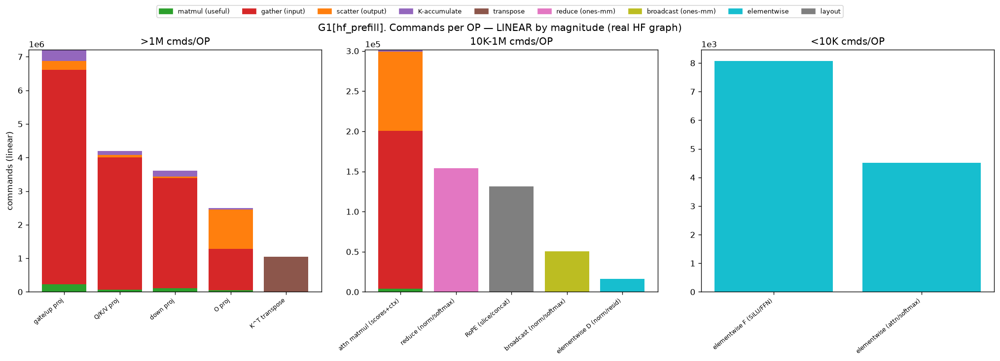
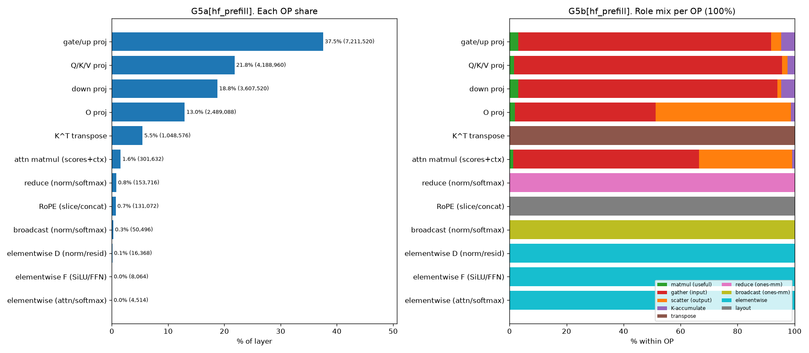
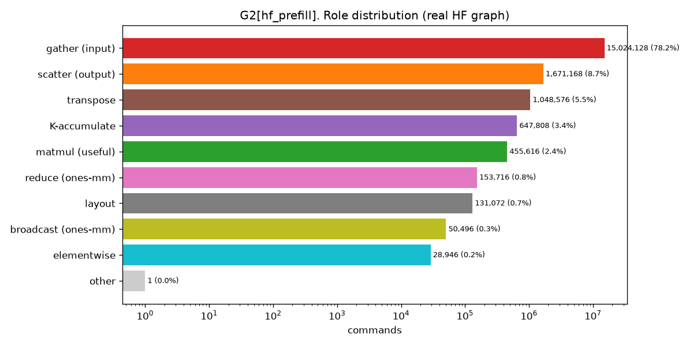
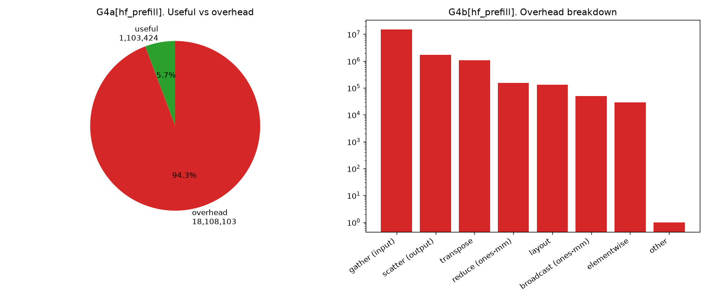
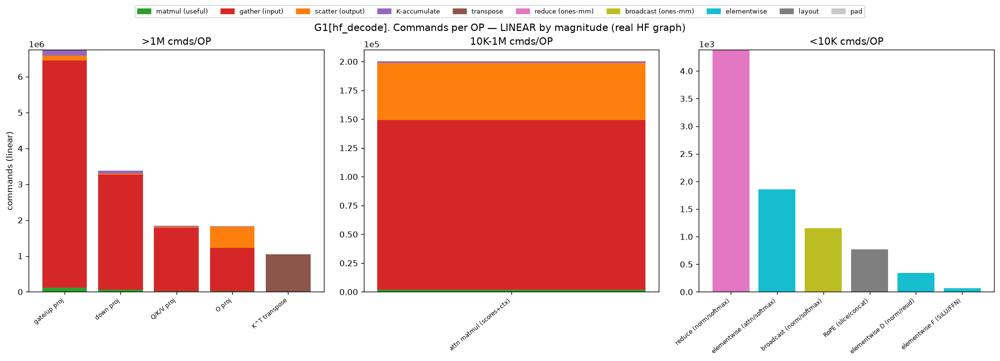
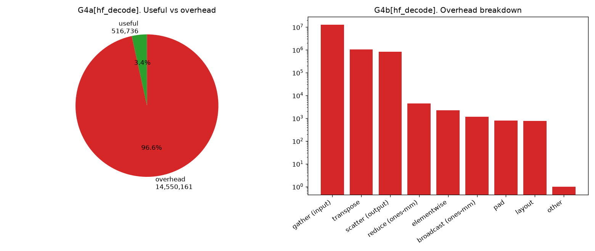
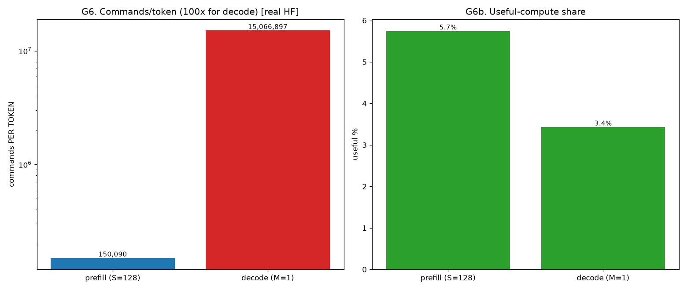
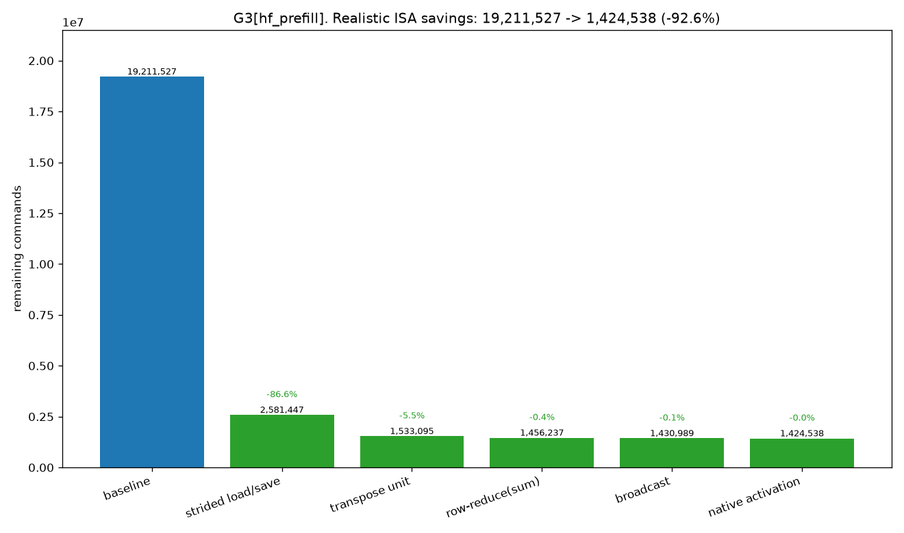
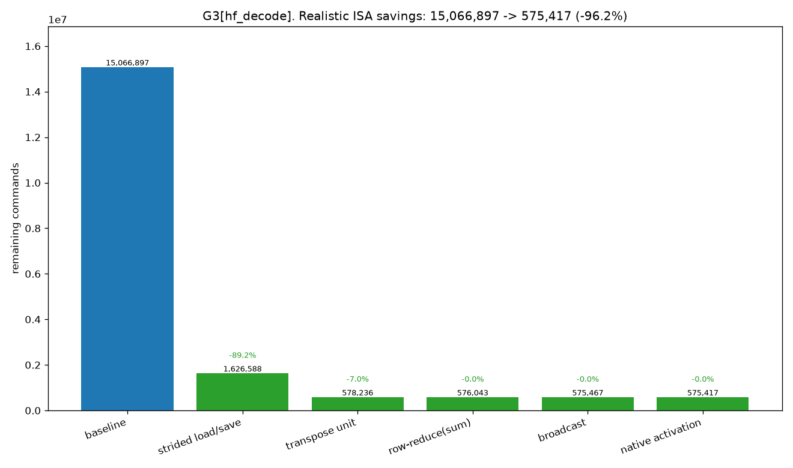

# TVM 기반 NPU 컴파일러 — 구현 상세 및 커맨드 오버헤드 분석 (실제 HF 모델 기준)

> 작성일: 2026-06-16
> 대상 모델: **Llama 3.2 3B** (HuggingFace `transformers`) / 대상 하드웨어: 본 레포 NPU c-model(`_poc/mysim`)
> 본 문서는 처음 보는 사람도 이해하도록 개념부터 서술한다. 코드: `d_compiler/`.
> **오버헤드 분석은 실제 HF `LlamaDecoderLayer`를 frontend로 import한 그래프를 기준으로 한다(아래 §6.0).**

---

## 0. 한 문장 요약

> 신경망(Llama 레이어)을 **TVM Relax 그래프**로 받아 → NPU가 못 하는 연산을 가능한 연산 조합으로 바꾸고 → 행렬곱을 **64×64 타일**로 쪼개 → **NPU 명령어**로 생성 → `mysim`에서 돌려 정답과 대조하는 **컴파일러**다.

핵심 결과(실제 HF Llama 3.2 3B 레이어 1개, frontend import 그래프 기준):
- 한 레이어 명령의 **유효 행렬곱은 prefill 5.7% / decode 3.4%뿐**, 나머지는 데이터 이동·우회 오버헤드.
- **gather(입력 타일을 연속으로 모으는 복사)가 prefill 78.2% / decode 84.1%** 로 압도적.
- 미지원 ISA(특히 strided load/save) 추가 시 명령을 **현실적으로 prefill −92.6% / decode −96.2%** 감축 가능.
- **decode는 토큰당 명령이 prefill의 100배** — GEMV(M=1)+가중치 재적재의 구조적 비효율.

---

## 1. 대상 하드웨어와 시뮬레이터 (배경)

### 1.1 NPU c-model
- **64×64 PE 행렬 배열**: 한 번에 64×64 타일 행렬곱.
- **G-buffer**: 평탄한 1D 메모리. FP16 저장, float32 계산, **저장(save) 시에만 FP16 반올림**.
- **명령은 contiguous(연속) 메모리만** load/save (stride 접근 없음 — 오버헤드의 핵심 원인).
- **루프·분기 없음.** → 컴파일러가 모든 반복을 펼쳐(unroll) 명령을 나열.

### 1.2 mysim (주어진 실행기)
`_poc/mysim.cpp`는 동작 시뮬레이터로 모든 원소를 stdout 출력한다. 기능 검증엔 좋지만 **실제 3072차원 전체 레이어를 끝까지 돌리는 건 비현실적**(출력량 폭발). 그래서 검증은 "작은 차원 전체 + 실가중치 조각". **mysim은 수정 불가**(주어진 ISA가 타깃). 사이클 모델이 없으므로 본 분석의 "오버헤드"는 **정적 명령 수**(프로그램 크기 ≈ fetch/issue 부하)이며 latency가 아니다.

---

## 2. 전체 컴파일러 구조

### 2.1 두 층의 IR
- **Relax** = 그래프 IR(텐서·op, "무엇을"). **TIR** = 루프 IR("어떻게"). 흐름: `Relax → TIR → NPU 명령(ISA)`.

### 2.2 모듈 지도 (`d_compiler/npu_compiler/`)
| 모듈 | 역할 |
|---|---|
| `frontend.py` | **PyTorch(HF) → Relax** (torch.export → from_exported_program → FoldConstant → import_legalize) |
| `import_legalize.py` | 고수준 op(silu/softmax/mean/rsqrt…) → 우리 primitive |
| `legalize.py` | 수동 빌더(rms_norm/rope/softmax/silu/swiglu) |
| `model.py` | Llama 레이어 Relax 조립 + numpy 참조 |
| `memplan.py` | 정적 메모리 배치(모든 텐서의 G-buffer 오프셋 고정) |
| `codegen.py` | Relax → NPU 명령. matmul은 TIR 백엔드로 위임, 나머지는 직접 emit. role 태깅·per-OP 기록(`emit_log`) |
| `tir_backend.py` | matmul 전용 TIR+tensorize + walker(TIR→ISA) |
| `isa.py` | 32비트 명령 인코더(mysim과 바이트 대조 검증) |
| `driver.py`/`runtime.py` | 묶기 + mysim 빌드·실행 |
| `cost.py` | 정적 분석기(명령 수, role별·OP별 집계) |

### 2.3 두 백엔드와 라우팅
- **direct**(`codegen.py`): 비-matmul op(elementwise/transpose/reduce/broadcast/slice/concat) + 행렬곱 오라클.
- **TIR**(`tir_backend.py`): 행렬곱 전용(타일+tensorize, input reuse).
- 라우팅: 모든 `relax.matmul` → TIR, 나머지 → direct.

---

## 3. 행렬곱의 TIR lowering (핵심, 6단계)

`relax.matmul` 한 줄이 NPU 명령이 되기까지(예: `C[128,128]=A@B`, 64×64 타일 2×2×2=8개):

1. **Relax** — `lv = R.matmul(x, w)` (무엇을).
2. **LegalizeOps → TIR** — 스칼라 3중 루프 `for i,j,k: C[i,j]+=A[i,k]*B[k,j]`.
3. **tir.Schedule** — `split`(64타일) → `reorder`(바깥 M,N,K / 안 64블록) → `decompose_reduction`(C=0 분리) → `tensorize`(안쪽 64³ 루프 → `call_extern("npu_gemm_acc")` 1개).
4. **match_buffer/access_ptr** — 타일의 시작·행간격을 **심볼**로 표현.
5. **_Walker** — 루프 펼침 + `off = 행×행폭 + 열` 로 심볼을 실주소화 + **gather**(연속화)·m_mul·누적 명령 emit. (NPU엔 루프가 없어 전부 펼침.)
6. **NPU ISA** — 평탄한 명령 목록.

> 단계별 IR은 `python d_compiler/walkthrough_tir.py`로 직접 관찰 가능.

---

## 4. 컴파일러가 적용한 최적화

| # | 최적화 | 내용 | 효과 |
|---|---|---|---|
| 1 | **input reuse** | 같은 `(주소,stride)` 입력 타일을 한 번만 gather 후 재사용 | 중복 gather 제거(3B matmul −72%) |
| 2 | **fill fusion** | C 0초기화를 표시만, 첫 누적이 덮어씀 | 0초기화 명령 제거 |
| 3 | **contiguous-skip** | 이미 연속(차원=64)이면 gather 생략 | 불필요 복사 제거 |
| 4 | **reduce/broadcast 전용 op 분리** | mean/softmax의 reduce·broadcast를 `relax.sum`/`relax.broadcast_to`로 → 모든 `relax.matmul`은 진짜 GEMM → TIR 단독 | matmul 경로 단일화 |
| 5 | **비-64 패딩(fallback 제거)** | 비-64배수 차원을 TIR 경로가 직접 패딩(byte-exact) | direct fallback 제거 |

미구현(최대 잠재 절감): **가중치 사전패킹** — 가중치는 상수이므로 tile-blocked 연속 배치로 미리 깔면 §6의 gather 대부분을 ISA 없이 제거 가능.

---

## 5. 정확성 검증 (실제 HF 포함)

- **실제 `transformers.LlamaDecoderLayer`(Llama 3.2 3B)와 수치 동등성**: 우리 2D 레이어에 실제 HF 가중치를 복사해 출력 비교 → **최대 상대오차 4.3e-7 (동일).** 구성요소별로도 RMSNorm 0, MLP 0, attention 5e-7로 일치.
- frontend로 import한 전체 Llama 블록(작은 차원) end-to-end: torch 대비 ~2.5%.
- 실제 Llama 3.2 3B 가중치 조각(q/k/v/o proj, FFN): ≤0.36%.
- 행렬곱: 임의 차원에서 TIR=direct=tiled_fp16_reference (byte-exact).
- (제외) softmax의 **reduce-max(max 빼기)** — ISA에 없어 생략.

---

## 6. 커맨드 오버헤드 분석 (실제 HF 그래프 기준)

### 6.0 분석 기반 — "진짜 HF"를 쓰는 방법과 그 한계

**literal HF 레이어는 우리 컴파일러로 그대로 들어오지 않는다.** 실제 `transformers.LlamaDecoderLayer`는 ① `torch.export`가 `_assert_tensor_metadata` 같은 우리 import 미지원 노드를 내고, ② 어텐션이 **4D 배치 텐서(batch,head,seq,dim)** 인데 **우리 NPU codegen은 2D 전용**(NPU 타일 모델이 2D)이라 4D matmul/transpose/softmax를 처리할 수 없다. (실측: import 시 `AssertionError: Unsupported function type _assert_tensor_metadata.default`.)

그래서 분석은 **HF Llama 3.2 3B의 연산을 head 루프로 펼친 2D 레이어**를 쓰되, **그 레이어가 실제 HF와 수치적으로 동일함을 증명**(§5, rel 4.3e-7)하고 **실제 frontend(torch.export→import_legalize)로 import한 그래프**를 측정한다. 즉:
- 연산(수식)은 **실제 transformers와 검증된 동일**.
- 그래프는 **실제 import 경로**로 생성(수동 빌더 아님). per-OP는 codegen의 `emit_log`로 binding별 귀속.
- HF 충실 포인트: RoPE는 **실제 HF식 slice+neg+concat**(→ layout), Kᵀ 전치는 **KV-head당 1회**(HF 배치 동작과 동일).

두 시나리오: **prefill**(S=128 토큰 동시), **decode**(M=1 토큰 생성, KV 캐시 길이 L=128; NPU 특성상 M=1은 64로 패딩).

### 6.1 Prefill (S=128) — 구성요소별 (총 19,211,527 명령)

| OP | 레이어 합 | % | 비고 |
|---|---:|---:|---|
| gate/up proj | 7,211,520 | 37.5% | 거의 gather |
| Q/K/V proj | 4,188,960 | 21.8% | 거의 gather |
| down proj | 3,607,520 | 18.8% | 거의 gather |
| O proj | 2,489,088 | 13.0% | gather+scatter |
| K^T transpose | 1,048,576 | 5.5% | 전치 |
| attn matmul (scores+ctx) | 301,632 | 1.6% | gather+scatter |
| reduce (norm/softmax) | 153,716 | 0.8% | ones-mm |
| RoPE (slice/concat) | 131,072 | 0.7% | layout(HF식) |
| broadcast (norm/softmax) | 50,496 | 0.3% | ones-mm |
| elementwise (norm/resid/SiLU/softmax) | ~28,946 | 0.2% | |

**role 분포**: gather **78.2%**, scatter 8.7%, transpose 5.5%, K-accumulate 3.4%, **matmul(유효) 2.4%**, reduce 0.8%, layout 0.7%, broadcast 0.3%, elementwise 0.2%.
**유효 연산(matmul+누적) = 5.7%**, 나머지 94.3%가 오버헤드.


*G1[HF prefill]: 구성요소별 명령 수(크기 tier별 선형). 큰 projection은 막대 대부분이 빨강(gather), 초록(matmul)은 바닥의 얇은 띠.*


*G5[HF prefill]: (좌) OP별 레이어 비중 — 상위 4개 projection이 ~91%. (우) OP별 role 구성(100%) — projection ~90% gather, O proj 절반 scatter, K^T 100% transpose, RoPE 100% layout, reduce/broadcast/elementwise 각각.*


*G2[HF prefill]: gather 78.2% 압도, 유효 matmul 2.4%.*


*G4[HF prefill]: 유효 5.7% vs 오버헤드 94.3%.*

### 6.2 Decode (M=1, L=128) — 구성요소별 (총 15,066,897 명령)

| OP | 레이어 합 | % |
|---|---:|---:|
| gate/up proj | 6,751,504 | 44.8% |
| down proj | 3,376,632 | 22.4% |
| Q/K/V proj | 1,846,704 | 12.3% |
| O proj | 1,834,560 | 12.2% |
| K^T transpose | 1,048,576 | 7.0% |
| attn matmul (scores+ctx) | 200,352 | 1.3% |
| reduce/broadcast/elementwise | ~8,000 | 0.0% |

**role 분포**: gather **84.1%**, transpose 7.0%, scatter 5.4%, K-accumulate 2.0%, **matmul(유효) 1.4%**, 나머지 ~0%.
**유효 연산 = 3.4%**(prefill보다 더 낮음).

**decode 특징**: M에 의존하는 부분(RMSNorm/softmax/A-gather)은 급감하지만 **가중치 gather는 M과 무관**해 거의 그대로 → gather 비중이 84.1%로 더 커진다. K^T transpose(캐시 [L,HD] 전치)는 prefill과 동일(1.05M)해 상대 비중이 7.0%로 상승.


*G1[HF decode]: projection의 gather가 더욱 지배. softmax/RMSNorm은 거의 소멸(M=1).*


*G4[HF decode]: 유효 3.4% vs 오버헤드 96.6%, gather가 prefill보다 더 큼.*

### 6.3 Prefill vs Decode — 토큰당 비용


*G6[HF]: (좌) 토큰당 명령 — decode가 prefill의 **100배**. (우) 유효 비율 — decode 3.4% < prefill 5.7%.*

| 지표 | prefill (128토큰 동시) | decode (1토큰) |
|---|---:|---:|
| 레이어 총 명령 | 19,211,527 | 15,066,897 |
| **토큰당 명령** | **150,090** | **15,066,897 (100×)** |
| 유효 연산 비율 | 5.7% | 3.4% |
| gather 비율 | 78.2% | 84.1% |

**왜 decode가 토큰당 100배인가**: 토큰 1개를 만들려고 **가중치 전체를 한 번 읽어야** 한다(projection의 gather는 M과 무관). 게다가 M=1이 **64로 패딩**되어 64×64 PE의 **1/64 행만 유효**. GEMV(행렬×벡터)를 행렬 엔진에 태우는 구조적 비효율. (배칭·KV캐시·양자화로 완화하는 영역. 우리 컴파일러엔 decode 전용 경로가 없어 동일 primitive로 추정한 per-token 비용이다.)

### 6.4 미지원 ISA 추가 시 절감 (상한 vs 현실)

각 미지원 연산을 전용 ISA로 대체할 때 줄어드는 명령. **상한** = 우회 role을 0으로 가정. **현실** = 대체 ISA가 새로 내는 명령(replacement)을 차감.

| 추가 ISA | 없애는 우회 | prefill 현실 절감 |
|---|---|---:|
| **strided load/save** | gather/scatter 복사 | **−86.6%** |
| transpose unit | Kᵀ 원소복사 | −5.5% |
| row-reduce(sum) | reduce=ones-mm | −0.4% |
| broadcast | broadcast=ones-mm | −0.15% |
| native activation | SiLU 체인 | −0.0% |
| **누적(현실)** | | **−92.6%** (남음 1,424,538) |


*G3[HF prefill]: 현실 절감 워터폴 — strided load/save 하나로 절벽(19.2M→2.6M).*


*G3[HF decode]: gather 비중이 더 커 현실 절감 누적 **−96.2%**(→575,417).*

**실행 시사점**: gather의 대부분은 **가중치 타일 gather**다. 가중치는 컴파일 타임 상수이므로 **호스트 사전패킹(소프트웨어, ISA 불필요)** 만으로도 이 86%의 큰 몫을 제거할 수 있다 — "−86%"는 ISA 없이도 상당 부분 달성 가능한 목표.

> reduce-max ISA는 절감이 아니라 안정 softmax(정확성)용이며 커맨드는 오히려 증가한다.

---

## 7. 결론 및 다음 단계

### 결론 (실제 HF 그래프 기준)
1. 명령의 **~94%(decode ~97%)가 데이터 이동·우회 오버헤드**, 유효 행렬곱은 prefill 5.7% / decode 3.4%뿐.
2. 근본 원인은 **NPU의 contiguous 전용 load/save** — 넓은 행렬 타일을 들어올 때(gather)·나갈 때(scatter) 복사. **strided load/save가 단일 최대 개선(−86%)**.
3. gather의 대부분이 **가중치**이므로 **가중치 사전패킹(소프트웨어)** 으로 ISA 없이도 큰 폭 절감 가능.
4. **decode는 토큰당 100배** — GEMV(M=1)+가중치 재적재. 배칭·KV캐시·사전패킹·양자화로 완화 대상.
5. 한계: literal 4D HF는 우리 2D 컴파일러로 import 불가 → **검증된 동등 2D 그래프**로 분석.

### 다음 단계
- **(SW) 가중치 사전패킹** 구현 → "ISA 없는 절감" 막대 추가.
- **(기능) 2D-batched 어텐션 지원** 또는 4D import 경로 → literal HF 직접 컴파일.
- **(SW) input reuse를 schedule(cache_read)로** + weight-stationary dataflow(PE 입력버퍼 재사용).
- **(분석) SEQ 스윕**(128→2048→4096) → attention(SEQ²) vs projection(SEQ) 역전 지점.
- **(기능) decode 경로**(KV 캐시 재사용, 배칭) 구현 후 재측정.
- **(정확성) reduce-max** 지원 시 안정 softmax.

---

### 부록 A. 재현
```bash
# 실제 HF 그래프 기준 분석 + 그래프 (prefill/decode)
python d_compiler/analyze_hf.py          # report/figs/*_hf_*.png
# transformers 동등성 검증은 analyze_hf.py의 PrefillLayer를 HF 가중치로 비교(§5)
# matmul lowering 단계별 IR
python d_compiler/walkthrough_tir.py
```

### 부록 B. 측정 한계
- 정적 명령 수만 측정(사이클 latency·메모리 대역폭 미반영) → 상대·구조 분석에 유효.
- literal 4D HF는 우리 2D codegen 미지원 → transformers와 **rel 4.3e-7로 검증된 2D 동등 그래프** 사용.
- decode는 컴파일러 전용 경로가 없어 동일 primitive로 추정(KV 길이 L=128 가정).
- ISA 절감 "현실" 모델의 replacement 가정은 `analyze_hf.py`의 `feats`에 명시.
