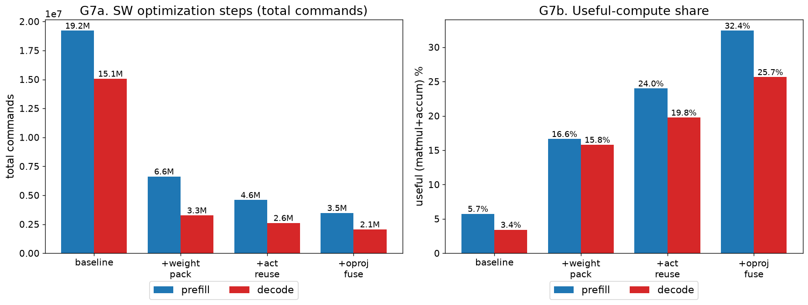
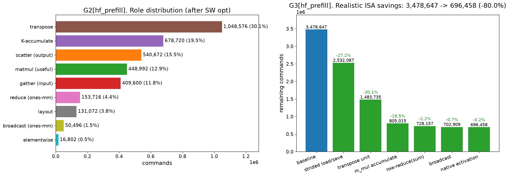
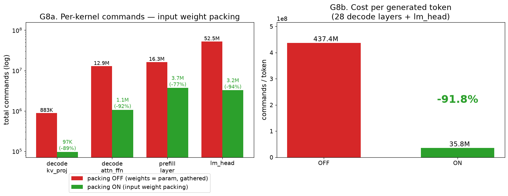
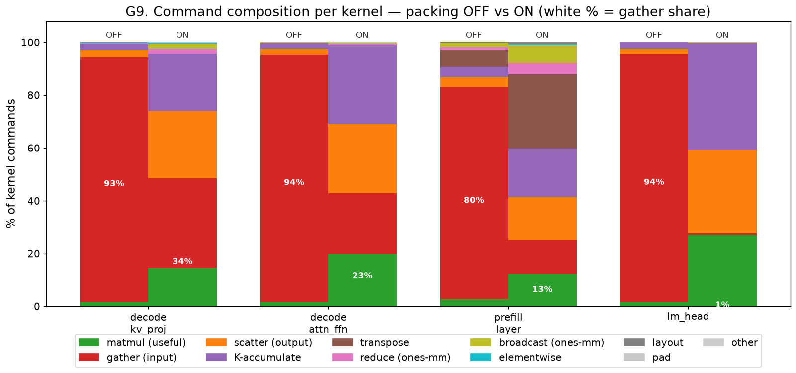

# NPU 컴파일러 확장 보고서 — O-proj 융합 최적화 · Prefill→Decode 생성 · 실측 오버헤드 분석

> 작성일: 2026-07-03
> 대상 하드웨어: 본 레포 NPU c-model(`_poc/mysim`) / 대상 모델: Llama 3.2 3B 계열
> 코드: `d_compiler/`  ·  선행 문서: `report/report_0616.md`(컴파일러 구조·matmul lowering·오버헤드 분석)
> **이 문서는 처음 보는 사람도 이해하도록 배경부터 설명한다.** 선행 문서(0616)를 안 읽었어도 따라올 수 있게 §0에 필요한 개념을 요약한다.

이 보고서는 선행 작업(0616) 이후 **추가로 구현·분석한 것**을 정리한다:
1. **O-proj head 융합 최적화** — prefill 명령을 추가로 크게 줄인 컴파일러 최적화 (§2)
2. **Prefill→Decode 전체 토큰 생성 지원** — KV cache를 포함한 실제 자기회귀 토큰 생성 (§3~§6)
3. **실제 생성 커널의 3B 실측 오버헤드 분석 → 입력 가중치 패킹 구현** — 최대 병목(미패킹 가중치 gather ~93%)을 찾아 패킹으로 **토큰당 명령 −91.8%(437M→35.8M)** 달성, byte-exact (§7, 핵심 결론)

그리고 그 사이의 그래프/코드 정비(§2.4, §3.1)도 함께 다룬다.

---

## 0. 배경: 이 NPU와 컴파일러를 이해하는 데 꼭 필요한 것

### 0.1 이 NPU가 할 수 있는 것 / 없는 것

우리가 컴파일 타깃으로 삼는 NPU c-model은 **64×64 행렬 연산기**다. 특징:

- **할 수 있는 것**: 64×64 타일 단위 행렬곱(`m_mul`), 벡터 elementwise 연산(덧셈·곱셈·exp 등), **연속(contiguous) 메모리 load/save**.
- **할 수 없는 것**:
  - **띄엄띄엄(strided) 메모리 접근** — 반드시 연속된 값만 읽고 쓴다.
  - **분기(if)·반복(loop)** — 하드웨어에 제어흐름이 없다. **컴파일러가 모든 것을 미리 펼쳐서(unroll)** 명령을 나열한다.
  - reduce-max, 정렬, 난수 등.
- **mysim**: 주어진 시뮬레이터. 수정 불가. (초기엔 "모든 원소를 출력해 3B는 못 돈다"고 봤으나, `runtime.py`가 mysim stdout을 버리고 결과는 `--gout` 바이너리로 읽으므로 **출력은 병목이 아니다**.) 실제 병목은 **실행 규모** — 3B 커널 한 호출이 명령 수(수백만~수천만) + G-buffer I/O(수백 MB)로 **수 분** 걸려, 28층 전체 생성은 비실용적. → **정확성 검증은 소차원**(§6), **실차원은 명령 수 분석**(§7)으로 한다. (소규모 3B 실행 자체는 `demo_generate_3b.py`로 확인됨.)

### 0.2 gather와 scatter — 오버헤드의 정체

행렬은 메모리에 **한 행씩 이어서(row-major)** 저장된다. 예를 들어 `[4,4]` 행렬:

```
        메모리 주소:  0  1  2  3  4  5  6  7  8 ...
                     a  b  c  d  e  f  g  h  i ...   (행0=abcd, 행1=efgh, ...)
```

NPU가 **왼쪽 위 2×2 블록** `[[a,b],[e,f]]`을 연산기에 올리려면, `a,b`(주소 0,1)와 `e,f`(주소 4,5)가 **떨어져 있다**(사이에 c,d). NPU는 이 strided 읽기를 못 하므로, **연속 임시버퍼로 한 행씩 복사**한다:

```
복사 → 임시버퍼: [a b e f]   (이제 연속 → 연산기에 올릴 수 있음)
```

- 이 "흩어진 입력을 모으는 복사" = **gather**.
- 반대로 "연산 결과를 넓은 행렬의 흩어진 자리에 써넣는 복사" = **scatter**.

**gather/scatter는 실제 계산이 아니라 데이터 이동 오버헤드**다. 선행 분석(0616)의 결론이 바로 "명령의 대부분이 gather/scatter 같은 우회 오버헤드"였다.

### 0.3 컴파일러 파이프라인 (아주 간단히)

```
PyTorch 레이어 → (frontend) → Relax 그래프 → (codegen / tir_backend) → NPU ISA → mysim
```

- **Relax**: 연산 그래프 IR(“무엇을 계산하나”).
- **codegen.py / tir_backend.py**: 그래프를 64×64 타일 NPU 명령으로 낮춘다(“어떻게 계산하나”). 행렬곱은 TIR 경로로 타일링된다.
- 자세한 내용은 선행 문서(0616) §2~§3 참고.

### 0.4 Prefill과 Decode

LLM 추론은 두 단계다:

- **Prefill**: 입력 프롬프트 전체(예: 128 토큰)를 **한 번에** 처리. 모든 토큰의 K/V(어텐션 키·값)를 계산.
- **Decode**: 그 뒤 토큰을 **한 개씩** 생성. 새 토큰 1개만 계산하고, 과거 토큰의 K/V는 **KV cache**에 저장해 재사용(다시 계산하지 않음).

선행 문서(0616)는 prefill의 오버헤드를 분석했다. 이 문서의 §3~§6은 **decode와 전체 생성**을 실제로 구현한 내용이다.

---

## 1. 선행 작업 요약 (0616에서 어디까지 왔나)

선행 문서에서 이미 달성한 것(이 문서의 출발점):

- prefill 레이어 하나를 NPU 명령으로 컴파일 + 실제 HF와 수치 동등 검증(rel 4.3e-7).
- **새 ISA 없이 SW 최적화 3단계**로 prefill 명령 대폭 감축:
  1. **가중치 사전패킹** (−65.5%): 상수 가중치를 미리 타일 배치 → 가중치 gather 제거.
  2. **활성화 gather 재사용** (누적 −76.1%): 같은 활성화를 여러 matmul이 다시 복사하지 않고 1회만.
  3. (이 문서에서 추가하는) **O-proj head 융합** ← §2

이 문서는 여기에 **O-proj 융합**을 더해 SW 최적화를 완성하고(§2), 그다음 **decode/생성**으로 넘어간다(§3~).

---

## 2. O-proj head 융합 최적화

### 2.1 문제: O projection이 명령의 최대 비중인데, 그 90%가 scatter

가중치 패킹 + 활성화 재사용을 적용한 뒤, per-OP 비용을 보니 **O proj(어텐션 출력 투영)** 가 1위(28.5%)였다. 그런데 그 안을 뜯어보니:

| OP | 총 명령 | 그중 scatter | 출력 shape |
|---|---:|---:|---|
| **O proj** | 1,309,440 | **1,179,648 (90%)** | `[128, 3072]` |
| down proj | 461,792 | 49,152 (11%) | `[128, 3072]` |

**O proj의 scatter가 down proj의 정확히 24배**인데, 두 연산의 출력 shape는 똑같다. weight가 커서가 아니다(O proj 총 weight는 오히려 down보다 작다).

### 2.2 원인: 어텐션 출력을 head별로 24번 따로 계산해 더함

우리 2D 레이어는 GQA 어텐션을 **head별로 펼쳐서** 계산한다(24개 query head):

```
attn = head0결과 + head1결과 + ... + head23결과
     = Σ_h (ctx_h @ Wo_h)      각 항이 [128, 3072]
```

즉 **각 head가 full-width `[128, 3072]` 출력을 따로 만들어 메모리에 쓴다(scatter). 그게 24번.** (진짜 HF는 O proj를 한 번의 큰 행렬곱으로 하지만, 우리 2D 코드가 head별로 분해한 결과 이렇게 됨.)

```
head0: ctx0 @ Wo0 → [128,3072] 계산 → 메모리에 scatter
head1: ctx1 @ Wo1 → [128,3072] 계산 → 메모리에 scatter
... (24번) ...
그다음: 24개를 elementwise로 전부 더함
```

scatter는 §0.2에서 봤듯 비싼 복사인데, 그걸 넓은 출력에 24번 하니 폭발한 것.

### 2.3 해결: 하나의 누적기에 24개를 모으고, scatter는 1번만

`Σ_h (ctx_h @ Wo_h)`는 결국 **하나의 값**이다. 24개 중간결과를 각각 메모리에 쓸 필요 없이, **하나의 출력 누적기에 계속 더하다가, 다 끝난 뒤 딱 1번만 메모리에 쓰면** 된다.

우리 walker(TIR→ISA 변환기)는 이미 "출력 타일을 연속 누적기(`cbuf`)에 모았다가 마지막 `flush()`에서 scatter" 하는 구조가 있었다. 예전엔 **head마다 walker를 새로 만들어 각자 flush** → scatter 24회. 융합은 **24개 head를 하나의 walker로 돌려 `cbuf`를 공유하고 `flush()`를 마지막에 1번만** 한다.

```
칠판(누적기)을 하나 두고:
  칠판 = head0 결과
  칠판 += head1 결과      ← 메모리에 안 쓰고 누적기에서 더함
  ... head23까지 ...
마지막에: 칠판을 메모리로 scatter   ← 딱 1번!
```

**구현** (두 부분):
- `codegen._detect_oproj_groups`: 그래프에서 *"같은 shape의 matmul들만 잎으로 갖는 add-tree"*(=`Σ_h ctx_h@Wo_h`)를 자동 탐지. K·N이 64배수일 때만 적용(아니면 자동 skip).
- `tir_backend.emit_matmul_accumulate_group`: 24개 matmul을 **하나의 walker + 공유 누적기**로 실행하고 `flush()`를 1번만. 각 head의 재-초기화는 `suppress_fill`로 억제.

### 2.4 결과

| 지표 | 융합 전 | 융합 후 |
|---|---:|---:|
| O proj scatter | 1,179,648 (24회) | **49,152 (1회)** |
| O proj 총 명령 | 1,309,440 | **203,232 (−84.5%)** |
| prefill 레이어 총 명령 | 4,596,999 | **3,478,647 (−24.3%)** |

**SW 최적화 4단계 전체** (새 ISA 없이):

| 단계 | prefill | (baseline 대비) | decode |
|---|---:|---:|---:|
| baseline | 19,211,527 | — | 15,066,897 |
| +가중치 패킹 | 6,628,615 | −65.5% | 3,270,417 |
| +활성화 재사용 | 4,596,999 | −76.1% | 2,615,057 |
| **+O-proj 융합** | **3,478,647** | **−81.9%** | **2,061,516 (−86.3%)** |

- 유효 연산(실제 행렬곱) 비율: prefill **5.7% → 32.4%**, decode **3.4% → 25.7%**.
- 융합 후 **남은 최대 오버헤드는 K^T transpose**(prefill 30.1%, decode 50.9%) — SW로 못 건드리는 순수 전치. (이게 §3의 decode 설계에서 중요한 힌트가 된다.)
- **정합성**: 융합은 더하는 순서만 다른 동등 연산. mysim에서 비융합과 ≈1~2 fp16 ULP 일치 확인.


*G7: SW 최적화 4단계 — (좌) 총 명령 19.2M→3.48M(prefill)/15.1M→2.06M(decode), (우) 유효 연산 비율 5.7%→32.4%/3.4%→25.7%.*


*G23[prefill, 최종]: (좌) 명령 종류 분포 — 융합 후 K^T transpose(30.1%)가 최대, scatter는 15.5%로 감소. (우) 새 ISA 6종 추가 시 절감 waterfall.*

### 2.5 그래프/코드 정비 (부수 작업)

- **G1**(OP별 명령): transpose가 혼자 있던 첫 subplot을 없애고 **2-subplot(≥10K / <10K)** 으로 병합 → transpose가 다른 연산과 같은 축에서 비교됨.
- **G2+G3 통합**: role 분포(G2)와 ISA 절감 waterfall(G3)을 **한 그림의 좌/우 subplot**(`g23_*`)으로 합침 → "무엇이 오버헤드인가 → 그걸 없애는 ISA"가 한눈에.

---

## 3. Prefill → Decode 전체 토큰 생성 (개요)

여기서부터가 이 세션의 큰 작업이다. **실제로 토큰을 생성**하는 전체 파이프라인을 컴파일 경로로 구현하고 소차원에서 검증했다.

### 3.1 목표와 전략

- **목표**: 프롬프트를 받아(prefill) 토큰을 하나씩 생성(decode)하는 것을 컴파일된 NPU 커널로 수행, **numpy 기준과 정확히 일치**함을 검증.
- **전략**: "정확성 먼저, 규모는 나중." 소차원에서 end-to-end 검증(빠름). 실차원 3B는 실행은 되나 호출당 수 분이라 전체 생성은 비실용적 → 명령 수 분석(§7)으로.
- **코드 배치**: decode 전용 파일을 따로 두지 않고 **기본 모듈(`model.py`·`driver.py`)에 통합**. `codegen.py`는 손대지 않음(decode도 같은 백엔드 100% 재사용). prefill과 decode의 공통 배선은 `_attn_head`/`_residual_ffn` helper로 공유(중복 제거).

### 3.2 왜 decode는 prefill과 다른 코드가 필요한가

백엔드·연산은 공유하지만 **그래프 구조**가 다르다:

| | prefill | decode |
|---|---|---|
| 입력 | 전체 시퀀스 `x[S,D]` | 새 토큰 `x[1,D]` + **KV cache** |
| K/V | 전부 새로 계산 | 캐시에서 읽고, 새 토큰 것만 계산 |
| 상태 | stateless | **cache(과거)** 위에서 동작 |

decode의 존재 이유가 바로 **과거 K/V 재계산을 피하는 것**(캐시). 그래서 캐시를 다루는 별도 그래프가 필요하다.

---

## 4. KV cache 설계

### 4.1 정적 최대길이 + 마스킹

프로덕션에서 흔한 방식이자 우리 NPU(분기 없음)에 맞는 방식:

- 시작 시 캐시를 **최대 길이 MAX로 미리 예약**: `Kt[HD, MAX]`, `Vc[MAX, HD]` (KV head마다).
- 매 스텝, 현재 위치 `pos` 슬롯에 새 토큰의 K/V를 써넣음.
- attention은 **항상 MAX 전체**에 대해 돌리고, 런타임 `mask`가 아직 안 찬 부분(`j > pos`)을 큰 음수로 가려 softmax에서 0이 되게 함.

```
pos=10, MAX=64 → attention은 64칸 전부 계산하되, mask가 11~63을 무시.
```

이 방식의 장점: **명령 스트림이 고정**(항상 MAX) → decode 커널을 **한 번만 컴파일**하면 모든 스텝에 재사용(분기·재컴파일 없음). 단점: 짧은 시퀀스에서 빈 슬롯도 계산(낭비). 이 낭비는 버킷팅으로 완화 가능하고, paged KV cache(vLLM/MLC)는 더 효율적이지만 **동적 인덱싱이 필요해 우리 정적 NPU엔 부적합**.

### 4.2 K를 "전치해서" 저장 (중요)

§2.4에서 decode의 최대 비용이 **K^T transpose**(50.9%)라고 했다. 원인은 매 스텝 캐시 `[L,HD]`를 통째로 `[HD,L]`로 전치하기 때문. 그래서 **캐시를 처음부터 `Kt[HD, MAX]`(전치된 형태)로 저장**한다:

- 새 토큰의 K는 **열 하나 추가**(`Kt[:, pos] = k_new`)만 하면 됨.
- 매 스텝 전치가 **사라진다.**

V는 `Vc[MAX, HD]`로 저장하고 새 토큰은 **행 추가**(`Vc[pos, :] = v_new`).

### 4.3 위치 정합성 (prefill이 쓴 자리를 decode가 그대로 봐야 함)

- 각 토큰의 K는 **자기 절대 위치 `pos`로 RoPE 회전한 뒤 slot `pos`에 저장**된다.
- decode의 Q도 현재 위치로 RoPE 회전 → `Q·K`가 상대 위치를 올바르게 반영(RoPE 성질).
- prefill이든 decode든 **slot 인덱스 = 절대 위치**로 일관되게 쓰고 읽는다. 이것이 §5.3의 M1·M6 테스트로 검증된다.

---

## 5. 구현

### 5.1 decode를 정적 커널 2개로 쪼갠 이유

캐시의 새 토큰을 **slot `pos`에 써넣는 것**이 유일한 "동적 주소" 작업인데, 우리 컴파일러는 주소를 컴파일 타임에 고정하므로 런타임 `pos`로 쓸 수 없다. 그래서:

```
[NPU] kv_proj      : x_new → 새 토큰의 K/V 계산 (정적)
[CPU] host append  : 그 K/V를 캐시 slot pos에 써넣음 (동적 offset → host가 numpy로)
[NPU] attn_ffn     : 캐시 대상 attention + FFN (정적, mask로 pos까지만)
```

즉 **동적인 부분만 host(CPU)가 맡고, NPU 커널 2개는 완전히 정적**이라 분기 없이 unroll된다.

### 5.2 CPU / NPU 역할 분담

| 처리 | 담당 | 이유 |
|---|---|---|
| embedding lookup (token id → 벡터) | **CPU** | 동적 인덱스 gather, 연산량 0, 테이블 큼 |
| 모든 행렬곱 (Q/K/V·attention·FFN·**lm_head**) | **NPU** | 텐서 연산, weight-packing 가능 |
| cache append (slot 쓰기) | **CPU** | 동적 offset |
| argmax / sampling (logits → 토큰) | **CPU** | reduce-max·정렬·난수, 연산량 작음 |

> 주의: **lm_head는 "행렬곱"이라 NPU**다. CPU로 보내는 건 그 결과(logits)에 대한 argmax지, logits를 만드는 matmul이 아니다.

### 5.3 파일과 함수 (decode 전용 파일 없이 기본 모듈에 통합)

**`npu_compiler/model.py`** — 그래프 빌더 + numpy 기준:

| 함수 | 역할 |
|---|---|
| `build_kv_proj_module(cfg)` | decode 커널1: `x[1,D]` → 새 K/V (K는 RoPE 적용) |
| `build_attn_ffn_module(cfg, MAX)` | decode 커널2: `x[1,D]` + 캐시(+런타임 mask) → `y[1,D]` |
| `build_prefill_layer_module(cfg, S)` | 배치 prefill 레이어: `x[S,D]` → 출력 y + K/V (한 번에) |
| `build_lm_head_module(cfg, vocab)` | RMSNorm + lm_head → `logits[1,vocab]` |
| `make_gen_weights(cfg, n_layers, vocab)` | 레이어별 가중치 + embedding·lm_head |
| `ref_*`, `decode_self_consistency` | numpy(float64) 기준(정답) |
| `_attn_head`, `_residual_ffn` | prefill·decode 공통 배선 helper (중복 제거) |

**`npu_compiler/driver.py`** — host 실행 루프:

| 함수 | 역할 |
|---|---|
| `generate(...)` | 단일 레이어 prefill→decode (은닉상태 입출력, 검증용) |
| `generate_tokens(..., batched_prefill=)` | **멀티레이어 자기회귀 토큰 생성** (전체 파이프라인) |

### 5.4 전체 생성 흐름 (`generate_tokens`)

```
[CPU] prompt token_ids ─embedding─▶ x
   │
[NPU] 배치 prefill: 레이어당 1커널(build_prefill_layer_module)
        → 모든 레이어 KV cache 씨딩 + 프롬프트 hidden 산출
   │
[NPU] lm_head(마지막 토큰 hidden) → logits   [CPU] argmax → 첫 생성 토큰
   │
   └▶ decode 루프 (토큰마다):
        [CPU] embed(직전 토큰) → x[1,D]
        [NPU] N개 레이어: (kv_proj → [CPU]append → attn_ffn)  ← 각 레이어 자기 캐시
        [NPU] lm_head → logits   [CPU] argmax → 다음 토큰
```

- 커널은 **한 번만 컴파일**하고 레이어·스텝에 재사용(가중치가 입력이라 가능).
- **배치 prefill**은 프롬프트를 레이어당 1커널로 처리(토큰별 반복 대신). §4.2 레이아웃 계약(K.T→열, V→행) 덕에 decode가 그 캐시를 그대로 이어받는다.

---

## 6. 검증 (`tests/test_decode.py`, 소차원, 전부 PASS)

실차원 3B는 호출당 수 분이라 전체 생성 검증이 비실용적 → 두 소차원 설정으로 검증한다:
- **MEDIUM**: 64배수 차원(D=64, 단일 head) → TIR 타일 경로.
- **REDUCED**: GQA(H=4, KV=2, HD=16) → direct/패딩 경로.

| # | 검증 내용 | 결과 |
|---|---|---:|
| M1 | prefill-전체 == prefill(프롬프트)+decode(나머지) (float64) | rel < 1e-9 |
| M2 | decode 커널 1스텝 == numpy (mysim) | fp16 수준 |
| M3 | 다중스텝 생성 == numpy (mysim) | MEDIUM rel 6.1e-4, REDUCED 9.8e-4 |
| **M4** | 멀티레이어(2층) 전체 LM greedy 생성 == numpy | **토큰 완전 일치** (MEDIUM `[21,21,9]`, REDUCED `[28,8]`) |
| M5 | 배치 prefill K/V == numpy | fp16 수준 |
| **M6** | 배치 prefill + decode 생성 == numpy | **토큰 완전 일치** |

각 테스트의 의미:
- **M1**: 캐시 로직(전치 저장·append·위치 정합)이 옳으면, 토큰별로 생성한 결과가 한 번에 prefill한 것과 같아야 한다. 이게 캐시의 근본 정확성.
- **M2/M3**: 컴파일된 decode 커널이 numpy와 일치(1스텝 → 다중스텝).
- **M4/M6**: embedding·멀티레이어·lm_head·argmax·(배치)prefill을 모두 엮은 **실제 토큰 생성**이 numpy와 **토큰 id까지 완전히 일치**. argmax는 이산 선택이라, 일치한다는 것은 전체 경로가 수치적으로 정확하다는 강한 증거다.

기존 테스트(`test_real_layer`의 byte-exact prefill 등)도 회귀 없이 통과 — 통합·helper 리팩터가 기존 동작을 보존함을 확인.

---

## 7. 실측 오버헤드 분석 — 실제 생성 커널 (3B 차원) ★핵심

정확성을 검증했으니(§6), 이제 **실제 구현된 생성 커널이 실차원(3B)에서 얼마나 무겁고, 어디를 먼저 최적화해야 하는지**를 측정한다. `analyze_kernels.py`로 `driver.generate_tokens`가 실제 돌리는 4개 커널을 3B 차원(D=3072, H=24, KV=8, HD=128, F=8192)으로 컴파일해 role·op별로 분해했다(**컴파일-only, mysim 실행 없이 명령 수 분석**).

> ⚠️ 선행 문서(0616) §6의 오버헤드 분석과 **측정 대상이 다르다**: 0616은 가중치를 **상수(constant)** 로 둔 그래프(**패킹 적용**)를 분석했고, 여기서는 **실제 생성 커널**(가중치를 **입력(param)** 으로 두어 28층·모든 토큰에서 재사용)을 분석한다. 이 차이가 §7.2 ①(최대 발견)의 핵심이다.

### 7.1 커널별 실측 (3B, MAX=128, S=128, vocab=128256)

| 커널 | 총 명령 | useful(mmul+accum) | gather | 지배 연산 | 컴파일 | G-buffer |
|---|---:|---:|---:|---|---:|---:|
| decode `kv_proj` | 883,392 | 4.0% | **92.7%** | K/V proj | 4s | 27 MB |
| decode `attn_ffn` (MAX=128) | 12,863,548 | 4.1% | **93.6%** | FFN gate/up 52% + down 26% | 56s | 393 MB |
| 배치 `prefill layer` (S=128) | 16,285,377 | 7.0% | 80.2% (+transpose 6.4%) | FFN gate/up 44% | 111s | 506 MB |
| `lm_head` (vocab 128256) | 52,494,924 | 4.2% | **93.9%** | lm_head matmul | 225s | 1610 MB |

**한 토큰 생성 비용**(현재=미패킹 상한): decode 레이어(`kv_proj`+`attn_ffn`) = **13,746,940** × 28층 + `lm_head` **52,494,924** ≈ **≈437M 명령/토큰**.

### 7.2 핵심 발견

**① 가중치 gather가 명령의 ~93% — 패킹이 안 걸려 있었다 (최대 병목 → §7.3에서 해결).**
생성 커널은 **28층·모든 토큰에서 커널을 재사용**하려고 가중치를 **입력(param)** 으로 둔다. 그런데 우리 가중치 패킹(0616의 −65.5% 최적화)은 **상수(constant)에만** 적용됐다(`memplan`이 상수만 tile-blocked로 미리 배치). → **생성 커널엔 패킹이 안 걸려 가중치를 매 사용마다 gather**했다. 그 결과 useful 연산이 **4~7%**로 붕괴(0616 패킹 후 prefill 32.4%와 대조). **이게 1순위 병목이었고, §7.3에서 「입력 가중치 패킹」으로 해결한다.**

**② K^T transpose는 사라졌다 (설계가 이미 해결).**
0616의 decode 분석은 매 스텝 캐시를 통째로 전치하는 naive 버전이라 transpose가 **50.9%**였다. 실제 구현은 **캐시를 전치 저장**(§4.2)하므로 `kv_proj`·`attn_ffn`에 **transpose가 0**이다. (배치 prefill 레이어만 자기 attention용 Kᵀ 6.4% — prefill당 1회.) → **0616이 최대 병목으로 짚었던 transpose는 이미 구조적으로 제거됨.**

**③ decode 레이어의 78%는 FFN이다 (gate/up 52% + down 26%).**
전형적 LLM decode 프로파일. 그리고 이 FFN도 전부 gather 지배(가중치 미패킹). → **FFN 가중치 패킹이 단일 최대 효과.**

**④ lm_head가 거대하다 (52.5M — decode 레이어의 3.8배).**
어휘 vocab=128256 때문에 `[1,3072]@[3072,128256]`의 거대 matmul(어휘 가중치 788MB). 역시 gather 93.9%(미패킹). 토큰마다 1회 필요.

**⑤ 정적-max의 attention 비용은 짧은 컨텍스트에선 작다.** `attn_ffn`을 MAX(컨텍스트 길이)별로 스윕:

| MAX | 총 명령 | attention(score/ctx) | FFN(상수) |
|---:|---:|---:|---:|
| 128 | 12,863,548 | 185,840 (1.4%) | 10,103,560 (78%) |
| 512 | 13,128,316 | 392,240 (3.0%) | 10,103,560 (77%) |
| 2048 | 14,187,388 | 1,421,936 (10.0%) | 10,103,560 (71%) |

**FFN 비용은 컨텍스트와 무관하게 상수(10.1M)로 지배적**이고 attention은 MAX에 비례하지만 2048에서도 10%뿐 — **총 명령은 16× 컨텍스트에도 +10%만** 증가. → 정적-max 빈슬롯 낭비는 (아주 긴 컨텍스트가 아닌 한) **2순위**.

### 7.3 입력 가중치 패킹 — 구현 & 실측 (§7.2 ①의 해결) ★

**병목이 "미패킹 가중치 gather"였으므로, 상수에만 되던 패킹을 입력(param) 가중치로 확장했다.**

- **패킹 자체는 저번(0616)과 동일** — 가중치 `[K,N]`을 64×64 타일이 연속이 되도록 `[Kt,Nt,64,64]`로 재배열해 gather를 없앤다. 다른 건 **적용 대상뿐**: 저번은 그래프에 박힌 **상수** 가중치, 이번은 커널 입력인 **param** 가중치.
- **왜 됐나(정당성)**: 가중치는 생성 내내 **안 바뀌는 정적 데이터**라 **딱 한 번 패킹**해 28층·모든 토큰에서 재사용 가능. (활성화는 토큰마다 바뀌어 못 함.)
- **구현**: `memplan.plan(pack_params=True)`가 matmul-B인 `W*` param을 `packed_meta`에 표시 → codegen이 `b_pack_nt` 전달 → walker가 `packed_src`로 **타일 연속 read(gather 0)**. host는 `run_compiled`이 넣을 때 같은 방식으로 재배열. **재컴파일 없음(param 유지), 결과 byte-exact**(M1~M6 전부 토큰 동일 재확인).

**실측 (3B, OFF→ON, 컴파일-only):**

| 커널 | OFF | ON | 감소 | gather | useful |
|---|---:|---:|---:|---:|---:|
| decode `kv_proj` | 883,392 | 96,960 | **−89.0%** | 93%→34% | 4%→37% |
| decode `attn_ffn` | 12,863,548 | 1,067,068 | **−91.7%** | 94%→23% | 4%→50% |
| 배치 `prefill layer` | 16,285,377 | 3,702,465 | −77.3% | 80%→13% | 7%→31% |
| `lm_head` | 52,494,924 | 3,244,620 | **−93.8%** | 94%→**1%** | 4%→**68%** |

**토큰당 비용: 437,409,244 → 35,837,404 (−91.8%)** — decode 레이어(kv+attn) 13.7M→1.16M/층, lm_head 52.5M→3.24M.


*G8: (좌) 커널별 명령 OFF(빨강)→ON(초록), 로그축. (우) 토큰당 비용 437M→35.8M(**−91.8%**). 새 ISA 없이 SW만으로.*


*G9: 커널별 명령 구성 OFF vs ON. 빨강(gather)이 93~94%→1~34%로 붕괴하고, 초록(useful)·보라(K-accumulate)·주황(scatter)이 드러남 — 이들이 다음 타깃(§7.4).*

### 7.4 남은 최적화 (패킹 후, 우선순위)

패킹으로 가중치 gather가 빠지자 **남은 오버헤드의 정체가 드러난다**(G9의 ON 막대): K-accumulate(보라), scatter(주황), 잔여 활성화·캐시 gather, prefill의 transpose.

| 순위 | 최적화 | 대상(패킹 후 남은 것) | 방법 |
|---|---|---|---|
| ~~1~~ | ~~입력 가중치 패킹~~ | ~~가중치 gather~~ | **완료(§7.3, −91.8%/토큰)** |
| **2** | **m_mul accumulate (HW)** | K-accumulate(patch 후 attn_ffn의 큰 비중, G9 보라) | `C+=A@B` 누산기로 부분합 흡수 |
| 3 | strided load/save (HW) | scatter(주황) + 잔여 활성화·캐시 gather | strided 접근 ISA |
| 4 | Kᵀ-전치 캐시(SW) | 배치 prefill의 transpose 6.4% | prefill도 K 전치 저장 |
| 5 | 버킷팅(SW) | 정적-max 빈슬롯(긴 컨텍스트) | §7.2 ⑤ |
| 6 | stable softmax | 정확성(`ws=0.05` 제약) | reduce-max 우회 |

**결론: 최대 병목이던 미패킹 가중치 gather를 「입력 가중치 패킹」으로 제거해 토큰당 명령을 −91.8%(437M→35.8M) 줄였다(byte-exact).** 이제 남은 것은 K-accumulate·scatter 등으로, 주로 **HW ISA(m_mul accumulate, strided load/save)** 영역이다. (재현: `python d_compiler/analyze_pack.py` → `python d_compiler/make_pack_figs.py`)

---

## 8. 한계와 남은 것

- **실차원 3B(28층·실가중치)**: mysim 실행은 규모 제약(§7의 명령 수 + G-buffer I/O로 호출당 수 분) → 소차원 end-to-end 검증(§6) + 실차원 명령분석(§7). 생성 로직 자체는 **층수·차원과 무관하게** 검증됨.
- ~~입력 가중치 패킹~~ → **완료(§7.3): 토큰당 −91.8%(437M→35.8M), byte-exact.** 남은 최적화는 §7.4(m_mul accumulate·strided load/save 등 HW ISA).
- **정적 최대길이의 빈-슬롯 연산 낭비**: 버킷팅으로 완화(단 §7.2 ⑤처럼 FFN 지배라 우선순위 낮음). paged KV는 동적 인덱싱이라 본 NPU 부적합.
- **sampling**: 현재 greedy(argmax)만. temperature/top-k/top-p는 CPU에서 추가(연산은 이미 CPU 담당).
- **stable softmax**: reduce-max ISA가 없어 `ws=0.05`로 스코어 fp16-safe하게 회피 중 → 제약 제거 필요.

---

## 9. 재현 방법

```bash
# (§2) O-proj 융합 포함 4단계 최적화 + 그래프 재생성
python d_compiler/analyze_hf.py            # report/figs/*_hf_*.png

# (§3~§6) prefill→decode 전체 생성 지원 검증 (M1~M6)
python d_compiler/tests/test_decode.py

# (§7) 실제 생성 커널 3B 오버헤드 실측 (컴파일-only)
python d_compiler/analyze_kernels.py

# (§7.3) 입력 가중치 패킹 전/후 3B 실측 + 그래프 (G8, G9)
python d_compiler/analyze_pack.py          # -> /tmp/pack_results.json
python d_compiler/make_pack_figs.py        # -> report/figs/g8,g9

# 실제 토큰 생성 데모 (소차원 / 실차원 3B)
python d_compiler/demo_generate.py
python d_compiler/demo_generate_3b.py [n_layers] [MAX] [n_gen]

# 기존 회귀 (byte-exact prefill 등)
python d_compiler/tests/test_real_layer.py
```

## 10. 변경 파일 요약

| 파일 | 변경 |
|---|---|
| `npu_compiler/codegen.py` | O-proj add-tree 탐지(`_detect_oproj_groups`) + 융합 dispatch (`fuse_oproj`) |
| `npu_compiler/tir_backend.py` | 공유-누적 그룹 emit(`emit_matmul_accumulate_group`) + `suppress_fill` |
| `npu_compiler/model.py` | decode/prefill/lm_head 빌더 + 생성 가중치 + numpy 기준 + 공통 helper |
| `npu_compiler/memplan.py` | **`plan(pack_params=True)`: 입력(param) 가중치 패킹** (§7.3) |
| `npu_compiler/driver.py` | `compile_module`/`run_compiled`(컴파일 캐싱) + **`pack_weights`(입력 가중치 패킹, `_pack2d`)** + `generate`/`generate_tokens`(배치 prefill) |
| `npu_compiler/legalize.py` | RMSNorm `sum(x²)` fp16 오버플로 수정(합산 전 `1/d` 곱해 mean 직접 계산) |
| `tests/test_decode.py` | M1~M6 검증 (신규, 패킹 ON에서도 byte-exact) |
| `analyze_kernels.py` / `analyze_pack.py` | 실제 생성 커널 3B 오버헤드 분석 / **패킹 전·후 비교** (§7, 신규) |
| `make_pack_figs.py` | G8·G9 그래프 생성 (§7.3, 신규) |
| `demo_generate.py` / `demo_generate_3b.py` | 소차원 / 실차원 3B 토큰 생성 데모 (신규) |
| `analyze_hf.py` | 4단계(+O-proj 융합) 측정, G1 2-subplot, G2+G3 통합 |
| `report/report_0616.md` | §8(decode 지원) 추가, 그래프/수치 갱신 |
| 이 문서 (`report_0703.md`) | O-proj 융합 + decode 생성 + 실측 분석 + **입력 가중치 패킹(§7.3)** |
