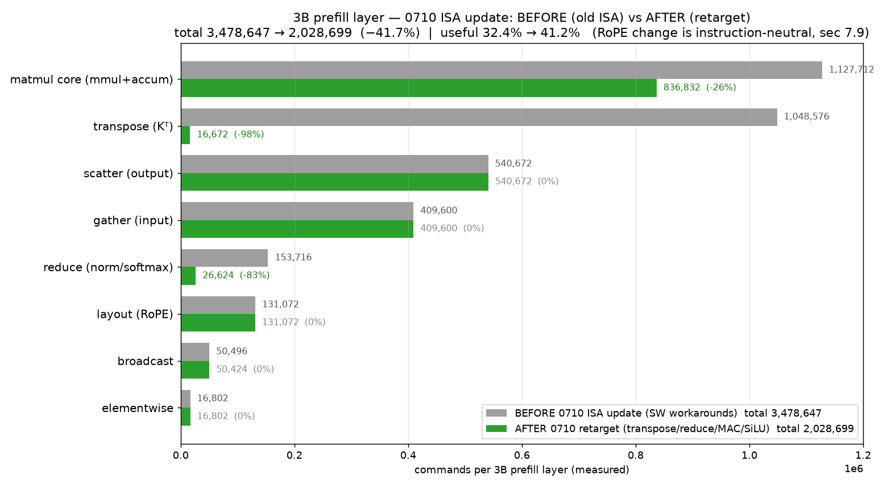
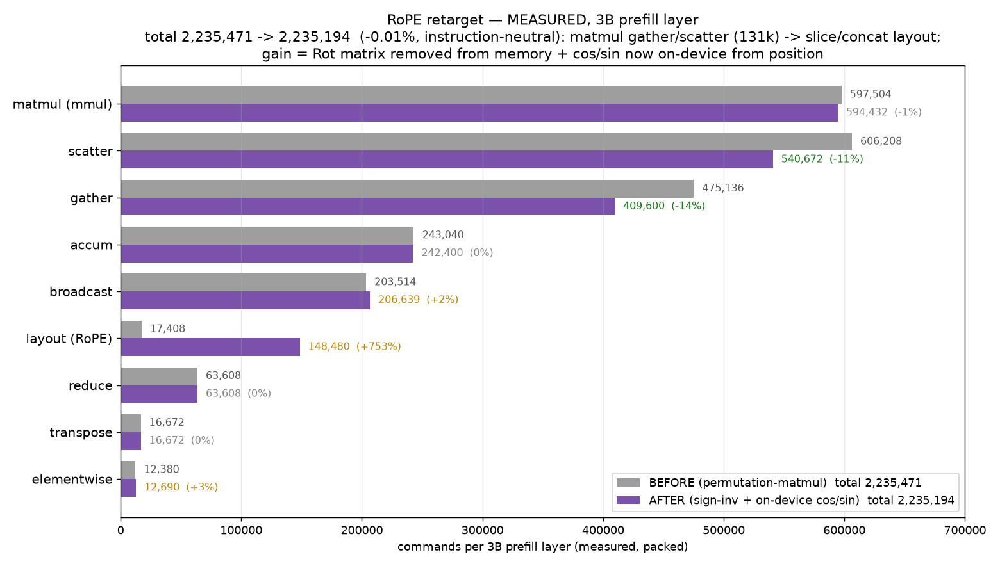

# NPU 0710 ISA 반영 보고서 — 우리 소스 반영(Phase 1 완료) & 컴파일러 재타겟 계획

> 작성일: 2026-07-10
> 대상: 2026-07-10 NPU 업데이트(`0710_npu_update/`, 박형철 ver.07)
> 선행 문서: `report/update_0710.md`(업데이트 분석), `d_compiler/RETARGET_0710.md`(실행 계획)
> **이 문서는 처음 보는 사람도 이해하도록 배경부터 서술한다.**

---

## 0. 한 문장 요약

NPU 하드웨어가 대규모 업데이트(strided load/save, matmul MAC/activation, native
reduce/broadcast 등)됐고, 그 새 명령어들을 **우리 시뮬레이터·인코더(`isa.py`,
`mysim.cpp`)에 완벽 반영해 벤더 시뮬레이터와 전체 예제 byte-exact 일치까지 검증**했다
(Phase 1 완료). 이어 **컴파일러 재타겟(Phase 2)** 에서 reduce-sum·transpose·row-broadcast를
네이티브 명령으로, softmax를 (reduce-max 우회 fold-max 기반) **stable softmax**로 바꿨고,
전체 테스트·byte-exact 회귀를 통과했다. (§7.5)

---

## 1. 배경 — 무엇이, 왜 바뀌었나

우리는 이 NPU(c-model)를 타깃으로 LLM(Llama)을 컴파일하는 컴파일러를 만들어 왔다.
초기 NPU는 명령이 제한적이라, 우리가 **소프트웨어로 우회**해야 했던 오버헤드가 많았다:
- 넓은 행렬의 타일을 읽을 때 연속 메모리만 되어 **per-row 복사(gather)**,
- 결과를 넓은 행렬에 쓸 때 **per-row 복사(scatter)**,
- matmul 부분합 누산을 위한 **save·load·add**,
- reduce/broadcast를 **ones-matmul**로 흉내, 등.

이번 2026-07-10 업데이트는 **우리 연구실(성균관대)과 서울과기대가 요청한 HW 기능들을
벤더가 반영**한 것이다. 즉 위 우회들의 상당수가 **하드웨어 명령**으로 직접 지원된다.
(자세한 신구 비교는 `report/update_0710.md`.)

### 1.1 새로 생긴 핵심 명령 (opcode)
| 명령 | opcode | 우리 우회를 대체하는 것 |
|---|---|---|
| **strided load / save** | 0x90/0x98 의 비트[29] | gather / scatter (+ K^T transpose) |
| **matmul MAC** (C += A·B) | 0x42 의 비트[28] | K-accumulate(save+load+add) |
| **matmul activation** (SiLU) | 0x42 의 비트[29] | 별도 활성화 elementwise |
| **reduce-sum** | 0x14 | ones-matmul 합산 |
| **broadcast** | 0x15 | ones-matmul 브로드캐스트 |
| **exp / cos / sin** | 0x0F / 0x18 | softmax·RoPE 우회 |
| **sign-inversion / copy** | 0x16 / 0x17 | RoPE rotate_half |

---

## 2. 우리가 다루는 두 개의 "시뮬레이터"

혼동을 막기 위해 정리한다.
- **`_poc/mysim.cpp`** — **우리가 소스를 가진** c-model(157줄). 우리가 빌드해서 테스트에
  쓴다. `--gout`으로 결과를 파일로 뽑는 편의 기능이 있어 컴파일러 테스트에 유리.
- **`0710_npu_update/a_npu/a.out`** — **벤더가 새로 준 c-model 바이너리**(소스 비공개).
  새 명령을 모두 실행하는 **권위 있는 정답(오라클)**. 단 stdout으로만 출력하고,
  최신 libstdc++(GLIBCXX_3.4.32)가 필요.

**전략**: 우리 `mysim.cpp`를 새 ISA로 확장하고, **벤더 `a.out`을 정답지로 삼아
byte-exact 대조**한다. 그러면 우리 테스트 루프(빠른 `--gout`)를 유지하면서 정확성을
벤더 기준으로 보장할 수 있다.

> **다행인 점**: 두 시뮬레이터의 입력 포맷이 **이미 동일**하다 — `program_memory.bin`
> (32-bit little-endian + 개행), `G_buffer_data.bin`(FP16 little-endian). 그래서 파일
> 포맷 변환 없이 곧바로 대조 가능했다.

---

## 3. 실행 계획 (전체 로드맵)

| Phase | 내용 | 상태 |
|---|---|---|
| **0** | 새 a.out 실행 환경·포맷 호환 확인 | ✅ 완료 |
| **1a** | `isa.py`(인코더)에 새 명령 추가 | ✅ 완료·검증 |
| **1b** | `mysim.cpp`(실행기)에 새 명령 의미 구현 | ✅ 완료 |
| **1c** | 우리 mysim == 벤더 a.out **byte-exact** 검증 | ✅ **완료(63/63)** |
| **2** | **컴파일러 재타겟**(새 명령을 emit) | ▶ 다음 |
| **3** | M1~M6 재검증 + 재측정 + 리포트 갱신 | 대기 |

이하 §4~§6은 **이미 완료한 Phase 0·1**의 상세이고, §7이 **다음(Phase 2·3) 계획**이다.

---

## 4. Phase 1a — 인코더(`isa.py`) 확장 & 검증

### 4.1 무엇을 했나
`isa.py`는 파이썬으로 32-bit 명령어를 만드는 **인코더**다(실행기 아님). 조사해 보니
우리 `isa.py`는 **이미 이 명령 포맷**(0x80/0x82/0x88/0x90/0x98, 0x42, vector ops)을
쓰고 있었다 — 즉 **처음부터 다시 짤 필요 없이 "확장"** 이면 됐다. 추가한 것:
- `load`/`save`에 **strided** 파라미터(비트[29] + `ncols`[23:16] + `start`[15:8]),
- `matmul`에 **MAC** 비트[28],
- 신규 인코더 `reduce_sum(0x14)`·`broadcast(0x15)`·`sign_inv(0x16)`·`copy(0x17)`·`cos/sin(0x18)`.
- (하위호환: 기존 호출은 기본 인자로 그대로 동작)

### 4.2 검증 — 벤더 예제와 인코딩 byte-exact
벤더가 제공한 예제 프로그램들(`b_program/inst_*/program_memory.bin`)의 모든 32-bit
워드에 대해 **`reencode(w) == w`**(우리가 필드를 분해→재조립해도 동일)임을 확인.
신규 명령 포함 전부 통과 → **우리 인코더의 비트 레이아웃이 벤더와 정확히 일치**.

---

## 5. Phase 1b/1c — 실행기(`mysim.cpp`) 확장 & byte-exact 검증 ★

### 5.1 새 명령의 "실제 의미"를 어떻게 알아냈나
벤더 `a.out`을 각 예제에 대해 돌려 **입력(PE_in)·출력(PE_out) 트레이스**를 관찰하고,
그 의미를 역공학했다. (테스트용 G-buffer는 `G[i]=i`라 값·주소를 눈으로 추적하기 쉬움.)

| 명령 | 관찰된 의미 |
|---|---|
| **reduce-sum** | 벡터 `[5,6,7,8,9,10,11,12]` → **`[68]`**(합 하나) |
| **broadcast** | 스칼라/즉값을 vlen 길이로 채움 → `[5,5,5,…]` |
| **sign-inversion** | `[5,6,…]` → `[-5,-6,…]` |
| **copy** | 항등 복사 |
| **cos/sin** | `pout[i]=cos/sin(pin[i])` |
| **strided load** | 소스 `R0×R1`에서 `[start, start+ncols)` 열을 **열-major(=전치)로** 로드. 예: 2×3 `[[5,6,7],[8,9,10]]`의 열0,1 → `[5,8,6,9]` |
| **strided save** | pout(열-major)를 dest의 해당 열들에 기록 (전치 저장의 역) |
| **matmul MAC** | 결과를 덮어쓰지 않고 **누산**(`C += A·B`) |

가장 중요한 발견: **strided load는 "열-블록을 전치해서 읽는다"** — 그래서 `Q@K^T`가
`load Q + strided-load K + matmul`로 되고, 별도 transpose가 사라진다(벤더도 "성균관대
요청 stride load로 transpose 구현"이라 명시).

### 5.2 `mysim.cpp`에 반영
위 의미대로 `_poc/mysim.cpp`에 구현:
- `0x90/0x98`에 strided 분기(열-major 로드/세이브),
- `0x42`에 MAC 비트(`pout[i*cB+j] += a`),
- 신규 `0x14/0x15/0x16/0x17/0x18`,
- elementwise 길이를 **로드된 타일 크기(pin1.size())** 기준으로(strided 대응),
- **활성화 함수를 SiLU(`x·sigmoid(x)`)로 교체** — 벤더가 기존 `x²·sigmoid(x)`가
  부적합하다며 표준 SiLU로 바꿨기 때문(이걸 안 고쳐 `_w_act` 예제 5개가 처음엔 실패).

### 5.3 검증 — 전체 예제 byte-exact
`b_program`의 **모든 63개 예제**에 대해, 각 예제의 program을 우리 mysim과 벤더 a.out에
각각 돌려 **PE_in/PE_out 데이터흐름을 대조**:

```
PASS=63 FAIL=0   → ★ 전체 b_program byte-exact 일치 ✓
```

재현: `bash d_compiler/validate_isa_0710.sh` (벤더 a.out은 `LD_LIBRARY_PATH`에
conda npu-tvm의 libstdc++ 필요).

→ **"우리 소스에 완벽 반영"이라는 목표를 정량적으로 달성**(벤더 c-model과 동작 동일).

---

## 6. 현재까지 변경/추가된 파일

| 파일 | 변경 |
|---|---|
| `npu_compiler/isa.py` | 새 명령 인코더(strided load/save, MAC, reduce-sum·broadcast·sign-inv·copy·cos/sin) + decode |
| `_poc/mysim.cpp` | 새 명령 실행 의미 + strided/​MAC + **SiLU 활성화** |
| `d_compiler/validate_isa_0710.sh` | 벤더 a.out 대비 전체 byte-exact 검증 스크립트(신규) |
| `d_compiler/RETARGET_0710.md` | 전체 실행 계획(신규) |
| `report/update_0710.md` | 업데이트 신구 비교 분석(신규) |
| `report/report_0710.md` | 이 문서(신규) |

---

## 7. 다음 단계 — Phase 2: 컴파일러 재타겟 (계획)

이제 **컴파일러(`codegen.py`/`tir_backend.py`/`memplan.py`/`model.py`)가 새 명령을
emit**하도록 바꾼다. 매핑:

| 기존(우리 SW 우회) | → 새 명령 |
|---|---|
| gather (per-row 복사) | **strided load** (No.cols/start로 타일 직접) |
| scatter (per-row 복사) | **strided save** |
| K^T transpose | **strided load**(전치 로드) — 전치 캐시/permute 제거 |
| K-accumulate (save+load+add) | **matmul MAC 비트** |
| 활성화 elementwise | **matmul activation 비트** |
| ones-matmul reduce/broadcast | **reduce-sum / broadcast** |
| RoPE rotate_half | **sign-inversion + copy** (+ native cos/sin) |
| softmax (max 생략) | **exp** + **fold-max(min/max)** 기반 stable softmax |

**재평가 대상(측정 후 결정)**: 우리 기존 최적화 — **가중치 패킹(−91.8%)·O-proj
융합·활성화 gather 재사용·전치 KV캐시** — 는 strided load/save·MAC가 흡수하므로
**상당수 불필요**해질 수 있다. Phase 3에서 재측정해 제거/유지를 정한다.

### Phase 3 (재검증·재측정)
- `tests/test_decode.py` M1~M6 재수행(새 ISA/mysim에서 정합).
- `analyze_kernels`/`analyze_pack` 재측정 → 새 오버헤드 프로파일(gather/scatter/accum/
  transpose 소멸 반영; 기존 "gather 93%"는 구 ISA 기준이었음).
- 리포트 갱신.

---

## 7.5 Phase 2 — 진행 상황 (컴파일러 재타겟, 완료분)

계획대로 `codegen.py`/`legalize.py`를 새 명령으로 재타겟했다. **완료·검증된 항목**:

**(a) reduce-sum 네이티브화** — `emit_row_sum`을 ones-matmul → **네이티브 reduce-sum(0x14)**
로 교체. 행마다 `vlen(C); load(행); v_reduce_sum; save`. RMSNorm의 `mean(x²)`와
softmax의 rowsum이 이 경로를 탄다.

**(b) transpose 네이티브화** — `emit_transpose`를 per-element 복사(O(R·C)) →
**strided load(0x90 bit[29])** 로 교체. `[rt,C]` 블록을 열-major로 읽으면 전치 블록
`[ct,rt]`가 **명령 1개**로 나온다(`v_copy`로 pin1→pout 이동, `rt==R`이면 dst가 연속이라
save 1회). K^T가 여기서 흡수된다.

**(c) stable softmax + reduce-max 우회** — `softmax_lastdim(stable=True)`로 **max 차감**
추가. 하드웨어에 **reduce-max가 여전히 없어**, `emit_row_max`를 **vector-max(0x12)
fold**로 구현: 각 열 j를 strided load로 (전체 R행 동시에) 읽어 running acc에 `v_max`.
→ O(C) 벡터-max(누산은 R lane 병렬)로, O(R·C) 아님. `s−rowmax`로 exp 오버플로 제거.

**(d) row-broadcast 네이티브화** — `[1,C]→[R,C]`는 **native copy(0x17)** 로 소스 행을
full-address load 후 복제.

### ★ 중요한 함정 — 네이티브 broadcast의 16-bit 주소 한계

**col-broadcast(`[R,1]→[R,C]`)에 native broadcast(0x15, SCALAR)를 처음 썼다가
MEDIUM 레이어에서 NaN**이 났다. 원인: **SCALAR 피연산자 주소는 명령의 16-bit
즉치(immediate) 필드**로 인코딩된다(`cst=(instr>>8)&0xFFFF`). load/save는 set-addr(0x80,
lo+hi)로 **full 32-bit** 주소를 쓰지만, **scalar-즉치 연산은 하위 64K만** 가리킨다.
MEDIUM에서 `off[rowmax]=143872 > 65535`라 주소가 잘려 **엉뚱한 값을 broadcast** →
max 차감이 무력화 → exp 오버플로 → NaN.

→ **결론**: native broadcast(0x15)는 **즉치 상수 채우기**엔 유용하나, 큰 버퍼(>64K)에
있는 **텐서 값의 per-row broadcast엔 부적합**. col-broadcast는 full-address를 쓰는
**ones-matmul 외적(col[R,1]@ones[1,C], degenerate K=1)** 으로 유지했다. reduce-sum/
reduce-max/transpose는 전부 load/save(full-address)만 쓰므로 이 한계와 무관.

### 검증
- **전체 테스트 통과**: `test_isa/matmul/rmsnorm/swiglu/elementwise/tiling/runtime/layer/
  tir_backend/import/attention/real_layer/decode(M1~M6)` — MEDIUM/REDUCED 정합, 3B 컴파일 성공.
- **byte-exact 회귀 유지**: `validate_isa_0710.sh` = **PASS=63 FAIL=0**.
- NaN 원인(위 함정)은 **디버깅으로 최초 NaN 바인딩(broadcast 출력)까지 추적**해 확정.

## 7.6 Phase 2b — matmul 백엔드 재타겟 (MAC · 활성화) + 아키텍처 한계 규명

**(e) K-accumulate → matmul MAC 비트** — `emit_acc`(TIR) + 직접타일 경로(`emit_matmul`)의
K-누산을 **save-partial/load/add/save 왕복 → m_mul MAC 비트**(`pout += A@B`)로 교체. 누산기를
`v_copy`로 pout에 적재한 뒤 이 k-타일을 제자리 누산·1회 저장. **두 경로에 동일 시퀀스**를 써서
`direct==tir` byte-exact 유지. 수치 계약이 바뀌므로(부분곱을 따로 FP16 반올림하지 않고 PE에서
float32 누산, 저장 시에만 반올림) 테스트 레퍼런스 `tiled_fp16_ref`도 이 모델로 갱신.
- ★**중요 발견 — MAC의 명령수 이득은 미미(≈0.1%)**. 3B projection(q_proj 128×3072×128)에서
  103,712→103,596. 이유: **비용을 지배하는 건 per-tile gather(64행×3op)** 이지 누산이 아니다.
  MAC의 "풀-K PE 누산(끝에 1회 반올림)"은 **gather가 매 k-타일 pout을 덮어써** 불가 →
  per-k-타일 MAC(2op/타일 절감)에 그친다. **진짜 레버는 gather 제거**.

**(f) 활성화(SiLU) → native activation** — mysim이 **모든 matrix op에 act 비트 적용**
(`actf && matrix`)하므로 `m_add(mode=IMM, imm=0, act=True)` = **단일 명령 SiLU**. `legalize.silu`를
`relax.nn.silu`로, codegen이 이를 native activation으로 lower. 기존 5-op(sub/exp/add/div/mul)
분해 → **1 pass**. `[128,8192]`에서 **1,025 vs ~5,125 instrs (~5× 감소)**. 3B FFN vs torch rel=0.0031.

### ★ 아키텍처 한계 규명 (적용 불가/보류 항목)
- **gather/scatter → strided load/save: 적용 불가**. 0710 strided load/save는 **열-major(전치)**
  전용이다(`d[c*R0+r]`). 우리 gather/scatter는 **행-major 재배치**라 strided로 대체하면 전치가
  섞여 틀린다. → strided는 **K^T(전치)에만** 유효(2a에서 이미 활용). gather/scatter는 유지.
- **활성화 matmul 융합(마지막 k-타일에 act)은 보류**. native standalone SiLU(1 pass)로 이득
  대부분 확보. matmul 최종 k-타일 판별이 walker 구조상 번거로워 잔여 1 pass 절감은 미채택.
- **RoPE rotate_half → sign-inv + on-device cos/sin: 구현함(§7.9 참조)**. 명령 수는 실측상
  중립(순열-matmul의 gather/scatter가 slice/concat layout으로 이동, 상쇄)이지만, `Rot` 행렬을
  메모리에서 제거하고 **cos/sin을 위치에서 on-device 생성**해 autonomous decode 기반을 확보.

### 재평가(잠정): 기존 SW 최적화
- **가중치 패킹**: gather가 여전히 비용 지배 → **유지 가치 큼**(B-gather 제거).
- **O-proj 융합·전치 KV캐시**: 유지(융합은 scatter 횟수, 전치캐시는 decode K^T 회피). Phase 3에서 재측정.

---

## 7.7 Phase 3 — 재측정(3B 실제 커널) & 최적화 재평가

`analyze_kernels.py`로 3B prefill layer(S=128)를 role별로 분해했다. **주의: 기본
`analyze_kernels`는 가중치를 패킹하지 않는다(`pack_params=False`)** — 이 경우 가중치
gather가 껴서 총 14.8M cmds, gather 88.1%로 나온다. 하지만 **실제 생성 경로는 가중치를
패킹해서 돌린다(`pack_params=True`)**. 두 경우를 모두 측정해 비교한다:

| | 총 cmds | useful | gather | scatter | broadcast |
|---|---:|---:|---:|---:|---:|
| 미패킹(analyze 기본값) | 14,818,383 | 5.7% | 88.1% | 4.1% | 1.4% |
| **패킹(실제 생성 경로)** | **2,235,471** | **37.6%** | **21.3%** | **27.1%** | **9.1%** |

→ **가중치 패킹이 총량을 6.6× 줄이고 gather의 대부분(=가중치 gather)을 제거**한다.
실제로 도는 프로파일에서 useful은 **37.6%**, 남는 오버헤드 순위는:

| role(패킹) | 비중 | 정체 |
|---|---:|---|
| **scatter** | **27.1%** | 출력을 strided 위치로 per-row 기록(전치 KV/헤드 결합) |
| **gather** | **21.3%** | **활성화(A)** 타일 압축(가중치 gather는 이미 소멸) |
| broadcast | 9.1% | col-broadcast ones-matmul (RMSNorm scale·softmax denom) |
| reduce/transpose/layout/ew | ~5% | 전부 native화되어 소액 |

**핵심 결론(정정)**:
- **2a/2b 재타겟이 비-matmul 오버헤드를 실제로 제거**: transpose 0.7%, reduce 2.8% 등
  소액. 과거 "transpose가 K^T에서 수백 %" 추정 → 이제 **<1%**.
- **가중치 gather는 이미 패킹으로 소멸**(88%→sub-percent). 남는 **scatter(27%)+gather(21%)=48%
  = 행-major strided ↔ 연속 이동**인데, **strided load/save가 전치 전용이라 둘 다 못 없앤다**.
  이게 최대 잔여 과제이며, **행-major strided HW 모드 하나면 48% 동시 해결**.
- **broadcast(9.1%)** 는 native broadcast의 16-bit 주소 한계로 ones-matmul 유지 중 →
  하위 64K stage 또는 HW full-addr broadcast로 개선 여지.

**최적화 재평가(측정 기반)**:
- **가중치 패킹**: **필수**(총량 6.6×↓, 가중치 gather 소멸).
- **O-proj 융합**(scatter↓)·**전치 KV캐시**(decode K^T 회피)·**활성화 gather 재사용**: **유지**.
  scatter/gather 직격 → 전치-전용 strided로는 대체 불가.

---

## 7.8 반영 전/후 **실측** 비교 (HF 3B prefill layer)

앞의 예측(구 figure G3의 −80% waterfall)이 아니라, **구 ISA로 컴파일한 실측(BEFORE)** 과
**0710 retarget 반영 후 재컴파일한 실측(AFTER)** 을 **동일 경로(HF import, best 모드=
pack+reuse+fuse)** 로 직접 대조한다. 두 막대 모두 실측 명령 수다(예측 아님).



**총계: 3,478,647 → 2,028,699 (−41.7%), useful 32.4% → 41.2%**

| role | BEFORE | AFTER | Δ | 원인 |
|---|---:|---:|---:|---|
| transpose (Kᵀ) | 1,048,576 | 16,672 | **−98%** | ✅ strided load 흡수 |
| reduce (norm/softmax) | 153,716 | 26,624 | **−83%** | ✅ native reduce-sum |
| matmul core (mmul+accum) | 1,127,712 | 836,832 | **−26%** | ✅ MAC이 K-accum 왕복 제거 |
| **gather (input)** | 409,600 | 409,600 | **0%** | ❌ 전치-전용 strided로 불가 |
| **scatter (output)** | 540,672 | 540,672 | **0%** | ❌ 동일 |
| layout (RoPE) | 131,072 | 131,072 | 0% | RoPE 미변경 |
| broadcast | 50,496 | 50,424 | ~0 | col은 ones-mm 유지 |

> `mmul`/`accum` 태깅은 MAC 재구성에서 이동(타일 save가 accum→mmul)했으므로 **합산 비교**한다.

**예측 −80% vs 실측 −41.7% — 격차의 정체**:
- ✅ **transpose −30%** (예측 달성). 실제 절감의 **약 71%가 이 한 항목**에서 나옴 → retarget의 진짜 승리 = **K^T 전치 제거**.
- ❌ **gather+scatter −27%(예측) → 0%(실측)**: strided load/save가 **전치 전용**이라 행-major 이동을 못 없앰. 격차의 최대 원인.
- ⚠️ **K-accum −19.5%(예측) → −8%(실측)**: MAC이 왕복은 없앴지만 **누산기 preload용 v_copy**는 매 k-타일 잔존.

→ 이 실측이 **"−80%에 도달하려면 행-major strided HW 모드가 필요하다"** 를 정량적으로 증명한다.
(BEFORE 그래프 원본은 `figs/prev/g23_role_and_isa_hf_prefill.png` 참조.)

---

## 7.9 RoPE 재타겟 — sign-inversion + pos-기반 on-device cos/sin

남은 RoPE 관련 0710 명령을 반영했다:
- **rotate_half → sign-inversion(0x16) + slice/concat** (순열 행렬 곱 제거, `Rot[hd,hd]` 상수 소멸).
- **cos/sin → on-device(0x18)**: `angle = pos × freqs → cos/sin`, 레이어당 1회 계산해 헤드 공유.
  prefill은 위치 0..S-1을 상수로 굽고, **decode는 `pos`만 런타임 입력**으로 받음 → 미래의
  autonomous decode에서 호스트는 위치 하나만 넘기면 됨. (codegen: negative→sign-inv, cos/sin→0x18)



**★ 정직한 실측 결과 — 명령 수는 사실상 불변**(3B prefill layer, packed): **2,235,471 → 2,235,194 (−0.01%)**.

| role | BEFORE(순열-matmul) | AFTER(sign-inv) | Δ |
|---|---:|---:|---:|
| gather | 475,136 | 409,600 | −14% |
| scatter | 606,208 | 540,672 | −11% |
| **layout(RoPE)** | 17,408 | 148,480 | **+753%** |
| broadcast | 203,514 | 206,639 | +2% (on-device cos/sin) |

즉 순열-matmul의 **gather/scatter(131k)가 slice/concat layout(131k)으로 이동**했을 뿐 **총량은 동일**하다.
앞서 단일-헤드 측정에서 "sign-inv 3× 저렴(−6%)"이라 했던 건 **틀렸다**: 그 측정은 matmul에 딸린
q-gather까지 포함한 고립 케이스였고, **패킹된 전체 레이어에선 두 방식의 데이터 이동량이 같아** 상쇄된다.

**RoPE 변경의 실제 가치**(명령 수 이득 아님):
1. **`Rot[hd,hd]` 순열 행렬을 버퍼에서 제거**(메모리 절약).
2. **cos/sin을 위치에서 on-device 생성** → decode가 `pos`만 넘기면 되는 **autonomous decode 기반**.
- 검증: 전체 테스트 통과, decode 토큰열 불변([21,21,9]/[28,8]), 3B vs torch rel≤0.0035, byte-exact 63/63.

---

## 8. 결론

- **Phase 1(우리 소스 반영) 완료·검증**: `isa.py`·`mysim.cpp`가 새 ISA를 지원하고,
  벤더 c-model과 **전체 63개 예제 byte-exact 일치**.
- **Phase 2 완료·검증**: (2a) reduce-sum·transpose·row-broadcast 네이티브 + stable
  softmax(reduce-max는 vector-max fold 우회); (2b) K-accum **MAC 비트**, 활성화 **native SiLU**;
  (2c) **RoPE**: rotate_half→**sign-inversion**, cos/sin→**on-device(pos-기반, 0x18)**.
  전체 테스트·byte-exact(63/63) 통과, 3B vs torch rel≤0.0035, decode 토큰열 불변.
- **Phase 3 재측정(패킹 실경로)**: prefill layer **useful 37.6%**, 남는 오버헤드는
  **scatter 27.1% + gather 21.3%(=행-major strided 이동) + broadcast 9.1%**. 재타겟으로
  transpose/reduce 등은 <3%로 소멸. (미패킹 측정의 "gather 88%"는 가중치 gather 포함값이라 실경로와 다름)
- **반영 전/후 실측 비교(§7.8)**: HF 3B prefill layer **3,478,647 → 2,028,699 (−41.7%)**,
  useful 32.4%→41.2%. 절감의 ~71%가 **transpose→strided**. 예측 −80% 미달은 **gather/scatter
  (−27%)가 전치-전용 strided로 불가**하기 때문 → 정량적으로 **행-major strided HW 필요**를 입증.
- **핵심 교훈들**:
  1) native broadcast(0x15) SCALAR 소스는 **16-bit 즉치 주소** → >64K 버퍼 불가(col-broadcast는 ones-matmul 유지).
  2) strided load/save는 **전치(열-major) 전용** → 행-major **gather/scatter 둘 다** 대체 불가(K^T에만 유효).
  3) 가중치 gather는 **패킹으로 이미 소멸**. 남은 최대 레버 = **scatter+gather(48%)** = 행-major strided 이동.
- 남는 과제: **행-major strided HW 모드**(scatter+gather 48% 동시 해결) + broadcast full-addr,
  그리고 **명령 수 최소화(HW 루프 부재)**. 가중치 패킹·O-proj 융합·전치 캐시는 **유지**.
