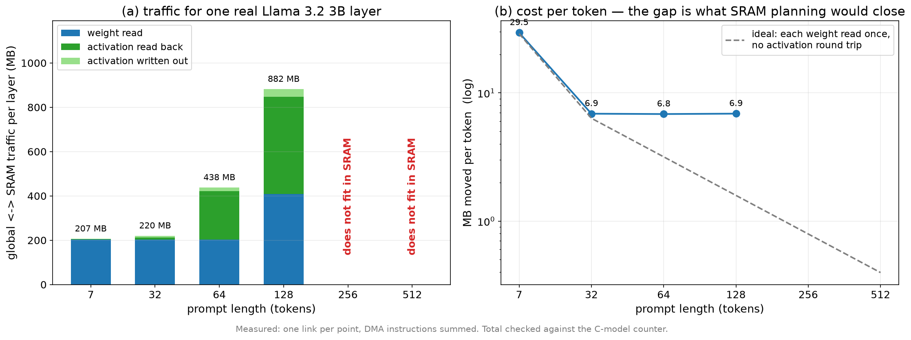
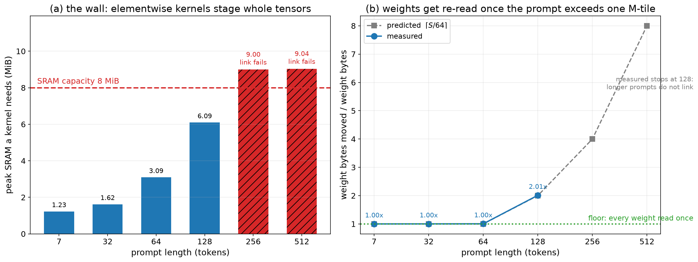

# NPU 컴파일러 종합 보고서 — 2026-09-01

이 문서는 현재의 **표준 TVM 기반 LLM 컴파일러**를 처음 보는 사람을 위해 쓴 것이다.
컴파일러가 무엇으로 구성되어 있고, 각 부분이 무슨 일을 하며, 모델 하나가 어떤
단계를 거쳐 NPU 명령어가 되는지("lowering")를 동작 중심으로 설명한다.
코드 위치는 참조용으로만 적는다. branch는 `cmodel-v09`.

---

## 0. 한 장 요약

```
 HF 체크포인트          우리가 정의한 모델 구조
 (torch.export)         (relax.frontend.nn)
      │                        │
      └────────────┬───────────┘
                   ▼
[1] 프론트엔드   Relax IRModule  (고수준 그래프: matmul, rms_norm, …)
                   │
[2] 그래프 pass  전부 TVM 표준.  LiftTransformParams 가 weight 전용 계산을
                 떼어내고, LegalizeOps 가 그래프 op을 TIR 루프 프로그램으로 만든다
                   │
                   ├──────────────▶ transform_params  →  host(LLVM)에서 1회 실행
                   │                (weight 전치·양자화 → 디스크 캐시)
                   │
                   ├──────────────▶ relax.build(…,"llvm")  →  CPU 참조 실행 (정답 대조)
                   ▼
[3] 메모리 계획  CallTIRRewrite → StaticPlanBlockMemory  ──▶  평면 정적 주소
[4] 스케줄       tir.Schedule (타일링 + SRAM staging + tensorize)
[5] codegen      스케줄된 TIR을 해석하며 v09 명령어 word 방출
[6] 링크         커널들을 하나의 직선 명령 스트림으로 연결 + peephole
[7] 실행         v09 C-model (시뮬레이터)
```

**기기용 경로는 LLVM을 거치지 않는다.** LLVM이 쓰이는 곳은 두 군데뿐이다 —
host가 실제로 실행하는 `transform_params`, 그리고 같은 IR을 CPU로 돌리는 대조용
참조. [5]~[6]이 표준 TVM에서 LLVM/CUDA codegen이 붙는 자리이고, v09 백엔드가
없으므로 그 자리를 우리 codegen이 채운다 — TVM의 다른 codegen들과 마찬가지로
**C++ 방문자**이며(§7.1), 파이썬 구현이 그 정의이자 폴백으로 남는다.

배포 단위는 **모델당 프로그램 2개**다: 프롬프트 길이의 `prefill_cache` 하나와
고정 capacity의 `decode` 하나(§18). 토큰마다 다시 링크하지 않는다.

핵심 설계 원칙 두 가지:

1. **표준 TVM 경로를 기본으로 한다.** 모델 정의부터 메모리 계획까지 TVM이
   제공하는 표준 단계를 그대로 쓰고, 우리 것은 표준이 마련해 둔 확장 지점
   (커스텀 legalize map, 커스텀 pass, tensorize 인트린식)에 끼워 넣는다.
   손으로 짠 기존 컴파일러(`backend_v09`)는 **oracle**(정답 비교용)로만 남는다.
2. **타깃 기계가 특이하다는 사실을 마지막 단계에만 가둔다.** v09는 분기·루프
   명령이 없는 직선(straight-line) 기계이고, 런타임도 할당기도 없다. 프로그램
   전체가 "명령어 word 목록 하나 + 초기 메모리 이미지 하나"다. 이 특성은
   [5]~[6]에서만 나타나고, 그 앞은 전부 보통의 TVM이다.

### 최종 검증 상태 (전체 깊이, 실제 체크포인트, C-model 실행)

| 모델 | 결과 | 규모 |
|---|---|---|
| Llama 3.2 3B (28층) | **HF golden token 358 일치 + HF logits cosine 0.9999927** (기존 golden 0.9999881 상회) | A1 적용 **15.3M word** (전 31.2M, −51.0%) · 6.1 GiB image |
| Qwen3-4B (36층) | **HF golden token 358 일치 + HF logits cosine 0.9999922** | A1 적용 **21.5M word** (전 42.9M, −49.8%) · 7.7 GiB image |
| Gemma 4 E2B (35층) | **HF golden token 108 일치 + HF logits cosine 0.9997845** | 13.7M word · 4.3 GiB image · 실행 247s |
| HF 추적 Llama (28층) | **HF golden token 358 일치 + cosine 0.9999927** — HF 모델 자체가 입력 (§2.5) | 16.0M word |
| W8A16 양자화 | 타일 규모에서 **numpy mirror와 bit-exact**, tiny 모델 cosine 0.999998. 실차원 양자화 matmul cosine 0.999964 (§16.3) | — |
| W8A8 (activation 양자화) | 단일 커널은 **모든 시험 폭에서 bit-exact**, tiny 전체 모델 0.999998. **실차원 전체 모델은 미해결** (§18.2b) | — |
| decode (생성) | tiny에서 **NPU == llvm == float32 전체 재계산**, 실 체크포인트 2층 절단에서 NPU == llvm. 28층 golden은 §18.3 | 모델당 프로그램 2개 |
| 컴파일 시간 | 28층 링크 **8,147s → 127.0s (64.1배)**, word 스트림 불변 (§7.1, §11.1) | codegen이 C++ (§7.1) |

---

## 1. 타깃 기계 (v09) — 컴파일러가 상대하는 것

컴파일러를 이해하려면 기계의 다섯 가지 특징을 먼저 알아야 한다.

**(a) 직선 프로그램.** 분기도 루프도 없다. 컴파일 시점에 모든 루프가 완전히
펼쳐지고, 모든 주소가 상수로 박힌다. "for 64번"은 명령 64벌이다. 이것이 이
컴파일러의 거의 모든 특이한 결정(전량 펼침, dead-store 제거의 완전성,
스냅샷 디버깅)의 근원이다.

**(b) 두 층 메모리.** 전역 메모리는 32-bit 셀 단위 주소의 16 GiB 공간이고
**연산 유닛이 직접 읽을 수 없다**. 연산은 8 MiB SRAM(4-bit nibble 주소)에서만
일어난다. 전역↔SRAM 이동은 DMA(GLOAD/GSTORE) 뿐이며, DMA는 **dtype을 모르고**
셀 단위로만 옮긴다. 2차원 전송(행 수 + 전역 행 간격)을 지원해서 큰 행렬의
타일 하나를 명령 하나로 가져올 수 있다.

**(c) 행렬 유닛.** 64×64 타일 단위 행렬곱. 내부 누적은 **FP32**, 저장 시 FP16
반올림. MAC 비트로 연속 호출을 누산기에 이어붙일 수 있어서 K축 타일들을
저장 없이 합산한다. 이 "FP32 내부 누적"이 뒤에 나올 정확도 판정 기준의
근거가 된다.

**(d) 벡터 유닛.** 256-lane, 한 명령이 **연산 하나**를 벡터 전체에 적용한다
(add/mul/exp/sqrt/…). 복합식(예: silu의 `x·σ(x)`)은 명령 여러 개로 풀어야
하고, 중간값은 SRAM에 놓아야 한다. INT8→FP16 변환(VDEQUANT), FP16→INT8
양자화(VQUANT)도 여기 있다.

**(e) 서술자(descriptor) 상태.** 피연산자 주소·모양·dtype은 명령 인자가 아니라
**별도 설정 명령으로 채워 두는 레지스터**다(0x80 주소, 0x82 벡터 길이,
0x88/0x89 행·열+dtype, 0x8A/0x8B scale 주소). 상태는 sticky라서 안 바꾸면
유지된다 — 이 성질이 최적화(A1)와 버그(INT8 dtype leak)의 양면이 된다.

---

## 2. [1] 프론트엔드 — 모델을 어떻게 정의하나

**표준 `relax.frontend.nn.Module`로 모델을 짠다.** PyTorch의 `nn.Module`과 거의
같은 감각이다: `nn.Linear`, `nn.RMSNorm`, `nn.ModuleList`를 조립해 `prefill`
메서드를 쓰면, `export_tvm()`이 그것을 **Relax IRModule**(TVM의 그래프 IR)로
바꿔 준다. 이 시점의 그래프는 `matmul`, `softmax`, `reshape` 같은 고수준
연산의 나열이고, 아직 기계와 아무 상관이 없다 — 실제로 **같은 모듈을 그대로
llvm으로 빌드해 CPU에서 돌릴 수 있고**, 우리는 이것을 검증에 계속 쓴다.

세 family가 있다 (`npu_compiler/nn_models/`):

- **Llama** (`llama.py`) — 기준 구현. GQA 어텐션을 `[seq, head, dim]` 3차원
  텐서로 쓰고, RoPE는 half-duplicate 주파수 + rotate_half 관례(기존 검증
  경로와 동일 수치)를 따른다. Llama-3 주파수 스케일링 포함.
- **Qwen3** (`qwen3.py`) — Llama + **head별 Q/K RMSNorm**(RoPE 전에 각 head를
  head_dim 축으로 정규화). 나머지는 Llama의 MLP/RoPE/mask를 그대로 재사용.
- **Gemma 4 E2B** (`gemma.py`) — 델타가 크다. 층마다 어텐션이 두 종류
  (sliding-window / full; head_dim 256 vs 512, RoPE theta 다름, full은
  proportional RoPE — 각도의 앞 1/4만 비영이고 나머지는 cos=1/sin=0이라
  통과), 마지막 20개 층은 K/V를 자기가 만들지 않고 **앞선 owner 층의 K/V를
  공유**, 층마다 per-layer embedding 행을 gate→projection으로 주입, 층당
  norm 5개, weight 없는 V-norm, scale 1.0 어텐션, tanh-GELU MLP, 층별 출력
  스칼라.

**호스트가 미리 만들어 주는 입력**이 몇 개 있다. embedding lookup(토큰 id →
행), RoPE cos/sin 표, causal/banded mask, (Gemma) per-layer embedding 표 행.
이들은 전부 **데이터 의존 gather**라서 — 주소가 토큰 값에 달려 있다 — 모든
주소가 컴파일 시점에 정해져야 하는 이 기계에서는 프로그램 안에 넣을 수 없다.
그래서 그래프의 입력 텐서로 들어온다.

각 family는 같은 모양의 인터페이스를 내놓는다: `model_config`(체크포인트
config → 빌드 인자), `build_prefill`(IRModule 생성), `load_params`(체크포인트
텐서를 파라미터 순서대로), `runtime_inputs`(위의 호스트 입력들). 덕분에 실행
스크립트 `run_nn_npu.py --model {llama,qwen3,gemma,hf}` 하나가 전부를 다룬다.

### 2.5 네 번째 프론트엔드 — HF 모델 자체가 입력 (`nn_models/hf.py`)

위의 세 frontend는 구조를 우리가 다시 쓰고 가중치만 HF에서 가져온다. 네 번째는
**HF 모델 자체를 입력으로 쓴다**: `transformers`가 모델을 만들고, HF의
`forward`를 `torch.export`가 그대로 추적하고, TVM 표준 torch 프론트엔드
(`from_exported_program`)가 그 추적을 Relax로 바꾼다. 구조도 수치도 HF가
원본이며, 아키텍처를 손으로 다시 쓰는 부분이 없다.

추적과 표준 파이프라인 사이에 필요한 처리(전부 이유가 있다):

1. **mask·position을 입력으로 뺀 뒤 상수로 bind** — HF는 forward 안에서
   mask/position을 만드는데 그 코드는 데이터 의존이라 기계가 못 돌린다.
   4D additive mask를 넘기면 HF가 그대로 통과시키고, position을 상수로
   bind하면 `FoldConstant`가 **rotary cos/sin 표 전체를 컴파일타임에 계산**해
   int64가 기계에 들어가지 않는다.
2. **가중치도 상수로 bind** — 어차피 프로그램 이미지에 박히는 기계다.
   덕분에 nn.Linear의 전치도 컴파일타임에 접힌다(LiftTransformParams가 주던
   이득을, 그 pass의 파라미터 장부 정리와 싸우지 않고 얻는다).
3. **추적된 RMSNorm을 op으로 복원** — HF는 fp32에서 "제곱→평균"으로
   정규화하는데 이를 fp16으로 내리면 실모델 폭(3072)에서 합이 넘친다.
   패턴 재작성으로 `relax.nn.rms_norm`을 복원하면 우리 legalize의 안전 전개
   (제곱 전에 1/√D)가 그대로 적용된다.
4. **잔여 fp32 섬 강등** — softmax/rotary의 fp32 upcast를 fp16으로. 손으로
   모델을 쓸 때 내렸던 결정을 pass로 옮긴 것이다.
5. **matmul의 unit batch 제거** — 추적본은 모든 텐서에 선두 1 차원을 달고
   다니는데, matmul 스케줄은 마지막 세 루프를 타일링하므로 벗겨 준다
   (reshape는 view가 되어 무비용).

검증: tiny HF Llama가 **HF torch 자신의 출력과** llvm 0.999999 / NPU
1.000000으로 일치, 실 체크포인트 1층이 llvm 대비 0.99856(손작성 1층 수치와
동일), 그리고 **전체 28층이 C-model에서 golden token 358 + HF logits cosine
0.9999927** — 손작성 frontend의 최종 수치와 완전히 같다
(16,021,618 word · 2,134 kernel · 링크 7,033s · 실행 275s).

---

## 3. [2] 그래프 pass — 그래프를 다듬는 표준 단계들

`npu_compiler/tvm_pipeline.py`의 `graph_pipeline`이 표준 pass들을 순서대로
돌린다. 각각이 하는 일:

- **CanonicalizeBindings / EliminateCommonSubexpr / FoldConstant** — 정리.
  같은 부분식 합치기, 상수 접기(예: RoPE 관련 상수 계산이 컴파일 시점에 끝남).
- **RewriteDataflowReshape** — reshape를 실제 복사가 아니라 **view**로 바꾼다.
  4차원 어텐션이 reshape/permute를 많이 쓰므로 필수.
- **LiftTransformParams** — **파라미터에만 의존하는 계산을 그래프에서 떼어**
  별도의 `prefill_transform_params` 함수로 옮긴다. 대표적으로 `nn.Linear`의
  weight 전치: 매 토큰마다 기계에서 전치하는 대신, 호스트가 모델 로드 때 한 번
  실행한다. 활성 메모리 풀이 1.6 GiB → 0.7 MiB로 줄었던 pass다. 양자화(§5)도
  이 pass에 올라탄다.
- **LegalizeOps (+ 커스텀 map)** — 고수준 연산을 **TIR PrimFunc**(구체적 루프
  프로그램)로 낮춘다. `matmul`은 3중 루프가, `softmax`는 max/빼기/exp/합/나눔
  루프들이 된다. 여기가 표준이 마련한 첫 확장 지점이다:
  `npu_legalize.legalize_map()`이 **RMSNorm 하나만** 교체한다 — TVM 기본
  lowering은 float32 중간 버퍼를 만드는데 우리 벡터 유닛은 FP16 저장이라 담을
  수 없다. 교체본은 제곱 **전에** 1/√D를 곱해(합이 FP16 범위에 머물게; 기존
  검증 경로의 V3-020 트릭) 텐서 dtype 그대로 계산한다.
- **AnnotateTIROpPattern** — 융합 가능성 분류. 단, **융합(FuseOps/FuseTIR)은
  끈다**. 측정해 봤다: 켜면 링크·실행은 되지만 결과가 틀리고(cosine 0.17),
  맞더라도 이득이 없다 — 벡터 유닛은 한 번에 연산 하나라 융합 본문을 다시
  단계별로 풀면 같은 일이 되기 때문(word 수 29,970 vs 29,946).
- **DeadCodeElimination** — 정리.
- **ToNonDataflow / RemovePurityChecking / CallTIRRewrite** — 빌드 배관.
  이후 그래프는 "PrimFunc를 순서대로 호출하는 바인딩 목록"이 된다.
- **StaticPlanBlockMemory** — 버퍼 **생존구간 분석** 기반의 정적 메모리 계획.
  수명이 겹치지 않는 텐서들이 같은 storage를 재사용한다.

이 파이프라인은 `relax.register_pipeline("npu")`로 등록되어 있어
`relax.get_pipeline("npu")`로도 얻는다. 중요한 성질: **여기까지의 결과물은
llvm으로도 그대로 빌드된다.** NPU 없이 "모델 정의 + 그래프 pass"만 먼저
검증할 수 있는 이유다.

---

## 4. [3] 메모리 계획 — 주소가 상수가 되는 곳

기계에는 할당기가 없으므로 모든 텐서가 **하나의 평면 전역 이미지 안의 고정
주소**를 가져야 한다. `npu_memplan.py`가 `StaticPlanBlockMemory`의 결과
(storage 객체와 그 안의 offset)를 받아 평면 주소로 편다:

- 함수 파라미터(입력, lift된 가중치)들을 앞에서부터 배치.
- storage들을 그 뒤에 배치 — StaticPlanBlockMemory가 재사용을 이미 결정했으니
  여기서는 자리만 정하면 된다.
- 그래프 상수는 **내용으로 키를 만들어**(dtype+shape+bytes) 중복 배치를 막는다
  (TVM이 객체를 재포장해서 `id()`가 불안정하기 때문).
- 모든 할당을 32-bit 셀 경계로 올림 — DMA가 셀 단위라서.

결과는 `StaticPlan`: 이름→주소 표, 총 크기, 호스트가 채워야 할 상수 목록.
호스트는 이 표대로 `build_image()`에서 초기 이미지를 만든다(가중치·입력을
제 주소에 복사).

---

## 5. 양자화 pass (W8A16) — 유일한 우리 그래프 pass

`npu_quantize.QuantizeWeightsW8A16`는 **LegalizeOps보다 앞**, 즉 아직 고수준
`matmul`이 보일 때 동작한다. 파라미터에서 온 weight의 matmul을 찾아 세 단계로
재작성한다:

1. `w_scale` — 출력 채널별 scale: `max|W[:,j]| / 127` (FP32).
2. `w_quantize` — `round(W/scale)`를 INT8로 (round-half-to-even, 하드웨어와
   동일).
3. `qmatmul` — **dequant와 matmul을 한 PrimFunc에 담은** 커널:
   `W_fp16[k,j] = int8[k,j] × scale_fp16[j]` 를 만든 뒤 보통의 FP16 matmul.

배치가 요점이다. 1·2는 파라미터만의 함수이므로 **LiftTransformParams가 알아서
호스트로 hoist**한다 → 토큰당 추가 비용 0, 전역 메모리에는 INT8 weight와
FP16 scale만 남는다(→ **DMA 트래픽 절반**, 이게 양자화의 실질 이득이다).
3은 활성값 x에 의존하므로 기계에 남는데, dequant와 matmul이 **한 커널**이라
lift가 둘을 갈라 FP16 weight를 전역에 되돌려 놓는 사고가 원리적으로 없다.

scale이 출력 채널별인 이유: scale은 **합산 축(K)에서 상수**여야 한다. 그래야
내적 밖으로 빠져나올 수 있고, 기계가 부분합이 누산기에 들어갈 때 곱하는 것과
수학적으로 같아진다.

기계 매핑(§7에서 codegen이 하는 일): INT8 타일을 dtype 모르는 DMA로 SRAM에
올리고 → **VDEQUANT**로 행 단위 INT8→FP16 변환(스칼라 scale 레지스터에 fp32
상수 1.0을 가리켜 순수 변환으로 사용) → 벡터곱 한 번으로 채널별 FP16 scale
적용 → 이미 검증된 FP16 gemm 경로 그대로.

C-model 실측: 단일 양자화 matmul이 같은 산술의 numpy mirror와 **bit-exact**
(64³과 패딩 7×128×96 모두), tiny-Llama 전체 경로 float32 대비 cosine 0.999998.

---

## 6. [4] 스케줄 — 루프 프로그램을 기계 모양으로

여기서부터 기계가 보이기 시작한다. 링커가 커널(PrimFunc)마다 `tir.Schedule`을
적용한다 (`npu_intrin.py`).

### matmul의 스케줄 (`schedule_matmul_sram`)

1. **producer 처리** — matmul보다 앞서 뭔가를 계산하는 블록(pad_einsum의
   패딩 채움, 양자화의 w_dequant)이 있으면: 그 입력들을 `cache_read`로 SRAM에
   올리고, 출력 버퍼를 `set_scope`로 SRAM에 둔다. 연산 유닛이 전역을 못 읽기
   때문이고, 이렇게 해 두면 matmul은 그 피연산자를 다시 staging하지 않는다
   (SRAM→SRAM 복사는 PE 출력 레지스터를 뺏어 MAC 사슬을 끊는다).
2. **패딩** — M/N/K가 64의 배수가 아니면 `pad_einsum`으로 반복 공간을 64
   배수로 키운다. 표준 프리미티브가 경계 조건(`if_then_else`)이 든 producer/
   consumer 블록을 만들어 주고, 그 경계는 codegen이 행을 in-bounds/패딩 두
   조각으로 나눠 처리한다.
3. **타일링** — i/j/k 각각을 64로 `split`하고 `reorder`로
   `i_o, j_o, k_o, i_i, j_i, k_i` 순서를 만든다. 바깥 세 루프가 "타일 격자",
   안 세 루프가 "타일 하나"다.
4. **staging** — 두 피연산자를 `cache_read("global.sram")`하고 `compute_at`으로
   k_o 루프에 붙인다: 각 K타일이 소비 직전에 DMA로 올라온다. 결과는
   `cache_write`로 SRAM에 두고 j_o에서 되쓴다. 패딩된 결과의 되쓰기(unpad)는
   `reverse_compute_at`으로 타일 루프 **안**에 넣는다 — 안 그러면 패딩된 결과
   전체(예: lm_head는 [64, 128256] = 16 MiB)가 N축 내내 살아 있어 SRAM을
   초과한다.
5. **tensorize** — `decompose_reduction`으로 초기화(0 채움)와 누적을 분리한
   뒤, 타일 몸통을 `npu_gemm_acc_sram`/`npu_fill_zero_sram` 인트린식으로
   바꾼다. 인트린식은 "이 블록은 64×64 gemm이다"라는 **표식**(call_extern)일
   뿐이고, 실제 명령은 codegen이 만든다. SRAM 스코프 전용 인트린식이 따로
   있는 이유는 tensorize가 스코프까지 일치를 요구하기 때문이다.

### 그 밖의 커널 (`schedule_generic_sram`)

softmax·norm·elementwise 등은 내부 버퍼를 SRAM으로 `set_scope`하고 입출력을
`cache_read`/`cache_write`로 staging하는 정도로 충분하다. 루프 구조 자체는
codegen이 통째로 읽는다(§7).

### 표준 압축 접미 — 실모델이 들어가게 만든 것

`cache_read`는 타일 하나만 staging해도 **생산자의 전체 shape**로 버퍼를
만든다. [3072,3072] weight면 18 MiB — 8 MiB SRAM에 안 들어간다. 표준 해법이
`CompactBufferAllocation`(실제 접근 영역으로 버퍼 축소)인데, 선행 pass들이
"모든 블록의 init이 lower된 상태"를 요구한다. 그래서 스케줄 직후에 표준 4종을
돌린다: `LowerInitBlock` → `PlanAndUpdateBufferAllocationLocation` →
`ConvertBlocksToOpaque` → `CompactBufferAllocation`. 이 과정이 리덕션을
"가드된 초기 store + 누적 store" 형태로 바꾸고 iter var를 없애는데, 우리
codegen의 매처가 그 형태까지 읽도록 확장되어 있다(감축 축은 가드 조건에
나타나는 루프 변수로 판별). 이게 풀리면서 실모델 차원의 커널당 SRAM이
1~2.5 MiB 수준으로 내려왔다.

---

## 7. [5] codegen — TIR을 걸어가며 v09 word를 만든다

`tir_codegen_v09.py`의 **Walker**가 스케줄된 TIR을 위에서 아래로 해석하며
명령을 방출한다. 분기 없는 기계라서 Walker는 사실상 **TIR 인터프리터**다:
루프를 만나면 파이썬에서 그 횟수만큼 돌고, 몸통이 요구하는 명령을 그때그때
쏟아낸다. 모든 인덱스 식은 즉시 상수로 평가된다.

동작 별로:

**(a) 루프-패턴 인식.** 루프 중첩 + 블록 하나 꼴을 만나면 세 패턴으로
분류한다 — *이동*(복사·slice·transpose·broadcast: 행마다 벡터 load/save 또는
strided load), *리덕션*(행마다 reduce_sum/reduce_max 한 방), *pointwise*
(아래 (b)). 어느 것도 아니면 보통 순회로 내려간다. 패딩 predicate(블록에 붙은
`T.where`)는 반복 공간을 실제 영역으로 좁혀 해석한다.

**(b) 표현식 직렬화 (`_materialize`).** pointwise 블록의 우변이 복합식이면
트리를 후위 순회로 풀어 벡터 명령 여러 개로 만든다. 중간값은 커널별로 잡은
**scratch slot**(6개, 폭은 그 커널이 다루는 가장 긴 행)에 둔다. 자연 지원이
없는 함수는 조합으로 전개한다: `sigmoid = 1/(1+exp(−x))`,
`rsqrt = 1/sqrt(x)`, `tanh = 1 − 2/(exp(2x)+1)` — tanh를 이 꼴로 쓰는 이유는
지수가 FP16을 넘쳐도 몫이 0이 되어 결과가 정확히 ±1로 포화하기 때문이다
(차분 꼴은 ∞/∞가 된다). `Cast(int8→fp16)`은 VDEQUANT 명령이 된다.

**(c) gemm 방출.** tensorize 표식(`npu_gemm_acc`)을 만나면 행렬 서술자
(MAIN=부모 행 폭, PARTIAL=타일 위치)를 채우고 `m_mul(mac=…)`을 낸다. 같은
C타일로의 연속 호출은 **MAC 비트로 누산기에 체인**되고, 다른 데서 PE 출력을
써야 할 때만 `flush`(save)한다. 사슬이 끊겼다 이어지면 저장해 둔 부분합을
행렬 load로 되불러 잇는다.

**(d) DMA 방출.** cache 블록(전역↔SRAM 이동)은 행 단위로 걷되, 방출 전에
행들을 분석해 최소의 전송으로 묶는다: 양쪽 다 연속인 행들은 **1D 병합**,
전역 쪽이 일정 간격의 같은 길이 행들이면 **2D 전송 하나**(타일 staging의
전형 — 이걸 안 쓰던 시절 대비 staged 128³ matmul이 5,313→273 word),
전역만 연속이고 SRAM이 흩어졌으면 scratch에 모아 정렬된 덩어리로 보내는
**bounce**(홀수 길이 행이 셀 중간에서 시작하는 문제의 해법; 셀을 공유하는
남의 반쪽은 먼저 읽어 보존한다). 주소 단위는 전역=**byte**(int8/fp16/fp32가
공유하는 유일한 단위; DMA만 전역 주소를 소비하므로 안전), SRAM=**nibble**
(버퍼 dtype별 폭: fp16=4, int8=2, fp32=8).

**(e) 속도.** 이 단계가 컴파일 시간의 대부분을 쓴다. 원인은 언롤 자체가 아니라
**루프 안에서 TVM 객체를 만지는 비용**이다 — TIR 노드는 자식 속성을 읽는 것
(`e.a`)도, dict 키로 해시하는 것도 전부 C++ 경계를 넘는 FFI 호출이다. 그래서
방출 지점마다 "TIR을 한 번만 읽고, 나머지는 순수 파이썬 산술"이 되도록 만든다:
버퍼 접근은 파이썬 함수로 컴파일해 접근 노드 주소로 캐시하고(affine이면
origin+step 곱셈-덧셈), select 조건은 원소마다 평가하되 스캔 전에 한 번
컴파일하며(`_scanner`), 행 루프의 불변식은 밖으로 뺀다. match_buffer 노드도
처음 본 것만 FFI로 읽고 캐시한다.

이 원칙을 실제로 적용한 결과가 §11.1이다(실차원 1층 **246.1s → 41.3s, 5.96배**,
전 구간 bit-exact).

### 7.1 native codegen — 같은 lowering을 C++로 (2026-09-01)

파이썬으로 남아 있는 한 위 최적화는 상수배로만 듣는다. TIR 노드는 자식을 읽는
것도 해시하는 것도 FFI이고, 분기 없는 기계라 그 비용에 **언롤된 반복 횟수**가
곱해지기 때문이다. TVM 자신의 codegen(LLVM/CUDA/C)이 전부 C++ 방문자인 이유가
이것이다.

그래서 같은 walker를 C++로 옮겼다(`d_compiler/npu_codegen/`). **out-of-tree**로
`libtvm.so`에 링크하고 TVM 전역 레지스트리에 등록하므로 TVM 자체는 다시 빌드하지
않는다.

핵심 설계는 **파이썬 Walker를 정의(reference)로 남기는 것**이다. C++이 모르는
구조를 만나면 예외를 던지고, 링커는 그 커널만 파이썬으로 방출한다. 그래서
커버리지가 모자라도 **속도만 손해이고 결과는 달라지지 않는다.**

| 실차원 Llama 1층 (495,386 word) | 링크 | 처리율 |
|---|---|---|
| 파이썬 walker | 40.6s | 12,193 word/s |
| **native walker** | **4.6s** | **108,749 word/s** |

**8.9배**이고 커널 종류는 **32/32 전부** native가 처리했으며, 프로그램은
**word 하나까지 동일**하다. §11.1의 파이썬 개선과 합치면 **246.1s → 4.6s,
53.5배**다.

검증(`tests/test_native_codegen.py`)은 세 겹이다: 모든 인코더·서술자·DMA 형태를
같은 스크립트로 돌려 word 대조, 네 그래프(llama prefill·qwen3 prefill·
prefill_cache·decode)에서 커널별 word 대조, 그리고 프로그램 전체가 파이썬 단독
결과와 동일한지. 기본값은 라이브러리가 있으면 켜짐이고 `NPU_NATIVE=0`으로 끈다.

---

## 8. [6] 링크 — 하나의 프로그램으로

`npu_link.compile_program`이 계획된 Relax 함수의 바인딩(=커널 호출)을 순서대로
걸으며, 커널마다 [스케줄 → 주소 바인딩(파라미터 순서!) → SRAM 배치 → Walker]
를 돌려 **하나의 어셈블러에 이어붙인다**. 그 밖에:

- **상수 풀** — pointwise 커널이 쓰는 스칼라 리터럴들(1.0, 2.0, softmax의
  상수 등)을 모아 이미지에 두고 시작 시 SRAM으로 한 번 DMA. VDEQUANT용 fp32
  1.0도 여기 얹는다. 수집 대상은 **기계가 실제 호출하는 커널만** — 호스트로
  lift된 PrimFunc의 리터럴(리듀스 항등원 −3.4e38 같은 것)은 FP16에 안 들어간다.
- **SRAM 배치** — 커널 로컬 버퍼(cache 버퍼, 패딩 버퍼)를 nibble 단위로 bump
  할당. 용량 검사는 target profile(§9)의 SRAM 크기로.
- **peephole (A1)** — 완성된 word 스트림에서 "이미 그 값인 서술자 레지스터에
  다시 쓰는 명령"을 지운다. 직선 스트림이라 상태 추적이 **완전**해서 증명
  가능하게 안전하고, 실측 결과도 전부 bit-exact였다. 효과: 1층 검증 프로그램
  **29,946 → 19,321 word (−35.5%)**.
- **SNAPSHOT 계측** — `snapshot_at={커널 번호}`를 주면 해당 커널 뒤에 전체
  이미지를 떨구는 명령을 끼워 준다. 커널별 llvm 참조값과 대조해 "처음
  어긋나는 커널"을 집는 디버깅 도구다(§10의 버그들을 이걸로 잡았다).

마지막으로 HALT를 붙이면 프로그램이 완성된다.

## 9. target과 build 진입점 (S6)

`npu_target.py`가 이 흐름을 TVM의 관례대로 포장한다. `npu_target()`은 진짜
`tvm.target.Target`(`ext_dev -keys=npu -model=v09`)이고, 기계 상수(SRAM 8 MiB,
타일 64, lane 256, scratch slot 6)는 target의 model이 고르는 `NpuProfile`에
모여 있어 링커와 스케줄이 거기서 읽는다. `build(mod, target)` 한 번이
[그래프 pass → 링크]를 다 하고 `NpuExecutable`(word 스트림 + 메모리 계획,
`.run()`/`.save()`)을 돌려준다.

`relax.build`를 종점으로 삼지 **않는** 것은 의도다: 그 끝은 할당기와 함수
호출 기제를 가진 런타임이 로드하는 `runtime.Module`인데, 이 기계엔 둘 다
없다. 미완성이 아니라 구조가 그렇다.

## 10. 실행과 판정 — 무엇을 기준으로 "맞다"고 하나

실행은 `v09_runtime`이 C-model 시뮬레이터에 [프로그램, 초기 이미지]를 넘기고
최종 이미지에서 출력 주소를 읽는 것이다.

판정 기준에 위계가 있다 (이번에 확립된 중요한 사실):

1. **커널 수준** — 손작성 oracle(backend_v09) 또는 numpy mirror와 bit-exact.
2. **모델 수준** — HF의 첫 생성 token 일치 + logits cosine.
3. **중간 검증** — 같은 lowered IR의 llvm 빌드. 단, **llvm은 우리보다 느슨한
   기준이다**: TVM의 float16 matmul은 float16으로 누적하는데 우리 기계는 내부
   FP32 누적이라, 실모델 1층 실측에서 float32 기준 우리가 cosine 1.000000,
   llvm이 0.999965였고 argmax도 우리만 기준과 일치했다. **둘이 어긋나면
   float32 numpy로 판정한다.**

## 11. 대표 측정치

- **전체 Llama 28층**: A1 적용 **15,285,893 word**(적용 전 31,222,473 · −51.0%) ·
  1,206 kernel · image 6,130 MiB · 실행 376s. DMA 적재 1.62G cell(≈6.5 GB —
  S=7이라 weight를 사실상 한 번씩만 읽음). token 358 = HF golden,
  **HF logits cosine 0.9999927** — 손작성 경로의 golden(0.9999881)을 표준
  경로가 상회한다.
- **전체 Qwen3 36층**: A1 적용 **21,540,580 word**(적용 전 42,899,225 · −49.8%) ·
  1,622 kernel · 7,675 MiB · 실행 397s. token 358 = HF golden,
  **HF logits cosine 0.9999922**(NPU logits 기준 — 기존 golden 수준을 표준
  경로가 재현).
- **A1 peephole**: matmul −46.6%, softmax −32.7%, 1층 전체 −35.5%, 전부
  bit-exact.
- **2D DMA**: staged 128³ matmul 5,313 → 273 word (19.5×).
- **W8A16**: mirror와 bit-exact(64³·패딩), tiny 모델 cosine 0.999998.
- 손작성 oracle 대비 전체 word 수: A1 이전 약 1.8×였으나 **A1 적용 후 약
  0.89×** — 표준 경로가 손작성 경로보다 짧아졌다 (oracle 층당 615,462 word
  × 28층 ≈ 17.2M vs 우리 15.3M). backlog에 후속 최적화 항목들 정리됨.

### 11.1 컴파일 시간 — 어느 단계가 얼마나 쓰나 (2026-09-01 실측)

"오래 걸린다"의 정체를 단계별로 분리해 재면 이렇다 (Llama 28층):

| 단계 | FP16 | W8A8 |
|---|---|---|
| TVM 그래프 pass + llvm 빌드 | 48.7s | 171.1s |
| **링크 (스케줄 + codegen)** | **8,147s** | **1,872s** |
| C-model 실행 | 376s | 65s |

**TVM도 실행도 아니고 링크가 94%다.** W8A8이 오히려 빠른 이유는 그 matmul
커널을 TIR에서 걷지 않고 직접 방출하기 때문인데(§18.2b), 이게 원인을 그대로
가리킨다 — 비용은 방출하는 word 수가 아니라 **TIR을 걷는 방식**에 있다.

결정적인 대조군은 손작성 `backend_v09`다. 같은 파이썬으로, 같은 완전 언롤을,
같은 Llama 층에 대해 **613,558 word를 0.8초(816k word/s)** 에 만든다. 즉
파이썬도 언롤도 원인이 아니다.

프로파일이 진짜 원인을 지목했다 — 시간의 대부분이 명령을 계산하는 일이 아니라
**TVM 객체를 만지는 일**이었다(FFI 호출 3,968만 회, TIR 속성 읽기 1,525만 회,
dict 해시 1,414만 회). 진단은 `ev()`를 감싸 느린 경로의 노드 종류와 호출자를
세는 식으로 했고, "전부 `_split_row`, 전부 비교 연산"이라는 답이 바로 나왔다.

고친 뒤 (실차원 1층, 495,386 word, **전 구간 bit-exact**):

| 조치 (실차원 1층, 495,386 word) | 링크 시간 | 처리율 |
|---|---|---|
| (기준) | 246.1s | 2,013 word/s |
| select 조건을 스캔 전에 한 번 컴파일 (`_scanner`) | 77.3s | 6,405 word/s |
| DMA 행 루프의 불변식을 밖으로 | 57.8s | 8,572 word/s |
| 주소 함수를 접근 노드 주소로 캐시 | 41.3s | 11,987 word/s |
| **codegen을 C++로 (§7.1)** | **4.6s** | **108,749 word/s** |

파이썬 수준 개선이 5.96배, 그 위에 native walker가 8.9배로 **누적 53.5배**다.

여기서 전체 모델을 재니 병목이 옮겨가 있었다. 28층 링크 342.0s의 **64%가
`_schedule`** 이었는데, 이유가 명확했다 — 28층 모델은 **커널 종류가 32개인데
호출이 1,206번**이라 같은 PrimFunc을 37번씩 다시 스케줄하고 있었다. 스케줄은
(PrimFunc, 타일)의 순수 함수이므로 GlobalVar로 캐시하면 그대로 사라진다.

| 전체 Llama 28층 (15,285,893 word) | 링크 시간 |
|---|---|
| (개선 전) | **8,147s** |
| A5 + native codegen | 342.0s |
| **+ 커널 스케줄 캐시** | **127.0s** |

**전체 모델 기준 64.1배** (2시간 16분 → 2분 7초). word 수는 15,285,893으로
§14의 게이트 기록과 정확히 같다.

현재 남은 배분: codegen(native) 102.1s(80%) · peephole 11.7s(9%) ·
schedule 6.3s(5%). 손작성 backend(816k word/s)와는 아직 차이가 있는데, 그쪽은
TIR을 아예 걷지 않고 shape 숫자에서 바로 찍는다는 점을 감안해야 한다.

### 11.2 host 파라미터 변환 캐시

`LiftTransformParams`가 떼어낸 weight 전치·양자화는 **IR로 표현된 변환**이라,
그 IR을 그대로 실행하는 것이 프로그램 이미지가 기대하는 값을 얻는 유일하게
안전한 방법이다(numpy로 다시 짜면 규칙이 둘로 갈라진다 — W8A8에서 host
`w_scale`이 fp32 1 ULP 달라 725개 weight의 tie-break가 뒤집힌 적이 있다).

그러나 그 결과는 실행마다 바뀌지 않는다. 그래서 한 번 계산해 디스크에 두고
이후에는 memmap으로 되읽는다(`generate(..., params_cache=…)`,
`run_nn_generate.py --params-cache`). 캐시 항목의 키는 **변환 함수 자신의 IR**
이라, 그래프나 양자화 모드가 바뀌면 낡은 weight를 재사용하는 대신 캐시를
빗나간다. 체크포인트의 동일성은 캐시 디렉터리를 지정하는 호출자가 책임진다.

검증: 캐시 없이 계산한 값과 **디스크에서 되읽은 값이 bit-identical**, 그래프를
바꾸면 별도 항목이 생성됨. tiny 모델에서 4.88s → 0.018s. 실모델에서 이 단계는
위 표의 첫 줄(FP16 48.7s / W8A8 171.1s)이다.

## 12. 겪은 버그와 교훈 (같은 함정을 다시 밟지 않기 위해)

| 버그 | 원인 | 교훈 |
|---|---|---|
| Qwen3 전체 깊이에서 token 0 | 표현식 scratch slot이 고정 8192 원소, Qwen3 FFN은 9728 → 옆 slot 덮어씀. Llama는 FFN이 정확히 8192라 **우연히** 통과 | 타일 규모 테스트로는 원리적으로 못 잡는 버그가 있다 → 실차원 테스트 유지. slot은 커널별 최장 행으로 |
| 실모델 1층 argmax 불일치 | llvm이 fp16으로 누적 — **우리가 맞고 llvm이 틀림** | llvm을 최종 기준으로 쓰지 말 것 (§10) |
| qmatmul에서 A 타일을 scale 주소에서 읽음 | 커널 버퍼를 `buffer_map` **순회 순서**로 바인딩 (4-파라미터 커널에서 처음 어긋남) | 반드시 파라미터 순서로 바인딩 |
| 상수 풀 fp16 overflow | 호스트로 lift된 PrimFunc의 리터럴(−3.4e38)까지 수집 | 기계가 호출하는 커널만 수집 |
| Gemma 층 대조가 cosine 0.018 | 참조 파일의 `hidden_NN`은 층 NN에 **들어가는** 상태 (off-by-one) | 참조 데이터의 인덱스 관례를 코드에 주석으로 박음 |
| 융합 켜면 결과 오류 | 융합 본문 직렬화 미검증 + 이득 없음 | 융합은 정확성부터; 현재 기본 off |
| HF 추적 경로가 실차원에서 전부 0 | 추적 모듈이 `lv` 같은 **바인딩 이름을 재사용** — 계획/링커가 name_hint로 키를 잡아 마지막 것이 덮어씀 | 계획 전에 이름 유일화 (tiny 모델도 조용히 영향: 0.9995→1.0000) |
| [7,128256] 복사가 45,696개만 이동 | vlen 필드가 16-bit인데 인코더가 **조용히 마스킹** | movement 경로에서 긴 행 분할 + 인코더는 초과 시 즉시 에러 |
| lm_head 전체 DMA가 인코딩 실패 | rows/cols 16-bit 필드 초과 | emitter가 필드 한계로 자동 분할 |
| INT8 dtype이 다음 연산에 누출 | 서술자 dtype은 sticky | 변환 후 FP16 복원을 방출 |

디버깅의 표준 수순도 정립됐다: (1) 같은 lowered IR을 llvm으로 돌려 그래프/
codegen을 가른다 → (2) 깊이·차원 이분으로 최소 재현을 만든다 → (3) SNAPSHOT
+ 커널별 llvm 참조 대조로 "처음 어긋나는 커널"을 집는다 → (4) 그 커널을
단독 링크해 단위 재현을 만들고 테스트로 고정한다.

## 13. 남은 것

- ~~실모델 양자화의 `w_dequant` SRAM 폭발~~ → **해결 (§16.3)**. dequant를 K
  타일 루프로 `compute_at` 하여 타일 단위로 만든다(실차원 cosine 0.999964).
  남은 것은 전체 모델 W8A16 게이트 **실행**.
- **W8A8 실차원** — 미해결. §17의 3b 참조.
- **백로그** (`d_compiler/OPTIMIZATION_BACKLOG.md`) — codegen의 C++ 이식(A6,
  **최종 목표**), 링크 시간 잔여분(A5), 커널 경계 넘는 DMA 병합, weight
  재적재(B1), 상수 index `take`→slice(lm_head 낭비 S배), transpose의
  matmul 흡수, layout 전파, MetaSchedule 튜닝, 비동기 DMA 등.
- ~~decode 경로~~ → **완료 (§18)**. 모델당 프로그램 2개(prefill_cache +
  고정 capacity decode)로 구현, tiny에서 float32 전체 재계산과 일치.
  전체 28층 golden 게이트는 §18.3 참조.

## 14. 전체 깊이 게이트 최종 결과 (2026-09-01 확정)

세 family 모두, 실제 체크포인트 전체 깊이가 C-model에서 HF golden token과
일치하고, **NPU logits 기준** HF logits cosine이 golden 수준에 도달했다.

| 모델 | word 수 (A1 후) | token | HF logits cosine | 실행 |
|---|---|---|---|---|
| Llama 3.2 3B (28층) | 15,285,893 (−51.0%) | **358 ✓** | **0.9999927** (기존 golden 0.9999881 상회) | 376s |
| Qwen3-4B (36층) | 21,540,580 (−49.8%) | **358 ✓** | **0.9999922** | 397s |
| Gemma 4 E2B (35층) | 13,665,154 | **108 ✓** | **0.9997845** | 247s |
| **Llama 3.2 3B — HF 추적 경로** (§2.5) | 16,021,618 | **358 ✓** | **0.9999927** (손작성과 동일) | 275s |

**native codegen(§7.1) 도입 후 네 게이트 전부 재실행 (2026-09-01)**:

| 모델 | word 수 | token | cosine | 링크 |
|---|---|---|---|---|
| Llama 28층 | 15,285,893 | 358 ✓ | 0.9999927 | 128s |
| Qwen3 36층 | 21,540,580 | 358 ✓ | 0.9999922 | 170s |
| Gemma 35층 | 13,665,154 | 108 ✓ | 0.9997845 | 196s |
| HF 추적 Llama | 16,021,618 | 358 ✓ | 0.9999927 | 155s |

**네 줄 모두 위 표와 완전히 같다.** 커널별 word 대조(§7.1)에 더해 실제 실행
결과까지 같다는 것이 확인된 셈이다. 링크는 전 8,147s에서 128s로 줄었다.

Llama 실행의 카운터는 `dma_cells_loaded` 1,619,976,421 · `matrix_ops` 787,008 ·
`gload` 786,312 · `gstore` 23,341이다. 이 중 `dma_cells_loaded`는 §15.4의
정적 트래픽 분석이 센 값과 **정확히 일치**하며, 그 분석의 검증 기준이다.

Gemma 이야기는 §12의 수순이 실제로 작동한 사례다. 첫 전체 실행이 token
236761로 실패했을 때: (1) 같은 lowered IR을 llvm으로 돌려 token 108 확인 →
frontend 무죄. (2) 깊이 이분 — 수정된 HEAD에서 2/5/16층이 HF hidden state와
cosine 0.999999/0.999999/0.999996 → full-attention과 공유 KV 포함 층 본체
무죄. (3) 원인은 실패 실행이 **buffer binding-order 버그 수정 전 코드**로
돌았던 것 (같은 word 수 13,665,154 — 프로그램 크기는 같고 주소만 틀렸었다).
HEAD 재실행으로 통과.

이로써 PLAN_TVM.md의 S0~S8 전 단계가 완료 상태다. 남은 것은 §13의 백로그
(성능 최적화)와 decode 경로의 표준화다.


---

# 부록: 메모리 계층·양자화 관점의 최적화 (2026-09-01 실측 포함)

## 15. 한정된 SRAM(8 MiB)을 어떻게 쓰고 있나

### 15.1 원칙: "상주"가 아니라 "타일 통과"

가중치 하나([3072,3072] = 18 MiB)가 SRAM보다 크므로, 이 컴파일러의 SRAM 전략은
**무엇을 상주시킬지 고르는 문제가 아니라, 모든 것을 타일 단위로 통과시키는
문제**다. 세 장치가 이를 만든다:

1. **`cache_read` + `compute_at`(k_o)** — matmul의 각 피연산자 타일이
   **소비 직전** K-타일 루프에서 DMA로 올라오고, 다음 타일이 같은 자리를
   재사용한다. 결과 타일은 `cache_write` 후 j_o에서 즉시 되쓴다.
2. **`CompactBufferAllocation`(표준 pass)** — `cache_read`가 잡는 버퍼를
   "생산자 전체 shape"에서 **실제 접근 영역**으로 줄인다. 이게 없으면
   실모델 커널당 18~48 MiB를 요구해 링크가 불가능했다(§6).
3. **커널 단위 bump 할당 + 함수 단위 storage 재사용** — 커널 로컬 버퍼는
   커널마다 0부터 bump 할당(커널 사이 재사용은 자동), 커널 결과 텐서들은
   `StaticPlanBlockMemory`가 생존구간으로 전역 storage를 재사용한다
   (소형 모델 실측 −6.7%; lift와 결합해 활성 풀 1,599.7 MiB → 0.7 MiB).

### 15.2 실측: 실모델 차원(3B, seq=7)에서 커널별 SRAM 사용량

기계가 실제 호출하는 32개 커널 중 상위:

| 커널 | SRAM | 내용 |
|---|---|---|
| `matmul5` (FFN down [7,8192]×[8192,3072]) | **1,160 KiB** | 최대 — A타일+B타일+C타일+패딩 버퍼 |
| `matmul2` (QK^T batched) | 868 KiB | |
| `matmul3` (probs×V) | 636 KiB | |
| q/k/v/o/gate/up proj | 450 KiB | |
| `silu` / `multiply` [7,8192] | 336 KiB | 행 단위 + scratch slot 6개 |
| `npu_rms_norm` | 174 KiB | |

**peak 1.13 MiB / 8 MiB = 14%.** 정확성 관점에서는 충분히 안전하고, 성능
관점에서는 **86%가 노는 공간**이다 — §17의 B1(weight 상주/재적재 제거)과
double-buffering이 정확히 이 공간을 쓰라고 있는 항목이다.

> **주의: 이 표는 seq=7에서만 성립한다.** 프롬프트가 길어지면 같은 커널들이
> SRAM을 선형으로 더 쓰고 **seq 256에서 8 MiB를 넘겨 링크가 실패한다.**
> 실측과 원인은 §15.4에.

### 15.3 DMA를 아끼는 세 가지 emitter 최적화 (모두 실측)

| 기법 | 무엇 | 효과 |
|---|---|---|
| **2D 전송** | 넓은 텐서의 타일(행 n개, 일정 간격)을 명령 하나로 | staged 128³ matmul **5,313 → 273 word (19.5×)** |
| **byte 단위 인접 병합** | 전역·SRAM 양쪽이 이어지는 행들을 한 전송으로 | 홀수 행 테스트 5,057 → 3,474 word |
| **bounce(산집합 모음)** | 전역만 연속이고 SRAM이 흩어진/비정렬 행을 scratch에 모아 셀 정렬 전송 | 홀수 길이·비정렬 시작을 정확히 처리 (KV cache 행 10바이트 간격이 이 경로) |

여기에 **A1 peephole**(§8)이 서술자 중복 설정을 지워 전체 프로그램을
−35~51% 줄인다(전부 bit-exact 확인).

### 15.4 프롬프트가 길어지면 무슨 일이 일어나나 (2026-09-01 실측)

15.1~15.3은 전부 **seq=7**에서 잰 것이고, 우리 게이트도 전부 seq=7이다. 그
한 점에서는 컴파일러가 최적으로 보인다 — weight를 정확히 한 번씩 읽고,
activation 왕복은 트래픽의 1%다. **둘 다 프롬프트가 길어지면 성립하지 않고,
SRAM은 아예 안 들어가게 된다.**

**측정 방법**: 링크된 프로그램의 DMA 명령이 옮기는 바이트를 직접 합산한다
(`d_compiler/analyze_traffic.py`). 실행이 아니라 링크 한 번이면 되고, 근사가
아니다 — 28층 프로그램에 대해 이 방식이 센 값과 C-model 자신의 카운터가
**둘 다 1,619,976,421 cell로 일치**한다. weight 총량도 파라미터 바이트를
손으로 센 값(6,425,843,712 B)과 8 KiB 이내로 맞는다.

실 Llama 3.2 3B **한 층**, 프롬프트 길이별:

| seq | weight 읽기 | activation 되읽기 | activation 쓰기 | 합 | SRAM peak |
|---|---|---|---|---|---|
| 7 | 203.0 MB | 1.9 MB | 1.7 MB | 207 MB | 1.23 MiB |
| 32 | 203.4 | 9.0 | 7.9 | 220 | 1.62 |
| 64 | 204.0 | **217.6** | 16.3 | 438 | 3.09 |
| 128 | **408.3** | 439.6 | 34.1 | 882 | 6.09 |
| 256 | — | — | — | — | **9.00 → 링크 실패** |
| 512 | — | — | — | — | **9.04 → 링크 실패** |





*(그림 생성: `report/figs/0901/plot_traffic.py` — 실측값 `traffic.json`에서
읽어 재생성. SRAM peak은 상수 풀·scratch slot까지 포함하므로 §15.2의 커널
버퍼만 센 1.13 MiB보다 조금 크다.)*

여기서 **서로 다른 결함 세 개**가 드러난다.

**(A) 원소별·정규화 커널이 텐서 전체를 SRAM에 올린다 — 동작 한계.**
seq 256에서 `mask_global.sram [24,256,256]`가, 512에서
`rms_norm_global.sram [512,3072]`가 혼자 8 MiB를 넘겨 **링크가 실패한다.**
이건 최적화 항목이 아니라 **지금 컴파일러가 긴 프롬프트를 컴파일하지
못한다**는 뜻이다. matmul은 `compute_at`으로 타일 단위가 되어 있는데,
`schedule_generic_sram`이 잡는 원소별 커널에는 그런 단계가 없다.

**(B) matmul의 activation 피연산자가 열 타일마다 재적재된다.** seq 32 → 64에서
activation 되읽기가 9.0 MB → 217.6 MB로 **24배** 뛴다. 이유가 역설적이다 —
seq가 64의 배수가 **아니면** `pad_einsum`이 패딩 버퍼를 만들고 그 버퍼가
SRAM에 상주하므로(`set_scope`) matmul이 제자리에서 읽어 **1회**로 끝난다.
64의 배수면 패딩이 없어 일반 `cache_read` 경로를 타고 **N/64회 재적재**된다.
FFN gate 하나만 해도 64×3072×2 B × (8192/64) = 50 MB이고, 층 전체를 더하면
201 MB로 실측 217.6 MB와 맞는다. 즉 **패딩이 필요한 경우가 우연히 더 빠르다.**

**(C) weight가 ⌈S/64⌉회 재적재된다.** 예측식 `K·N·⌈M/64⌉` 그대로다 —
seq 64까지 1.00×, seq 128에서 **2.01×**. seq 512면 8×가 된다.

(B)와 (C)를 합치면 **토큰당 비용이 seq 32 이후로 전혀 개선되지 않는다**
(그림 (b)의 평평한 6.9 MB/token). 프롬프트를 길게 넣는 이유가 토큰당 비용을
낮추는 것인데, 지금은 그 이득이 사라진다.

### 15.5 설계 제안 — SRAM 배치를 하나의 문제로 풀기

세 결함의 뿌리는 하나다. **SRAM 배치가 커널마다 0부터 bump 할당이고, 용량을
보고 무언가를 정하는 단계가 없다.** 스케줄은 고정 레시피라 원소별 커널은
텐서 전체를, matmul 피연산자는 타일 하나를 올린다 — "들어가는 만큼"이라는
선택지가 없다.

필요한 것은 **용량 제약 하에서 무엇을 얼마나 SRAM에 둘지 정하는 단계**이고,
셋을 따로 풀면 안 된다. 같은 8 MiB를 나눠 쓰기 때문이다:

```
minimize   K·N·⌈M/Tm⌉            (weight 재적재)
         + M·K·⌈N/Tn⌉            (activation 피연산자 재적재)
         + Σ 왕복(비상주 텐서)     (커널 간 왕복)
s.t.       panel(Tm,Tn) + Σ 상주 텐서 + scratch ≤ 8 MiB
```

**목적함수가 바이트라서 cycle 모델이 필요 없다.** 앞서 "latency 정보 없이 뭘로
정하냐"에 대한 답이기도 하다 — 이 결정은 세기만 하면 최적해가 정해지고,
검증도 C-model의 `dma_cells_loaded`로 바로 된다.

순서는 이렇게 본다.

1. **원소별 커널을 행 블록으로 (A)** — 최우선. 성능이 아니라 **컴파일 가능
   여부**다. `schedule_generic_sram`에 행 축 `split` + `compute_at`을 넣어
   "SRAM에 들어가는 행 수"만 올린다. seq 한계가 사라진다.
2. **staging 단위를 PE 타일에서 분리 (B, C)** — 행렬 유닛이 64×64를 먹는 것과
   SRAM에 얼마를 둘지는 **독립인데 지금 둘 다 64로 묶여 있다.**
   `schedule_matmul_sram(..., panel=(Tm,Tn,Tk))`로 열어 두고, 위 식으로
   패널을 고른다. (B)는 패딩 유무에 따라 경로가 갈리는 것도 함께 없앤다.
3. **커널 간 상주 (왕복 제거)** — 커널 단위 bump를 버리고 그래프 레벨에서
   생존구간·사용횟수를 보고 상주 집합을 고른다. global에 대해
   `StaticPlanBlockMemory`가 하는 일을 SRAM에 대해 하되, 용량이 빡빡하므로
   **선택**이 추가된다. seq=512에서 층 하나의 hidden이 3.1 MiB라 상주가
   현실적이다.
4. **double buffering** — ISA에 barrier/async DMA가 생긴 뒤. 여기부터는
   바이트가 아니라 겹침이 관건이라 벤더 숫자(대역폭·발행률·지연)가 필요하다.

**선행 조건**: 지금 게이트가 전부 seq=7이라 1~3의 개선도 회귀도 보이지 않는다.
`analyze_traffic.py`가 그 기준선이다 — 실행 없이 링크만으로 트래픽과 SRAM
peak을 내므로 A/B에 쓸 수 있다.

## 16. 양자화(W8A16): Q/DQ 그래프는 어떻게 처리되나

### 16.1 구조로 해결한 Q/DQ — "fusion pass"가 필요 없게 설계

일반적인 양자화 그래프는 weight마다 Q(quantize)/DQ(dequantize) 노드가 붙어
커널 수가 불어나고, 이를 fusion pass로 이웃 연산에 접는 것이 통례다.
이 컴파일러는 **배치(placement)로 같은 결과를 얻는다**:

1. **Q는 기계에 아예 없다.** `scale`·`quantize` 계산은 파라미터만의 함수라서
   `LiftTransformParams`가 **호스트 1회 실행**으로 hoist한다.
2. **DQ는 matmul과 한 PrimFunc다.** dequant(VDEQUANT + scale row 곱)와
   matmul을 한 커널로 내보내므로, lift가 둘을 갈라 FP16 weight를 전역에
   되돌릴 수 없고(→ DMA 절감 유지), 그래프에 독립 DQ 노드가 생기지 않는다.

**실측 census (tiny Llama 1층, W8A16):**

```
DEVICE(매 토큰): 45 calls — npu_qmatmul×5, matmul×5(좁은 k/v proj·어텐션·lm_head는 dense 유지),
                 나머지는 비양자화와 동일.  독립 Q/DQ 커널: 0개
HOST(1회):       npu_w_quantize×5, npu_w_scale(fp32+fp16)×10, transpose×8
```

즉 **일반 FuseOps 없이도 Q/DQ가 전부 접혀 있다.** 참고로 일반 융합은 측정
결과 이 기계에서 무익하다(§3): 벡터 유닛이 한 번에 연산 하나라 융합 본문을
다시 풀면 같은 일이 되고(word 29,970 vs 29,946), 현재 codegen으로는 결과도
틀린다(cosine 0.1749) — 그래서 기본 off다.

### 16.2 실측: 양자화의 실제 이득 (같은 모델, 같은 입력, C-model 카운터)

| | FP16 | W8A16 | Δ |
|---|---|---|---|
| DMA 적재 (cells) | 25,701 | **17,733** | **−31.0%** |
| weight bytes (lifted) | 78,208 | 46,336 | −40.8% |
| 프로그램 word | 19,321 | 24,525 | +26.9% (in-SRAM dequant 작업) |
| float32 대비 cosine | 1.000000 | 0.999998 | 양자화 오차뿐 |

weight가 정확히 절반이 안 되는 이유: norm/좁은 proj는 FP16 유지 +
채널당 FP16 scale이 추가되기 때문. word 증가는 **SRAM 내부 작업**(VDEQUANT
+ 곱)이라 외부 메모리 트래픽과 무관하다 — 이 기계의 병목 가정(DMA)에서
올바른 교환이다. 커널 수준으로는 numpy mirror와 **bit-exact**(64³·패딩
7×128×96)까지 확인되어 있다.

### 16.3 실측: 양자화가 지금 막히는 지점 (실모델 차원)

```
quantized [7,3072]×[3072,3072] 링크 시도:
  LinkError: kernel exceeds SRAM capacity
    w_dequant_global.sram  18.00 MiB (float16)   <- 원인
    lv1_global.sram         9.00 MiB (int8)
```

`w_dequant` 버퍼가 **weight 전체 크기**로 SRAM에 잡혀 있었다 — dequant가
타일 루프 안으로 `compute_at` 되지 않아서였다.

**해결(2026-09-01)**: `w_dequant`와 그 뒤의 int8/scale stage를
`compute_at(k_o)`로 K-타일 루프에 넣었다. dequant된 weight가 타일 하나씩만
존재하고 `CompactBufferAllocation`이 타일 크기로 줄인다. 실측:

```
quantized [7,3072]×[3072,3072]  → 링크 성공, C-model 실행
  fp32 dense 대비 cosine 0.999964   (순수 INT8 오차 수준)
  numpy mirror 대비 max|diff| 0.04
```

트레이드오프는 행 타일마다 재-dequant(B1의 재적재와 동형). 남은 것은 전체
모델 W8A16 게이트(oracle의 cosine 0.9994~0.9998 재현)뿐이다.

## 17. 남은 이슈와 최적화 항목 (우선순위순, 측정치 포함)

1. ~~양자화 dequant의 타일화~~ → **완료 (§16.3)**. 남은 것은 전체 모델
   W8A16 게이트 실행뿐.
1b. **긴 프롬프트가 컴파일되지 않는다 — 최우선 (§15.4)**. 원소별·정규화
   커널이 텐서 전체를 SRAM에 올려서 **seq 256에서 링크가 실패한다**(필요
   9.00 MiB / 용량 8 MiB). 성능이 아니라 동작 한계이고, 고치는 법은
   `schedule_generic_sram`에 행 블록화를 넣는 것이다(§15.5의 1번).

2. **B1: weight·activation 재적재 (§15.4)** — 실측: weight는 seq 128에서
   **2.01×**(예측식 ⌈S/64⌉ 그대로), activation 피연산자는 seq 64에서
   **217.6 MB/층**(패딩이 없어 열 타일마다 재적재 — 역설적으로 패딩이
   필요한 seq에서는 1회로 끝난다). 15.2의 **86% 노는 SRAM**이 해법 공간이고,
   핵심은 **staging 단위를 PE 타일(64)에서 분리**하는 것이다(§15.5의 2번).
   양자화와 결합하면(§16.2의 −31%와 곱) 효과가 복리다.
3. ~~링크 시간~~ → **완료 (§11.1, §7.1). 전체 모델 8,147s → 127.0s, 64.1배.**
   decode의 context별 재링크는 §18의 고정-capacity 설계로 해소(모델당 링크
   2회, step 재링크 0회)했고, 최초 링크도 28층 기준 2시간 16분 → **2분 7초**가
   됐다. 원인은 언롤이 아니라 루프 안의 FFI 왕복이었다 — 파이썬 수준 정리
   (5.96배) → codegen의 C++ 이식(8.9배) → 커널 스케줄 캐시(2.7배)의 순서로
   병목이 옮겨갔고, 매 단계 word 스트림은 동일했다.

3b. **W8A8 실차원 미해결** — 단일 커널은 모든 시험 폭에서 bit-exact이고 tiny
   전체 모델도 0.999998인데, 실 체크포인트에서는 28층이 token 0 / cosine NaN,
   1층 절단이 llvm 대비 cosine 0.111이다. 커널 단독은 맞으므로 **커널 간
   상호작용**(sticky 서술자 상태 또는 SRAM 겹침)이 의심된다. SNAPSHOT 추적을
   붙였으나 참조 하네스 자체에 버그가 있어(참조가 일부 텐서를 0으로 읽음)
   아직 신뢰할 수 없다 — 하네스부터 고쳐야 한다. 1층 재현이 41s 링크로
   가능해졌으므로(§11.1) 사이클은 짧다.
4. **A2 잔여: 커널 경계를 넘는 DMA 병합** — 층 출력 store 직후 다음 커널이
   같은 텐서를 다시 load하는 왕복이 남아 있다.
5. **C2: 상수 index take → slice** — prefill lm_head가 전체 seq에 대해
   계산됨(마지막 행만 필요) → **×seq 낭비**(seq=7이면 7배). decode 경로는
   1행이라 이미 낭비가 없다.
6. **비동기 DMA/double buffering** — ISA에 barrier가 없어 전송·연산 중첩
   불가(ISA 확장 보류 항목). 15.2의 SRAM 여유가 이중 버퍼 공간이다.
7. **정밀도 관찰** — 실데이터 RMSNorm에서 `(x/√D)²`가 fp16 subnormal에
   닿아 상대오차 0.55%(스케일 10배 시 0.10%) 실측. 현재 cosine 게이트에는
   무해하나, scale-aware 전개(입력 크기에 따라 사전 스케일 선택)가 후보.
8. **MetaSchedule 타일 튜닝 / layout 전파(C4) / transpose 흡수(C3)** —
   미측정 백로그 유지.


## 18. decode와 생성 런타임 — 모델당 프로그램 2개 (2026-09-01)

### 18.1 설계: 고정 capacity + 길이 mask

동적 shape이 없는 기계에서 "step마다 context가 자라는" decode를 프로그램
하나로 만드는 표준 해법을 썼다:

- **cache는 고정 capacity**로 잡는다: K는 `[L, kv, hd, C]`(decode의 score
  matmul이 바로 읽는 **전치** 배치), V는 `[L, kv, C, hd]`.
- decode는 **항상 `C+1` slot을 어텐션**한다: 이번 토큰의 K/V를 그래프 안에서
  concat으로 붙이고, **additive mask 입력 `[1,1,C+1]`** 이 현재 길이를
  지정한다 — 유효 slot과 자기 자신은 0, 빈 slot은 fp16 바닥값(softmax가 0으로).
- decode는 `(logits, 이번 step의 K행, V행)`을 반환하고, **호스트가 그 행을
  cache의 다음 slot에 써넣는다**. shape이 step마다 불변이므로 컴파일된
  decode 프로그램 하나가 전체 생성을 담당한다.

따라서 배포 단위는 정확히 **프로그램 2개**다: `prefill_cache`(prompt 길이,
logits + 초기 cache 반환)와 `decode`(capacity 고정). 런타임
(`npu_generate.py`)은 둘을 **한 번 링크하고 재사용**한다 — step별 재링크가
없다. 같은 루프를 llvm runner로도 돌릴 수 있어 step 단위 교차검증이 된다.

### 18.2 양자화와의 관계 (사용자 질문 정리)

- **weight 양자화(W8)는 오프라인이 맞다**: scale/quantize는 파라미터만의
  함수라 lift된 transform에서 **모델 로드 시 1회** 실행된다(토큰마다 아님).
  `run_nn_npu.py --params-cache`가 그 결과를 npz로 저장해 이후 실행에서
  재사용한다 — 진짜 "사전 양자화 보관".
- **vector unit의 VQUANT는 activation 양자화(A8)용**이다: 행마다 동적
  max가 필요해 기계 안에서만 가능하다.

### 18.2b W8A8 — activation 양자화 완료 (2026-09-01)

`QuantizeW8A8` pass가 파라미터-weight matmul을 W8A8 커널 하나로 재작성한다.
기계 매핑은 oracle의 검증된 시퀀스를 그대로 방출한다(전용 emitter,
`npu_w8a8.py`):

- 행마다: `|x| = max(x, −x)` → seeded reduce-max → ÷127을 **FP32로 저장**
  (scale 레지스터가 읽는 폭) → **VQUANT**로 INT8 행 생성 — 전부 SRAM 안.
- **INT8×INT8 gemm**: 서술자 dtype=INT8, `ascale`/`wscale` 레지스터가
  타일-로컬 scale 벡터를 가리키고, 기계가 부분합이 FP32 누산기에 들어갈 때
  `w_scale[col]·a_scale[row]`을 곱한다(scale이 K에서 상수라 수학적으로 동일).
- 이 커널만은 TIR을 걷지 않고 직접 방출한다 — TIR 본문은 llvm 교차검증용
  의미 정의로 남는다(커널 단위 tensorize에 해당).

**실측 (전부 C-model):**

| 검증 | 결과 |
|---|---|
| mirror(`w8a8_reference`, lift된 q_w/w_scale 입력) 대비 | **bit-exact**: 64³, [7,128]×[128,192], [7,3072]×[3072,3072], [7,8192]×[8192,3072], [64,3072]×[3072,8192] |
| fp32 dense 대비 cosine (실모델 폭) | 0.999917~0.999967 — 순수 W8A8 오차 |
| tiny Llama 전체 그래프 | float32 대비 **0.999998**, argmax 일치, vquant 카운터 20(=양자화 matmul 5×행 4) |
| 전체 28층 실 체크포인트 (`--quantize w8a8`) | **게이트 진행 중** — 완료 시 추기 |

도중에 잡은 함정 둘: (a) gemm이 SRC1/SRC2 dtype을 INT8로 남겨 다음 커널의
벡터 load가 거부 → emitter 끝에서 FP16 복원(sticky dtype 규칙 §12 재확인),
(b) 호스트 transform의 w_scale이 numpy와 1 ULP 달라 경계값 725개가 반대로
반올림 — mirror는 기계의 **실제 입력**(lift된 텐서)을 받아야 한다.

### 18.3 검증 상태

| 수준 | 결과 |
|---|---|
| tiny 3-token 생성 (mask 경로 포함) | **NPU == llvm == float32 전체 재계산** (`[0,1,27]`) — cache가 의미 변경 없는 최적화임을 매 step 증명 |
| 실 체크포인트 2층 절단 | NPU == llvm (`[0,0,0]`) |
| 전체 28층 golden `[358,1184,311]` | **미실행.** 프로그램 2개를 링크해야 하는데, 링크가 §11.1 이전에는 프로그램당 2시간대였다. 5.96배 개선과 params 캐시(§11.2)를 반영해 다시 돌릴 것 |

prefill 단계의 첫 토큰이 golden 358과 일치하는 것은 §14에서 이미 확인됐으므로,
이 게이트가 새로 검증하는 것은 **decode 두 step**(고정 capacity + 길이 mask +
host의 KV 기록)이다.


---

## 19. 부록: v09 전체 ISA 표

모든 명령은 32-bit word이고 **opcode는 최하위 바이트 [7:0]**이다. 아래 표의
비트 필드는 인코더(`isa_0818.py`/`isa_v09.py`)와 C-model(`mysim_v09.cpp`)
디스패치에서 그대로 옮긴 구현 진실이다.

### 19.0 공통 코드 (범례)

| 코드 | 값 |
|---|---|
| 피연산자(operand) | 0=SRC1, 1=SRC2, 2=DST (3=무시) |
| 주소 종류 | 0=MAIN(부모 영역), 1=PARTIAL(타일 위치) |
| mode | 0=IMM(즉값), 1=SCALAR, 2=VECTOR |
| dtype | 00=FP16, 01=FP32, 10=INT8, 11=INT4 |
| activation | 0=off, 1=표준 tanh-GELU, 2=SiLU, 3=legacy GELU |

### 19.1 제어

| op | 이름 | word 구성 | 동작 |
|---|---|---|---|
| 0x00 | NOP | 전체 0 (예약 비트 0 강제) | 없음 |
| 0xF0 | SNAPSHOT | [7:0]만 사용 | 전체 global 이미지를 snapshot 파일에 append (디버깅 계측; §8) |
| 0xFF | HALT | [7:0]만 사용 | 최종 이미지 기록 후 정지 — 유일한 정상 종료 |

### 19.2 서술자(descriptor) 설정 — sticky 상태

| op | 이름 | word 구성 | 동작 |
|---|---|---|---|
| 0x80 | ADDR half | [31:30] operand, [29] high, [28] partial, [23:8] 16-bit half | 피연산자의 MAIN/PARTIAL **SRAM nibble 주소**의 상/하위 16-bit 갱신 (24-bit 초과 시 오류) |
| 0x82 | VLEN | [23:8] 길이 | 벡터 길이 설정 (16-bit; 256-lane이 내부 strip-mine). **초과분은 인코더가 즉시 거부** (§12 버그의 교훈) |
| 0x88 | MROWS | [31:30] operand, [29] partial, **[26:25] dtype(v09)**, [23:8] rows | 행 수 + **서술자 dtype** 설정. ver.08 word에 dtype 2-bit만 추가 — 기존 프로그램은 dtype=00(FP16)으로 그대로 유효 |
| 0x89 | MCOLS | 0x88과 동일 구성, [23:8] cols(MAIN에서는 stride) | 열 수/stride + dtype |
| 0x8A | ASCALE half | [29] high, [23:8] half | activation-scale **FP32 벡터**의 SRAM nibble 주소 (2-word: lo+hi). matmul이 행 index로, VQUANT/VDEQUANT가 스칼라로 읽음 |
| 0x8B | WSCALE half | 0x8A와 동일 | weight-scale FP32 벡터 주소. matmul이 열 index로 읽음 |

### 19.3 load / save (SRAM ↔ 연산 유닛 레지스터)

| op | 이름 | word 구성 | 동작 |
|---|---|---|---|
| 0x90 | LOAD | [31] matrix, [30] operand(SRC1/2), [29] strided, [23:16] ncols, [15:8] start | matrix=0: 벡터 load(FP16만 — INT는 VDEQUANT로만 진입). matrix=1: 행렬 타일 load — 서술자 dtype이 INT8/4이면 packed 정수 해석. strided는 열 gather |
| 0x98 | SAVE | [31] matrix, [29] strided, [23:16] ncols, [15:8] start | PE/벡터 출력 레지스터를 DST 서술자 위치에 저장. 벡터 save의 목적지 dtype은 FP16/**FP32**(서술자 dtype) — FP32 저장이 별도 플래그 없이 dtype으로 표현됨(W8A8의 a_scale 저장이 이 경로) |

### 19.4 벡터 유닛 (연산 하나/명령, vlen 원소)

공통 word 구성: [31:30] mode, [23:8] imm(signed 16-bit; V3-030), [7:0] op.
피연산자는 SRC1/SRC2 서술자, 결과는 출력 레지스터(이어서 SAVE).

| op | 이름 | 비고 |
|---|---|---|
| 0x01 | ADD | |
| 0x02 | SUB | |
| 0x08 | LOGICAL | [29:27] sub-op (and/or/xor/…) |
| 0x09 | SHIFT | imm=양, 주로 IMM mode |
| 0x0A | MUL | |
| 0x0B | DIV | IMM mode면 즉값으로 나눔 (÷127이 이 경로) |
| 0x0C | MULADD | out += a·b |
| 0x0D | MOVE | |
| 0x0E | SQRT | 단항 |
| 0x0F | EXP | 단항 |
| 0x11 | COMPARE | a==b → 1/0 |
| 0x12 | MIN/MAX | [28] 1=max — W8A8의 절댓값 `max(x,−x)`가 이 명령 |
| 0x13 | CONVERT | [31] 방향, float↔int |
| 0x14 | REDUCE_SUM | 행 전체 → 스칼라 (flat FP32 순서) |
| 0x15 | BROADCAST | [31:30] mode(1=SCALAR: 주소에서 읽음), [29] high — 주소 half 갱신 **겸 실행** (유일하게 설정+실행 동시; A1 peephole이 이 op를 후보에서 제외하는 이유) |
| 0x16 | SIGN_INV | −x |
| 0x17 | COPY | |
| 0x18 | COS/SIN | [27] 1=sin |
| 0x19 | REDUCE_MAX | seeded(V3-003 수정) — 아무 부호에서나 정확 |
| 0x1A | **VQUANT** (v09) | SRC1 FP16 행 → DST 서술자 dtype(INT8/4)로 RNE+포화 저장, scale=ASCALE 주소의 FP32 스칼라 |
| 0x1B | **VDEQUANT** (v09) | SRC1 서술자 dtype(INT8/4) 행 × ASCALE 스칼라 → FP16 출력 레지스터 (scale=1.0이면 순수 변환 — W8A16이 이 용법) |

### 19.5 행렬 유닛 (64×64 타일, 내부 FP32 누적)

공통 word 구성: [31:30] mode, **[29:28] activation**, **[27] MAC**, [23:8] imm, [7:0] op.

| op | 이름 | 동작 |
|---|---|---|
| 0x40 | M_ADD | 타일 + (스칼라/타일) |
| 0x41 | M_SUB | |
| 0x42 | M_MUL | **행렬곱**. MAC=1이면 누산기에 합산(K-타일 체인). 서술자 dtype이 INT8이면 INT8×INT8이고, 부분합이 누산기에 들어갈 때 `w_scale[col]`(WSCALE), `a_scale[row]`(ASCALE)를 곱함 — **dequant가 matmul 내부에서** 일어나는 지점 |
| 0x43 | M_MOVE | 타일 이동(+activation) — activation 적용 통로 |

### 19.6 DMA (global ↔ SRAM; **4-word**, dtype 무관, 32-bit 셀 단위)

| word | 구성 |
|---|---|
| w0 | [31:8] **SRAM nibble 주소**(24-bit, 8-nibble 정렬), [7:0] op (0xA0 GLOAD / 0xA8 GSTORE) |
| w1 | global **셀** 주소 (32-bit) |
| w2 | global 행 간격 (셀) |
| w3 | [31:16] rows, [15:0] cols (셀) |

동작: `rows`개 행을, global에서는 `g_addr + r·stride`부터 `cols`셀씩,
SRAM에서는 빈틈없이 연속으로 이동. 2차원이라 큰 행렬의 타일 하나가 명령
하나다(§15.3의 19.5× 절감이 이 필드에서 나옴). rows/cols가 16-bit이므로
emitter가 초과 전송을 자동 분할한다(§12).

### 19.7 우리 컴파일러가 쓰지 않는/조건부로 쓰는 것

- 0x08 LOGICAL, 0x09 SHIFT, 0x11 COMPARE, 0x13 CONVERT — 현재 LLM 경로에서
  미사용(ISA에는 존재).
- activation 코드(0x40대의 [29:28]) — 현재 codegen은 SiLU/GELU를 벡터
  조합으로 전개(§7b)하고 네이티브 activation은 백로그 D의 최적화 후보.
- INT4(dtype=11) — VQUANT/VDEQUANT/행렬 load가 지원하나 pass 미구현.
